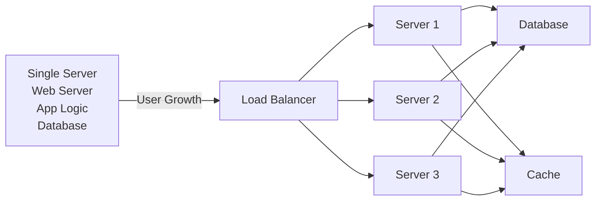
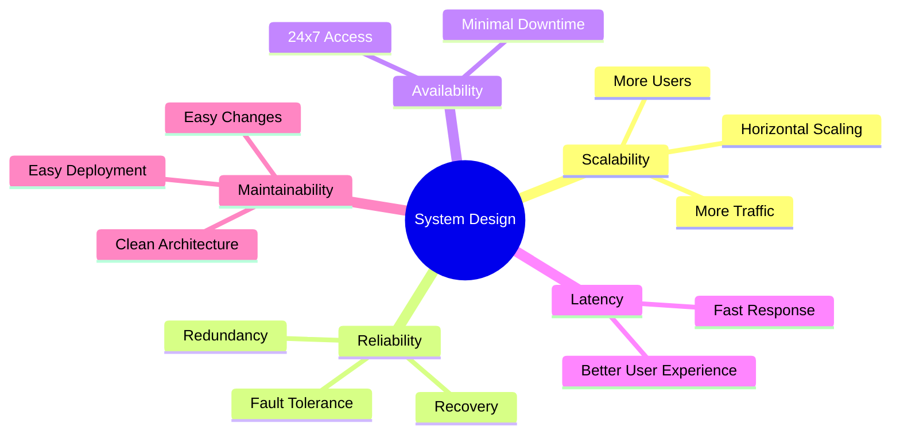
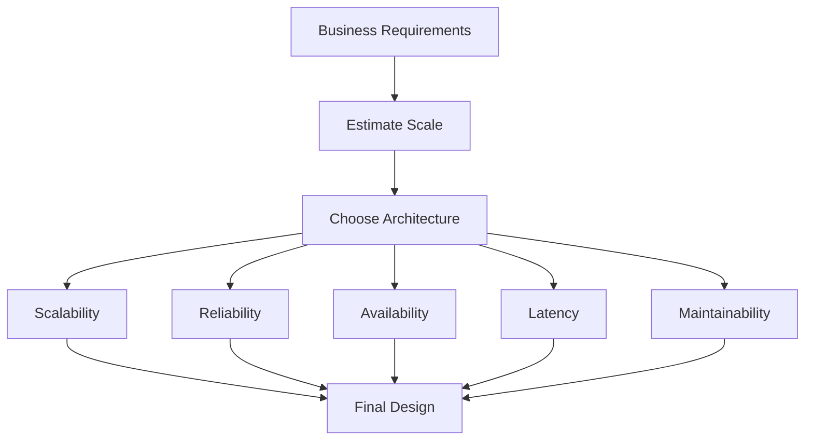
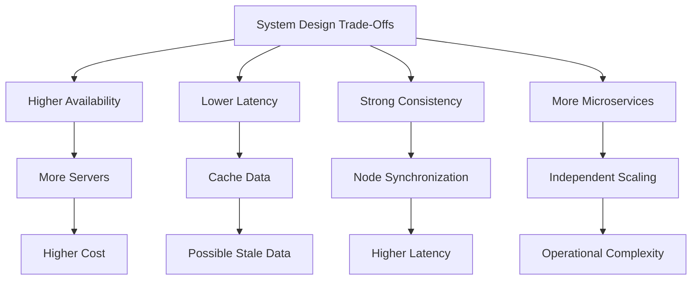

## 01. What is System Design?

Before we start this course, let's talk about what even is system design.

System design is the process of defining the architecture, interfaces, and data for a system that satisfies specific requirements. System design meets the needs of your business or organization through coherent and efficient systems. It requires a systematic approach to building and engineering systems. A good system design requires us to think about everything, from infrastructure all the way down to the data and how it's stored.

### Why is System Design so important?
System design helps us define a solution that meets the business requirements. It is one of the earliest decisions we can make when building a system. Often it is essential to think from a high level as these decisions are very difficult to correct later. It also makes it easier to reason about and manage architectural changes as the system evolves.

### Single Machine → Distributed System

Every app starts simple — one server does everything. As users grow, you split responsibilities:

### The 5 Core Pillars

| Pillar | What it means |
|--------|--------------|
| **Scalability** | Handle more users over time |
| **Reliability** | Keep working when things fail |
| **Availability** | System is accessible 24/7 |
| **Latency** | How fast a single request is served |
| **Maintainability** | Easy for engineers to change & deploy |

### System Design - Decision flow

### Key Trade-offs

> Every design decision is a trade-off. There is no perfect system.

**Example:** Instagram shows your feed with a slight delay — they chose *eventual consistency* over *strong consistency* because 1 second delay is invisible to users and saves huge infrastructure cost.

### ❓Questions

1. What is System Design and why does it matter?
2. What are the 5 core pillars of a well-designed system?
3. Explain the trade-off between consistency and availability with an example.
4. How does a system evolve from a single machine to a distributed architecture?
5. What would you consider first when designing a system for 1M vs 1B users?

---
