# 10. ACID, Distributed Transactions & BLOB Storage

> A payment goes through. Half the money leaves your account. The other half never reaches the recipient. The system crashed mid-transaction. Without ACID guarantees, this is exactly what can happen. And in a distributed system where 10 services across 5 servers are all part of one "transaction" — keeping everything consistent becomes one of the hardest problems in engineering.

---

## Table of Contents

1. [ACID Transactions](#1-acid-transactions)
2. [Distributed Transactions — The Hard Problem](#2-distributed-transactions--the-hard-problem)
3. [Two-Phase Commit (2PC)](#3-two-phase-commit-2pc)
4. [Three-Phase Commit (3PC)](#4-three-phase-commit-3pc)
5. [Saga Pattern](#5-saga-pattern)
6. [Optimistic vs Pessimistic Locking](#6-optimistic-vs-pessimistic-locking)
7. [BLOB Storage](#7-blob-storage)
8. [Interview Questions](#-interview-questions)

---

## 1. ACID Transactions

ACID is a set of four properties that guarantee database transactions are processed reliably. Every time you transfer money, place an order, or book a seat — ACID is what ensures nothing goes wrong halfway through.

---

### Atomicity — All or Nothing

A transaction is indivisible. Either every operation inside it succeeds, or none of them do. There is no in-between state.

**The scenario that makes this click:**

You transfer ₹10,000 from your account to a friend. Two things must happen:
1. Debit ₹10,000 from your account
2. Credit ₹10,000 to your friend's account

Without atomicity, the system could crash after step 1 but before step 2. You lose ₹10,000. Your friend gets nothing. The money vanishes. Atomicity prevents this — if step 2 fails, step 1 is automatically rolled back. Either both happen or neither does.

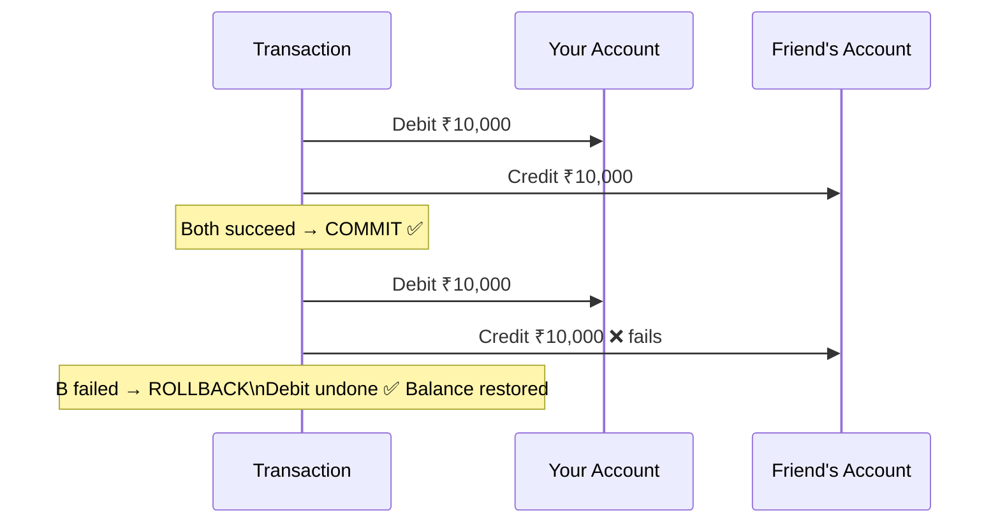

---

### Consistency — Valid State to Valid State

A transaction must take the database from one valid state to another valid state. It cannot violate the integrity constraints of the database.

If a bank rule says "balance cannot go below zero", then no transaction — no matter what — can result in a negative balance. If it would, the transaction is rejected entirely.

Consistency is about the database's rules — the invariants that must always hold true. The system enforces them before committing any transaction.

---

### Isolation — Concurrent Transactions Don't Interfere

Multiple transactions can run simultaneously, but each one must behave as if it is running alone. One transaction's intermediate state must never be visible to another.

**The scenario:**

Two people book the last available seat on a flight at the same time. Without isolation, both transactions might read "1 seat available", both proceed to book, and you end up with two bookings for one seat.

Isolation prevents this — the first transaction to complete locks that seat, and the second one sees "0 seats available" and fails cleanly.

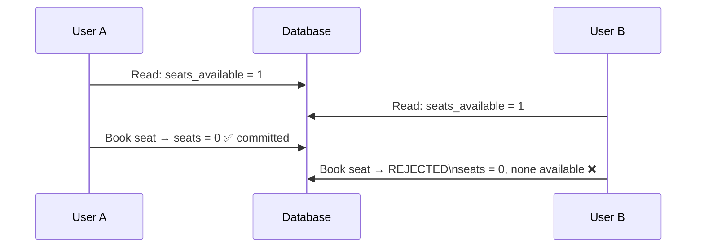

---

### Durability — Committed Means Permanent

Once a transaction is committed, its changes are permanent. A power outage, hardware crash, or server restart cannot undo a committed transaction. The data is written to persistent storage before the commit is confirmed.

This is why databases write to a **Write-Ahead Log (WAL)** before applying changes. If the system crashes and restarts, it replays the WAL to restore the committed state.

---

### ACID in One Sentence Each

| Property | Promise |
|----------|---------|
| **Atomicity** | All operations succeed or none do — no partial state |
| **Consistency** | Transactions respect database rules — valid in, valid out |
| **Isolation** | Concurrent transactions do not see each other's work in progress |
| **Durability** | Committed data survives crashes |

---

## 2. Distributed Transactions — The Hard Problem

ACID is straightforward when your data lives in one database on one machine. The database handles everything internally.

But in a microservices system — where your Order Service, Payment Service, and Inventory Service each have their own database — a single user action spans multiple services. "Place an order" means:

1. Payment Service charges the card
2. Inventory Service reserves the item
3. Order Service creates the order record
4. Notification Service sends a confirmation

All four must either succeed together or fail together. But they are running on different machines with different databases. There is no single ACID transaction that spans them all.

This is the distributed transaction problem, and it is genuinely hard.

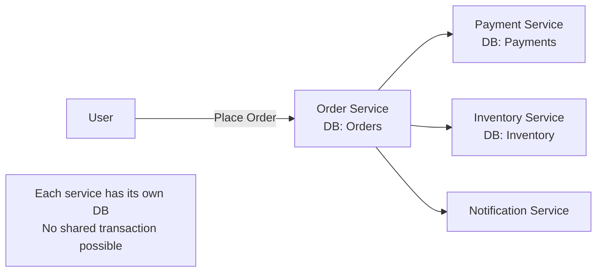

What happens if payment succeeds but inventory reservation fails? You charged the customer but cannot fulfill the order. What if the order is created but the payment confirmation gets lost in the network? Engineers have solved this in three main ways.

---

## 3. Two-Phase Commit (2PC)

2PC is the classic solution. It introduces a **coordinator** that orchestrates all participants through two phases, ensuring they either all commit or all abort.

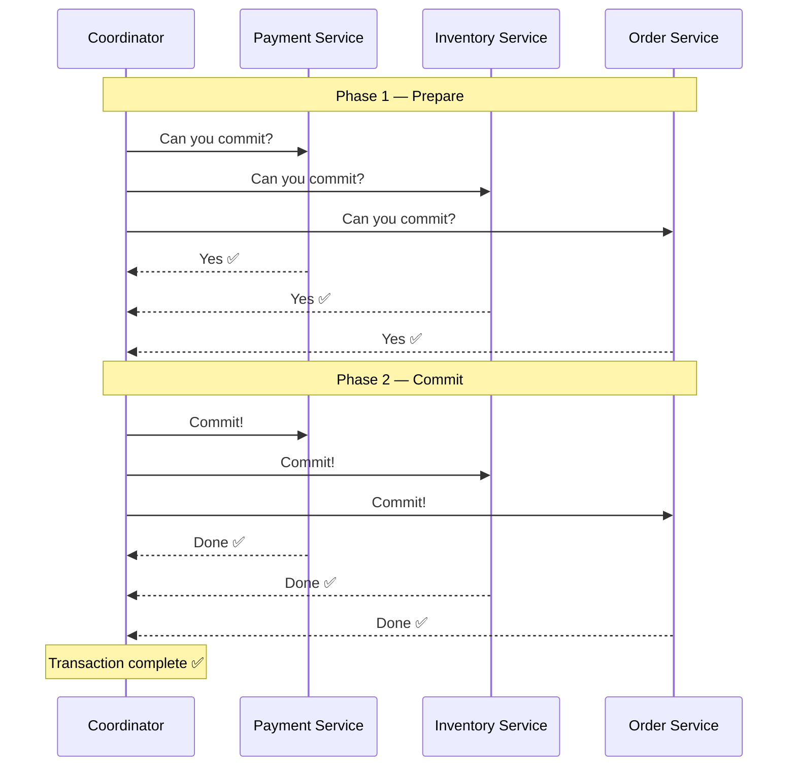

If any participant says "No" in Phase 1, the coordinator sends an abort to everyone — and all participants roll back.

### What Can Go Wrong With 2PC

**The coordinator crashes.** If the coordinator dies after sending "prepare" but before sending "commit" — all participants are stuck holding locks, waiting forever. They cannot commit or abort on their own. The system is blocked.

**Network partition.** A participant says "Yes, ready to commit" — then loses network connection before receiving the commit message. It is in a prepared state indefinitely. No progress.

**Blocking protocol.** All participants hold locks during the entire process. If any step is slow, everything waits. At scale, this becomes a throughput killer.

2PC is correct but fragile and slow. It works for systems where strong consistency is critical and the number of participants is small — like coordinating two databases in a traditional monolith.

---

## 4. Three-Phase Commit (3PC)

3PC adds a phase between Prepare and Commit to reduce the blocking problem of 2PC. The key addition is the **Pre-Commit** phase — which gives participants a chance to "get ready" before the final commit signal arrives.

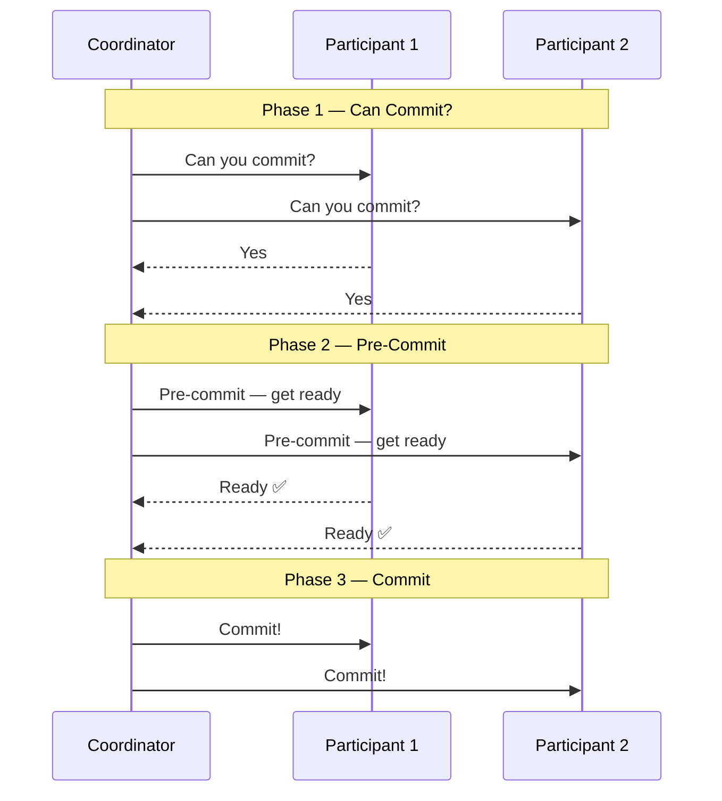

The extra phase means participants know the coordinator intended to commit. If the coordinator crashes after pre-commit, participants can safely commit on their own — because they know everyone was ready.

3PC reduces the blocking window but adds more network round trips — slower but safer than 2PC. In practice, **neither 2PC nor 3PC is commonly used in modern microservices** because they are too slow and too fragile at scale. The Saga pattern is the modern alternative.

---

## 5. Saga Pattern

The Saga pattern does not try to create a single distributed transaction. Instead, it breaks a long transaction into **a series of smaller local transactions**, each in its own service. If one step fails, it runs **compensating transactions** to undo the completed steps.

Think of it like booking a trip:
1. Book flight ✅
2. Book hotel ✅
3. Book car rental ✅
4. Charge card ❌ fails

Instead of rolling back instantly like a database, a Saga runs compensation:
- Cancel car rental
- Cancel hotel
- Cancel flight
- Refund any partial charges

Each compensation is a real business operation — not a database rollback.

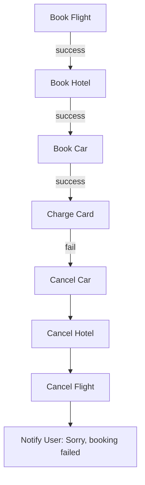

### Orchestrator Saga — One Boss

A central **Orchestrator** service manages the entire saga. It tells each service what to do and when. It tracks progress. If something fails, it issues compensating calls.

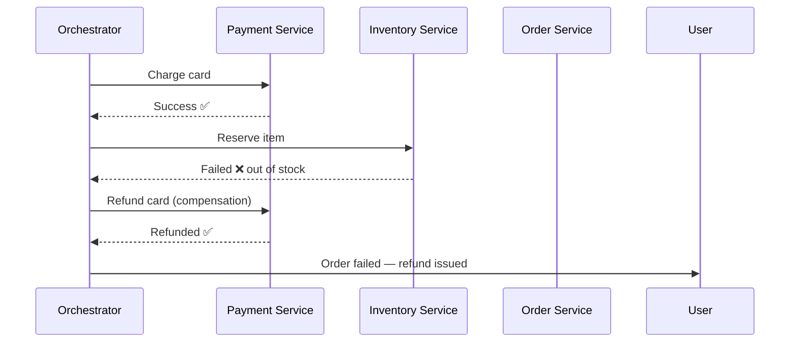

**Advantages:** Clear, centralized flow. Easy to monitor. Easy to add complex compensation logic. One place to look when something goes wrong.

**Disadvantages:** The orchestrator becomes a single point of failure. It can become a bottleneck. It knows too much about other services — tight coupling.

---

### Choreography Saga — Everyone Talks to Everyone

No central coordinator. Each service listens for events and publishes its own events. Services react to each other autonomously.

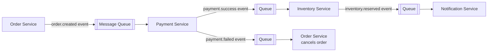

Each service subscribes to the events it cares about and reacts accordingly. If payment fails, it publishes a `payment.failed` event. The Order Service listens and cancels the order. No coordinator needed.

**Advantages:** Fully decentralized. No single point of failure. Services are loosely coupled and autonomous. Scales well.

**Disadvantages:** Hard to trace what happened in a failed saga — events are scattered across services and queues. Harder to visualize the full flow. Compensation logic is distributed and harder to reason about.

---

### Orchestrator vs Choreography

| | Orchestrator | Choreography |
|--|-------------|-------------|
| Control | Centralized | Decentralized |
| Single point of failure | Yes — orchestrator | No |
| Coupling | Tighter | Loose |
| Visibility | Easy to trace | Hard to trace |
| Complexity | Simpler compensation logic | Distributed, harder to debug |
| Best for | Complex flows with many steps | Simple, loosely coupled systems |

---

## 6. Optimistic vs Pessimistic Locking

When multiple users try to update the same data at the same time, you need a strategy to prevent conflicts. There are two fundamentally different philosophies.

---

### Pessimistic Locking — Assume the Worst

Lock the data before you read it. Nobody else can touch it until you are done. The name comes from the assumption: "someone will definitely try to modify this data while I am working with it, so I will lock it to be safe."

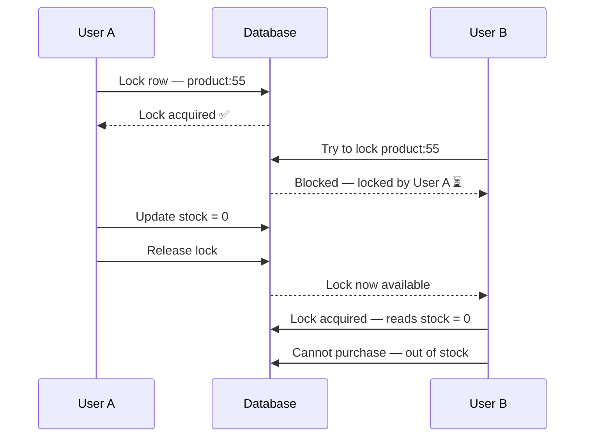

**Advantages:** No conflicts ever happen. Data integrity is guaranteed.

**Disadvantages:** Reduced concurrency — other users are blocked and waiting. In high-traffic systems, locks become bottlenecks. If a transaction holds a lock and crashes, other transactions wait forever (deadlock).

**Best for:** High-conflict scenarios where the same records are frequently updated by many users simultaneously. Bank account updates, seat reservations, stock trading.

---

### Optimistic Locking — Assume the Best

Do not lock anything. Read the data, remember its version number. When you write, check if the version number has changed since you read. If it has not — proceed. If it has — someone else modified it in the meantime, retry or abort.

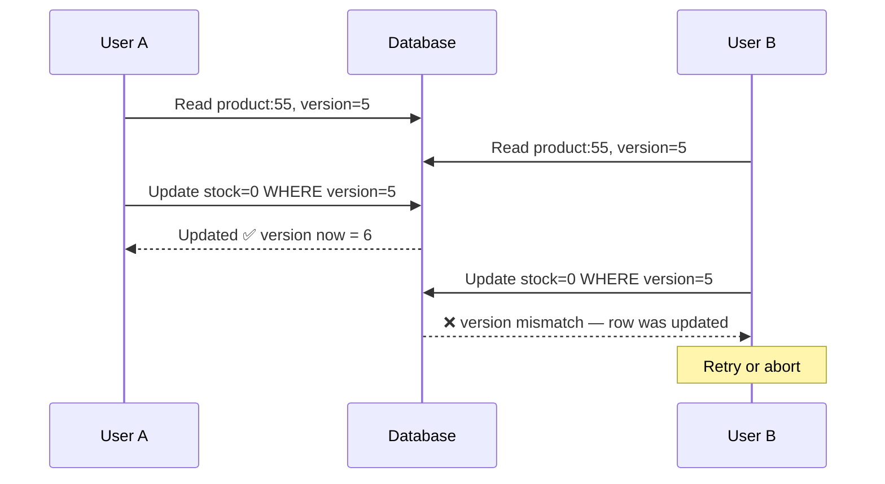

**Advantages:** No locks means maximum concurrency. Reads never block. In low-conflict scenarios, this is significantly faster.

**Disadvantages:** When conflicts do occur, the losing transaction must retry — which adds overhead and complexity. Not suitable for high-conflict scenarios.

**Best for:** Systems where conflicts are rare — profile updates, settings changes, comment edits. Most users will not be editing the same record at the same moment.

---

### Optimistic vs Pessimistic — When to Use Which

| | Pessimistic | Optimistic |
|--|-------------|-----------|
| Assumption | Conflicts are likely | Conflicts are rare |
| Mechanism | Lock before read | Version check before write |
| Concurrency | Low — others blocked | High — no blocking |
| Conflict handling | Prevented entirely | Detected and retried |
| Best for | High-contention data | Low-contention data |
| Example | Flight seat booking | User profile update |

---

## 7. BLOB Storage

Most databases are optimized for structured data — rows, columns, indexed fields. But what about a user's profile picture? A 4K video uploaded to YouTube? A PDF invoice? These are binary files — unstructured, large, and very different from a database row.

**BLOB (Binary Large Object) Storage** is purpose-built for storing and serving large binary files. It is not a database — it is an object store, optimized for exactly this use case.

### What Makes BLOB Storage Different

Regular databases:
- Optimized for structured query operations
- Store data in fixed formats
- Not efficient for files >1MB
- Expensive to scale for large binary data

BLOB storage:
- Optimized for storing and retrieving large binary files
- Virtually unlimited scalability
- Cheap at massive scale
- Built-in CDN integration
- Designed for direct file access with a URL

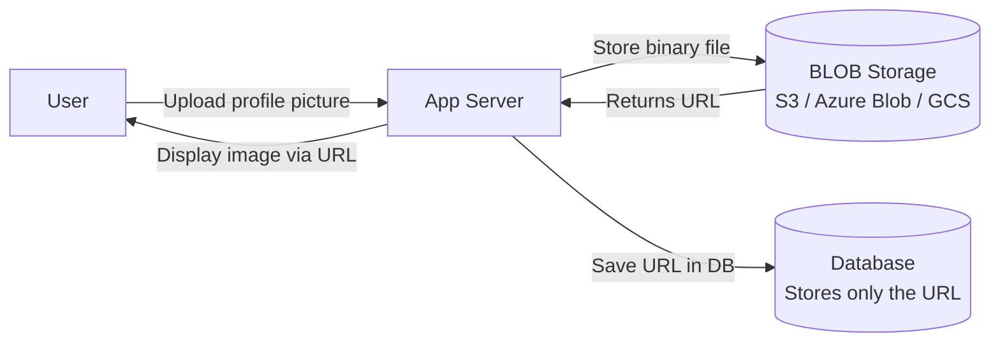

The database stores only the URL pointing to the file. The actual binary data lives in BLOB storage. This pattern is used universally — Instagram stores your photos in S3, not in PostgreSQL.

### What Goes in BLOB Storage

- Profile pictures, avatars
- Videos — YouTube uploads, Instagram Reels, Zoom recordings
- Audio files — podcasts, voice messages, music
- Documents — PDFs, invoices, contracts
- Application backups and exports
- Machine learning model files
- Software release binaries

### Popular BLOB Storage Services

| Service | Provider | Known for |
|---------|----------|-----------|
| **Amazon S3** | AWS | Industry standard, massive ecosystem, versioning |
| **Azure Blob Storage** | Microsoft | Deep Azure integration, tiered storage |
| **Google Cloud Storage** | Google | Strong consistency, good ML integration |
| **Cloudflare R2** | Cloudflare | S3-compatible, zero egress fees |

### S3 Key Features Worth Knowing

**Versioning** — S3 keeps every version of every file. You can restore any previous version of an object. Critical for documents and backups.

**Storage tiers** — S3 has multiple storage classes. Frequently accessed files → S3 Standard (fast, expensive). Rarely accessed → S3 Glacier (slow to retrieve, very cheap). You move files between tiers automatically based on access patterns.

**Pre-signed URLs** — You can generate a temporary URL that gives someone access to a private file for a limited time. Used for secure file sharing, profile picture uploads directly from the browser.

**Lifecycle policies** — Automatically delete or archive files after a set period. Old log files, expired exports, temporary uploads — clean themselves up.

### The Upload Flow — Why It Matters in Interviews

A common system design question is "how do you handle large file uploads?" The naive approach — upload to your server, server uploads to S3 — wastes your server's bandwidth and time. The right approach:

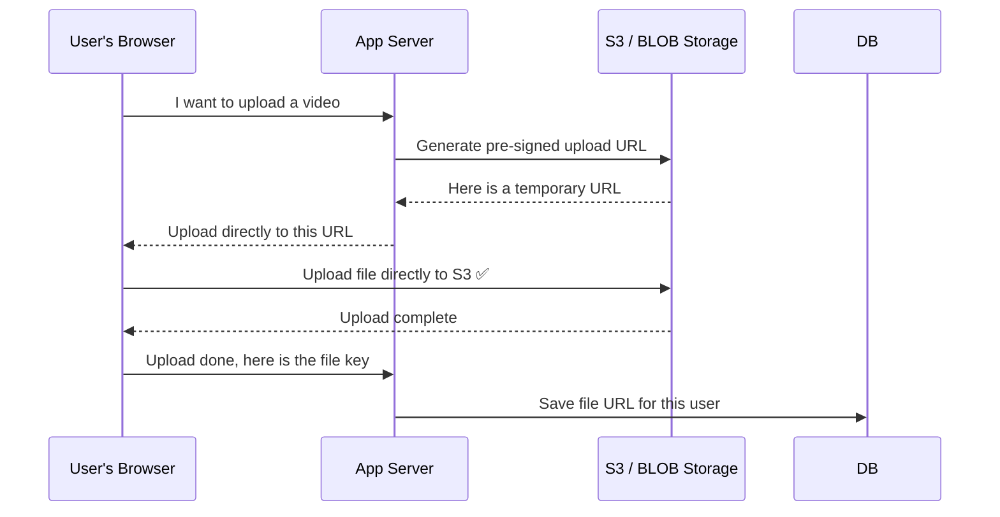

The file never touches your application server. The user uploads directly to S3. Your server just coordinates the URL generation. This is how every production system handles file uploads at scale.

---

## Interview Questions

**ACID**
1. What are the four ACID properties? Explain each with a real-world example.
2. What happens if atomicity is violated in a bank transfer?
3. What is the difference between consistency in ACID and consistency in CAP theorem? (Very common trick question)
4. How does isolation prevent the double-booking problem?
5. How does a database guarantee durability? What is a Write-Ahead Log?

**Distributed Transactions**
1. Why is it hard to maintain ACID properties in a microservices system?
2. What is the Two-Phase Commit protocol? Walk through it step by step.
3. What happens if the coordinator crashes in 2PC during the commit phase?
4. Why is 2PC considered a blocking protocol?
5. How does 3PC improve on 2PC? What does the extra phase add?
6. Why are neither 2PC nor 3PC commonly used in modern microservices systems?

**Saga Pattern**
1. What is the Saga pattern? How does it handle failures?
2. What is a compensating transaction? Give a real-world example.
3. What is the difference between Orchestrator and Choreography Saga?
4. What are the advantages of Choreography Saga? What makes it harder to debug?
5. You are designing an e-commerce order flow across Payment, Inventory, and Order services. Would you use 2PC or Saga? Which Saga type?
6. What happens if a compensating transaction also fails in a Saga?

**Locking**
1. What is the difference between optimistic and pessimistic locking?
2. When would you use pessimistic locking over optimistic locking?
3. What is a deadlock? How can pessimistic locking cause it?
4. How does optimistic locking use version numbers? Walk through a conflict scenario.
5. You are building a ticket booking system for a cricket match. Which locking strategy do you use?

**BLOB Storage**
1. What is BLOB storage and how is it different from a database?
2. Why should you not store large files directly in a relational database?
3. Explain the pattern of storing file URLs in a database vs the file in BLOB storage.
4. What is a pre-signed URL? When would you use one?
5. How would you handle a large video file upload in a system design? Walk through the flow.
6. What is S3 versioning? When is it critical?

---
