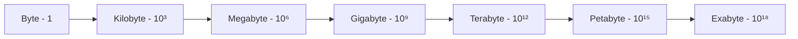
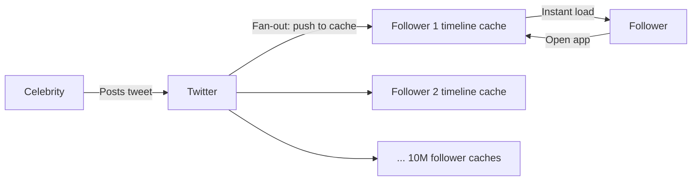
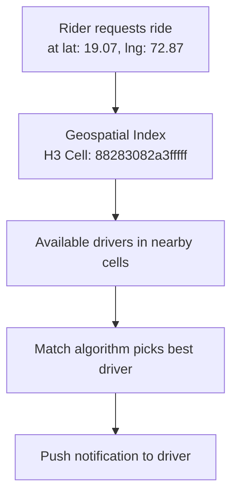
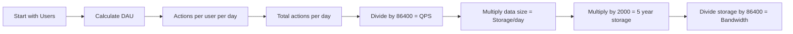

# 11. Back-of-Envelope Estimations

> In a system design interview, you will almost always be asked to estimate scale before you start designing. "How many messages per second does WhatsApp handle? How much storage does Twitter need per year? How many servers does Uber need?" These are not trick questions — they want to see how you think through numbers. This topic teaches you the mental math framework and applies it to three of the most common case studies.

---

## Table of Contents

1. [Why Estimations Matter](#1-why-estimations-matter)
2. [The Building Blocks — Numbers to Memorise](#2-the-building-blocks--numbers-to-memorise)
3. [Data Size Reference](#3-data-size-reference)
4. [Powers of 2 Reference](#4-powers-of-2-reference)
5. [WhatsApp Estimation](#5-whatsapp-estimation)
6. [Twitter Estimation](#6-twitter-estimation)
7. [Uber Estimation](#7-uber-estimation)
8. [Estimation Cheat Sheet](#8-estimation-cheat-sheet)
9. [Interview Questions](#-interview-questions)

---

## 1. Why Estimations Matter

Before you design any system, you need to know its scale. The architecture for a system handling 1,000 users per day is completely different from one handling 1 billion.

Estimations tell you:
- How much storage you need to provision
- How many servers are required
- Whether you need sharding, caching, or CDN
- Where the bottlenecks will likely appear

**You will never get the exact number. That is not the point.** The point is to reason clearly, make sensible assumptions, and arrive at a number that is in the right ballpark. Interviewers want to see your thinking, not a precise answer.

---

## 2. The Building Blocks — Numbers to Memorise

These are the conversions that come up in every estimation. Internalise them.

### Time Conversions

| Period | Seconds |
|--------|---------|
| 1 minute | 60 seconds |
| 1 hour | 3,600 seconds |
| 1 day | 86,400 seconds ≈ **100,000** (round up for easy math) |
| 1 month | ~2.5 million seconds |
| 1 year | ~31.5 million seconds ≈ **30 million** |
| 5 years | 365 × 5 ≈ **2,000 days** |

### The Most Useful Conversions

```
1 million requests/day  ÷ 86,400 seconds  ≈  12 requests/second
1 billion requests/day  ÷ 86,400 seconds  ≈  12,000 requests/second

100 million users × 10% daily active       = 10 million DAU
10 million DAU × 10 actions/day            = 100 million actions/day
100 million actions/day ÷ 100,000 seconds ≈ 1,000 actions/second (QPS)
```

### Read vs Write Ratio (common assumptions)

Most systems are **read-heavy**. Typical ratios:

| System | Read:Write |
|--------|-----------|
| Social media feed | 100:1 |
| E-commerce catalogue | 50:1 |
| Messaging (WhatsApp) | 1:1 (every send = every receive) |
| Ride-hailing (Uber) | 10:1 |

---

## 3. Data Size Reference



| Unit | Bytes | Real-world sense |
|------|-------|-----------------|
| **Byte (B)** | 1 | One character |
| **Kilobyte (KB)** | 10³ = 1,000 | A short text message |
| **Megabyte (MB)** | 10⁶ = 1,000,000 | A photo, a minute of audio |
| **Gigabyte (GB)** | 10⁹ | A movie, 1000 photos |
| **Terabyte (TB)** | 10¹² | 1000 movies |
| **Petabyte (PB)** | 10¹⁵ | All of Facebook's photos from 2009 |
| **Exabyte (EB)** | 10¹⁸ | The entire internet in 2010 |

### Typical Data Sizes to Remember

| Data type | Size |
|-----------|------|
| ASCII character | 1 byte |
| Integer / Long | 4–8 bytes |
| Tweet text (280 chars) | ~280 bytes |
| WhatsApp text message | ~100 bytes |
| Profile picture (compressed) | ~200 KB |
| High-res photo (Instagram) | ~3 MB |
| 1 minute of audio | ~1 MB |
| 1 minute of SD video | ~10 MB |
| 1 minute of HD video | ~100 MB |

---

## 4. Powers of 2 Reference

Useful when working with distributed systems, cache sizes, and binary data.

| Power | Value |
|-------|-------|
| 2⁰ | 1 |
| 2¹ | 2 |
| 2² | 4 |
| 2³ | 8 |
| 2⁴ | 16 |
| 2⁵ | 32 |
| 2⁶ | 64 |
| 2⁷ | 128 |
| 2⁸ | 256 |
| 2⁹ | 512 |
| 2¹⁰ | 1,024 ≈ 1,000 |
| 2²⁰ | ~1,000,000 (1 million) |
| 2³⁰ | ~1,000,000,000 (1 billion) |

**The key shortcut:** 2¹⁰ ≈ 10³. So 2²⁰ ≈ 10⁶, 2³⁰ ≈ 10⁹. Use this when converting between binary and decimal at scale.

---

## 5. WhatsApp Estimation

WhatsApp is a messaging system. The core questions: how many messages per second, how much storage, how much bandwidth.

### Assumptions — State These in the Interview

- **Total users:** 2 billion
- **Daily Active Users (DAU):** 50% of total = **1 billion DAU**
- **Messages per user per day:** 40 messages sent, 40 received = 80 messages/day
- **Message types:** 80% text, 15% images, 5% videos

---

### Messages Per Second (QPS)

```
Total messages/day = 1 billion users × 40 messages = 40 billion messages/day

QPS = 40 billion / 86,400 seconds
    ≈ 40 billion / 100,000 (rounded)
    = 400,000 messages/second
    ≈ 400K messages/second
```

Peak traffic is typically 2–3x average:

```
Peak QPS ≈ 400K × 3 = ~1.2 million messages/second
```

---

### Storage Per Day

**Text messages:**
```
80% of 40 billion = 32 billion text messages/day
Average text message size = 100 bytes

Storage = 32 billion × 100 bytes
        = 3.2 trillion bytes
        = 3.2 TB/day (text only)
```

**Images:**
```
15% of 40 billion = 6 billion images/day
Average image size = 200 KB = 200,000 bytes

Storage = 6 billion × 200,000 bytes
        = 1.2 quadrillion bytes
        = 1.2 PB/day (images)
```

**Videos:**
```
5% of 40 billion = 2 billion videos/day
Average video clip = 5 MB = 5,000,000 bytes

Storage = 2 billion × 5,000,000 bytes
        = 10 quadrillion bytes
        = 10 PB/day (videos)
```

**Total storage per day:**
```
Text:   3.2 TB
Images: 1.2 PB
Videos: 10 PB
Total:  ≈ 11.2 PB/day
```

**Storage for 5 years:**
```
5 years = 365 × 5 ≈ 2,000 days
Total = 11.2 PB × 2,000 = 22,400 PB ≈ 22 Exabytes
```

---

### Bandwidth

```
Inbound (messages being sent):
11.2 PB/day ÷ 86,400 seconds ≈ 130 GB/second inbound

Outbound (messages delivered to recipients):
Each message is delivered to at least 1 recipient, often a group
Assuming 1.5x amplification:
130 GB/s × 1.5 ≈ 195 GB/second outbound
```

---

### Servers Required

Assuming each server handles 50,000 connections (WebSocket):

```
1 billion DAU, assume 10% online at any time = 100 million concurrent users
Servers = 100 million / 50,000 = 2,000 servers for connections alone
```

Plus servers for message processing, storage, media encoding, and more.

---

### WhatsApp Summary

| Metric | Value |
|--------|-------|
| DAU | 1 billion |
| Messages/second | ~400K |
| Peak messages/second | ~1.2M |
| Storage/day | ~11 PB |
| Storage/5 years | ~22 Exabytes |
| Bandwidth inbound | ~130 GB/s |

---

## 6. Twitter Estimation

Twitter is a read-heavy social media platform. Most users read far more than they write.

### Assumptions

- **Total users:** 500 million registered
- **DAU:** 200 million (40%)
- **Tweets per user per day:** 5 tweets posted (write)
- **Tweets read per user per day:** 200 tweets (read)
- **Read:Write ratio:** 40:1 (very read-heavy)
- **Tweet size:** 300 bytes (text) + metadata

---

### Write QPS (Tweets Posted)

```
Total tweets/day = 200 million DAU × 5 tweets = 1 billion tweets/day

Write QPS = 1 billion / 86,400 ≈ 1 billion / 100,000 = 10,000 tweets/second

Peak write QPS ≈ 10,000 × 3 = 30,000 tweets/second
```

(For comparison: during major events like the FIFA World Cup final, Twitter has recorded 150,000+ tweets/second.)

---

### Read QPS (Timeline Reads)

```
Total timeline reads/day = 200 million × 200 tweets = 40 billion reads/day

Read QPS = 40 billion / 86,400 ≈ 460,000 reads/second

Peak read QPS ≈ 460K × 3 ≈ 1.4 million reads/second
```

This massive read load is why Twitter needs aggressive caching for timelines.

---

### Storage Per Day

**Tweet text:**
```
1 billion tweets/day × 300 bytes/tweet
= 300 billion bytes/day
= 300 GB/day (text only)
```

**With images (assume 30% of tweets have an image, average 3 MB):**
```
300 million tweets with images × 3 MB
= 900 million MB
= 900 TB/day
```

**With videos (assume 5% of tweets have video, average 10 MB):**
```
50 million video tweets × 10 MB
= 500 million MB
= 500 TB/day
```

**Total storage per day:**
```
Text:   300 GB  ≈ 0.3 TB
Images: 900 TB
Videos: 500 TB
Total:  ≈ 1,400 TB/day = 1.4 PB/day
```

**Storage for 5 years:**
```
1.4 PB × 2,000 days = 2,800 PB = 2.8 Exabytes
```

---

### Bandwidth

```
Outbound (timeline delivery):
40 billion tweets read/day × 300 bytes = 12 TB/day of text
Media adds significantly more — estimate ~5 PB/day delivered

5 PB / 86,400 seconds ≈ 58 GB/second outbound bandwidth
```

---

### Fan-out Problem

When a celebrity with 10 million followers tweets, that tweet needs to be delivered to 10 million timelines. At 30,000 tweets/second, the fan-out load is enormous.

Twitter solves this with **pre-computed timelines** stored in cache (Redis). When you post, your tweet is pushed into the timeline cache of your followers. When a follower opens Twitter, they read from cache — not a live database query across all follows.



---

### Twitter Summary

| Metric | Value |
|--------|-------|
| DAU | 200 million |
| Write QPS | ~10,000/sec |
| Read QPS | ~460,000/sec |
| Read:Write ratio | ~46:1 |
| Storage/day | ~1.4 PB |
| Storage/5 years | ~2.8 Exabytes |
| Outbound bandwidth | ~58 GB/sec |

---

## 7. Uber Estimation

Uber is a geo-distributed real-time system. The key metric is not messages but **location updates** — every driver sends their GPS coordinates every few seconds.

### Assumptions

- **Total registered drivers:** 5 million (globally active)
- **Active drivers at peak:** 1 million
- **Riders making requests at peak:** 3 million
- **Location update frequency:** Every 4 seconds per driver
- **Average trip duration:** 30 minutes
- **Trips per day:** 15 million trips

---

### Driver Location Updates Per Second

```
1 million active drivers × 1 update / 4 seconds
= 250,000 location updates/second
```

This is just location data — before you even count trip requests, payments, or notifications.

Each location update:
```
driver_id (8 bytes) + lat (8 bytes) + lng (8 bytes) + timestamp (8 bytes) = 32 bytes
```

```
Bandwidth from location updates:
250,000 updates/sec × 32 bytes = 8 MB/second inbound (location data alone)
```

---

### Trip Requests Per Second

```
15 million trips/day ÷ 86,400 seconds = ~175 trips/second average

Peak (rush hour = 4x average):
175 × 4 = ~700 trip requests/second
```

---

### Storage Per Day

**Location data (all driver updates):**
```
250,000 updates/sec × 32 bytes × 86,400 seconds
= 691 billion bytes/day
≈ 700 GB/day of location data
```

Uber does not need to store every location update forever — only recent history for ETAs. Most raw location data is aggregated and discarded within hours.

**Trip records:**
```
15 million trips/day
Each trip record: ~500 bytes (route, driver, rider, fare, timestamps)

= 15 million × 500 bytes = 7.5 billion bytes = 7.5 GB/day (trip records)
```

**Total meaningful storage per day:**
```
Location (retained 24h): ~700 GB
Trip records:            ~7.5 GB
Total permanent:         ~8 GB/day
```

Uber's permanent storage needs are actually modest — what is expensive is the **real-time processing** of location data, not long-term storage.

**Trip storage for 5 years:**
```
7.5 GB × 2,000 days = 15,000 GB = 15 TB (just trip records — very manageable)
```

---

### Geospatial Index

Uber's hardest technical problem is not storage — it is finding available drivers near a rider in real time, across millions of drivers updating their location every 4 seconds.

The solution is **geospatial indexing**. Uber divides the world into a grid using an algorithm called **S2 geometry** (Google) or **H3 hexagonal grid**. Each driver is assigned to a cell. When a rider requests, the system looks up all drivers in nearby cells.



---

### Servers Required

For 250,000 location updates/second, if each server processes 10,000 updates/second:

```
Servers for location processing = 250,000 / 10,000 = 25 servers
```

But Uber runs across multiple regions with redundancy, so real numbers are much higher. Plus servers for matching, payments, routing, notifications, analytics, and more.

---

### Uber Summary

| Metric | Value |
|--------|-------|
| Active drivers at peak | 1 million |
| Location updates/sec | 250,000 |
| Location data/day | ~700 GB |
| Trip requests/sec (peak) | ~700 |
| Trips/day | 15 million |
| Trip record storage/day | ~7.5 GB |
| Storage/5 years (trips) | ~15 TB |
| Location update bandwidth | ~8 MB/sec inbound |

---

## 8. Estimation Cheat Sheet



### The 5-Step Framework

**Step 1 — Users:** How many total users? What % are daily active?

**Step 2 — Actions:** How many key actions does each DAU perform per day? (messages sent, tweets posted, rides requested, videos watched)

**Step 3 — QPS:** Total actions per day ÷ 86,400 = average QPS. Multiply by 2–3 for peak.

**Step 4 — Storage:** Average data size per action × total actions per day = storage per day. Multiply by 2,000 for 5-year estimate.

**Step 5 — Bandwidth:** Storage per day ÷ 86,400 = bandwidth in bytes/second. Convert to GB/s or TB/s.

---

### Quick Reference

| Calculation | Shortcut |
|-------------|---------|
| X million/day → per second | X ÷ 100 ≈ X × 0.01 per second |
| X billion/day → per second | X × 10 per second |
| 5 years | 2,000 days |
| 1 year | 30 million seconds |
| 1 day | 86,400 seconds ≈ 100K |
| 1 MB/user × 1B users | 1 PB |
| 1 KB/request × 1M req/sec | 1 GB/sec bandwidth |

---

## Interview Questions

**Foundations**
1. How many seconds are in a day? Why is this important in estimations?
2. How do you convert "1 million requests per day" to requests per second?
3. What is the difference between storage per day and bandwidth?
4. How do you estimate peak QPS from average QPS?

**WhatsApp**
1. Estimate the number of messages WhatsApp processes per second.
2. How much storage does WhatsApp need per day if 40% of messages contain images?
3. How many servers does WhatsApp need to maintain persistent WebSocket connections for 1 billion users if 10% are online at any given time, and each server handles 50,000 connections?
4. Why is bandwidth different from storage? Calculate both for WhatsApp.

**Twitter**
1. Estimate the read QPS for Twitter's timeline feature.
2. Why is Twitter's read:write ratio so high compared to WhatsApp?
3. What is the fan-out problem on Twitter? How does pre-computing timelines solve it?
4. Estimate how much storage Twitter needs per year for tweet text alone.

**Uber**
1. How many location updates per second does Uber process globally?
2. Why is Uber's permanent storage requirement relatively small despite massive real-time data?
3. What is geospatial indexing? Why does Uber need it?
4. Estimate the bandwidth consumed by driver location updates alone.

**General**
1. How do you handle uncertainty in estimations during an interview?
2. A system serves 500 million users. Each user uploads 1 photo per week. Average photo size is 3 MB. How much storage is needed per year?
3. Your API handles 10 million requests per day. Each request/response is 10 KB. What is the outbound bandwidth?

---
