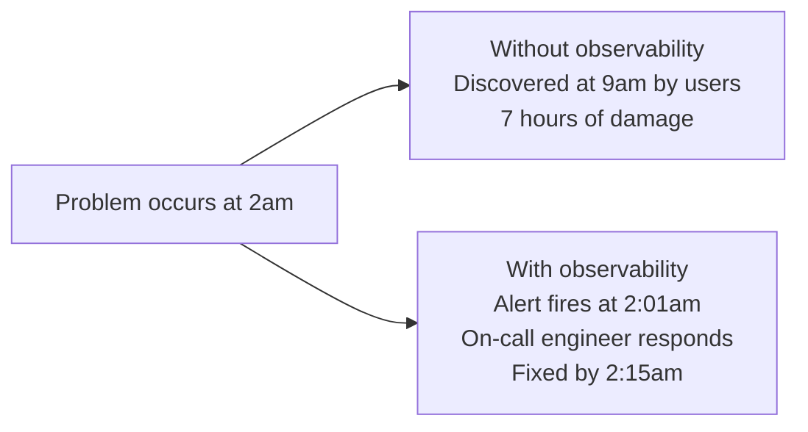
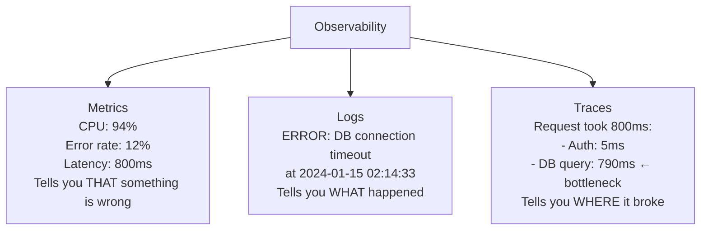
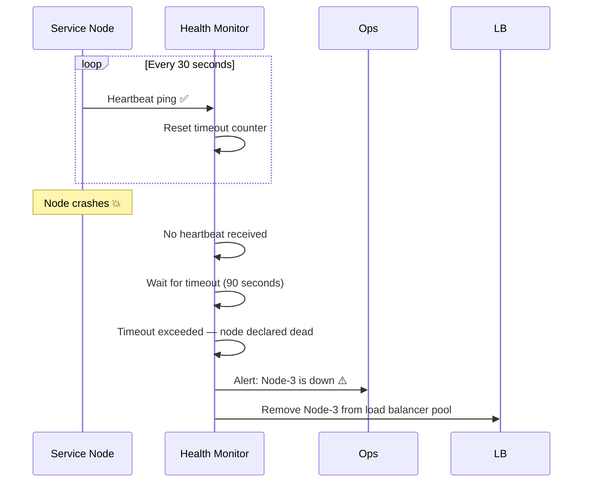
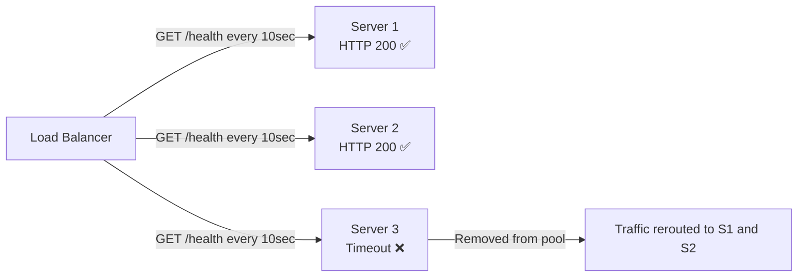
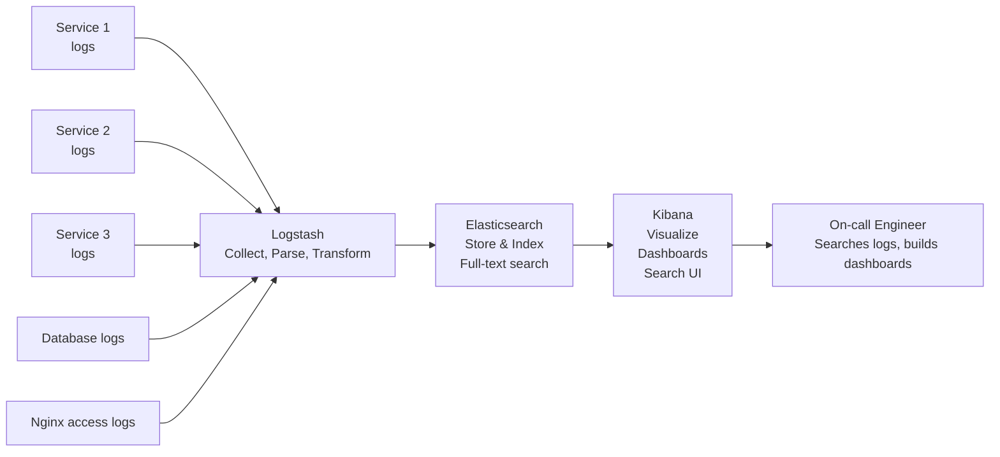
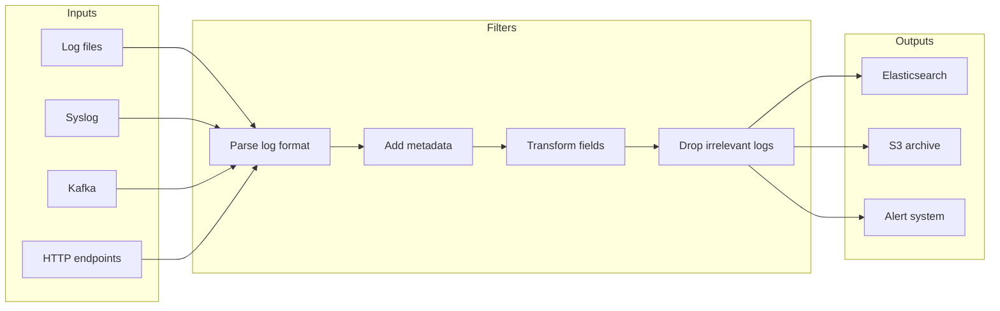
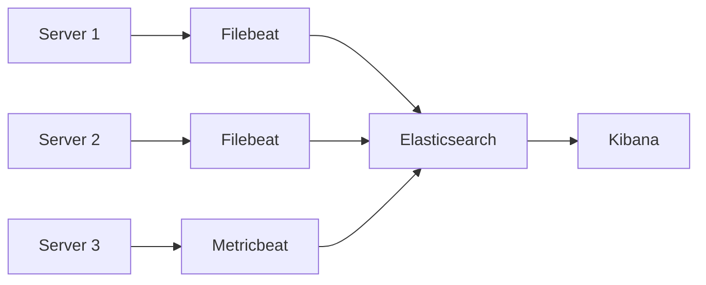
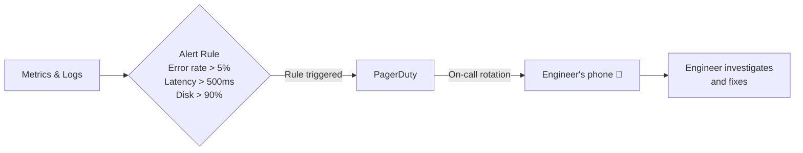

# 14. Heartbeat, Monitoring & the ELK Stack

> Your system is running in production. How do you know it is healthy? How do you know the moment something goes wrong — before your users tell you? How do you debug an issue that happened at 3am across 50 servers? This topic covers the observability tools that answer all of these questions.

---

## Table of Contents

1. [Why Observability Matters](#1-why-observability-matters)
2. [The Three Pillars of Observability](#2-the-three-pillars-of-observability)
3. [Heartbeat](#3-heartbeat)
4. [ELK Stack](#4-elk-stack)
5. [Monitoring vs Logging vs Tracing](#5-monitoring-vs-logging-vs-tracing)
6. [Alerting](#6-alerting)
7. [Interview Questions](#-interview-questions)

---

## 1. Why Observability Matters

Imagine your application serves 1 million users. At 2am, a database connection pool fills up. Requests start timing out. Users see errors. Orders fail silently. By the time someone notices at 9am, you have lost 7 hours of revenue and broken trust with thousands of customers.

Observability means your system tells you what is happening — in real time, in detail, at every layer. You should know about a problem before your users do.



The difference between these two outcomes is monitoring, logging, and alerting.

---

## 2. The Three Pillars of Observability

Every mature observability strategy is built on three things:

**Metrics** — Numbers over time. CPU usage, request rate, error rate, latency. Tell you *that* something is wrong.

**Logs** — Text records of events. Every request, every error, every state change. Tell you *what* happened.

**Traces** — The path of a single request through your entire system. Tell you *where* the slowdown is.



In production, you need all three. Metrics tell you there is a fire. Logs tell you where it started. Traces show you exactly which path through the code caught fire.

---

## 3. Heartbeat

A heartbeat is a periodic signal that a node or service sends to say "I am alive and healthy." If the signals stop, something is wrong.

It is named after the biological heartbeat — a regular, rhythmic signal that stops when the patient does.



### What Heartbeats Enable

**Liveness detection** — The most basic use. If a node stops sending heartbeats, it is considered dead. The system can automatically route traffic away from it.

**Failure detection** — In a cluster, nodes watch each other. If three nodes agree that Node-5 has missed its last three heartbeats, they declare it failed and trigger recovery.

**Leader election** — In distributed systems with a leader node (like Kafka's controller or a database primary), if the leader's heartbeat stops, a new leader is elected from the remaining nodes.

**Load balancer health checks** — Load balancers send HTTP health check pings to backend servers. If a server does not respond with 200 OK within the timeout, it is removed from the pool. This is a heartbeat in HTTP form.



### Health Check Endpoint

Every production service should expose a health check endpoint:

```json
GET /health

{
  "status": "healthy",
  "uptime": 86400,
  "checks": {
    "database": "connected",
    "redis": "connected",
    "disk_usage": "43%",
    "memory_usage": "61%"
  },
  "version": "2.4.1",
  "timestamp": "2024-01-15T02:00:00Z"
}
```

The load balancer checks this endpoint every 10–30 seconds. If `status` is not healthy, or the request times out, the server is removed from rotation.

---

## 4. ELK Stack

ELK stands for **Elasticsearch, Logstash, Kibana** — three open-source tools that together form the most widely used logging and analytics platform in production systems.

Every service generates logs. When you have 50 services each generating thousands of log lines per second, you cannot SSH into individual servers and tail log files. You need a centralized place to collect, store, search, and visualize all of it. That is what ELK does.



---

### Elasticsearch

Elasticsearch is a distributed, full-text search and analytics engine. It is the storage and query layer of ELK.

You send it documents (JSON objects — your log lines). It indexes every word in every field. You can then search across billions of log entries in milliseconds.

```json
{
  "@timestamp": "2024-01-15T02:14:33Z",
  "level": "ERROR",
  "service": "payment-service",
  "message": "DB connection timeout after 5000ms",
  "userId": 10142,
  "requestId": "abc-xyz-123",
  "host": "prod-server-7",
  "duration_ms": 5000
}
```

Once this log is in Elasticsearch, you can search:
- All errors in the payment service in the last hour
- All requests from userId 10142 today
- All requests that took longer than 3 seconds

Elasticsearch handles billions of documents across a cluster of nodes, with near real-time indexing.

---

### Logstash

Logstash is the data pipeline. It collects logs from multiple sources, parses and transforms them, and sends them to Elasticsearch.



A typical Logstash pipeline:
1. Collect raw log lines from files, Kafka, or HTTP
2. Parse unstructured text into structured JSON fields
3. Add metadata — environment (prod/staging), region, service name
4. Drop noisy debug logs that you do not want to store
5. Send cleaned, structured logs to Elasticsearch

---

### Kibana

Kibana is the visualization layer. It connects to Elasticsearch and gives you a web interface to search logs, build dashboards, and create alerts.

**What you do in Kibana:**

**Search and filter:** Find all errors in the payment service in the last 30 minutes. Filter by user ID to see everything that happened to one specific user. Full-text search across billions of log lines in seconds.

**Dashboards:** Build real-time dashboards showing error rate over time, latency percentiles, request volume by endpoint, number of active users. These dashboards update automatically.

**Anomaly detection:** Kibana can detect when a metric is behaving unusually — like error rate suddenly spiking — and trigger alerts.

---

### Beats — The Modern Addition (ELKB Stack)

In modern deployments, a lightweight agent called **Filebeat** or **Metricbeat** runs on each server and ships logs/metrics directly to Elasticsearch, bypassing Logstash for simple cases.



Beats are lightweight — they use very little CPU and memory. They are responsible for shipping data. Heavy transformation still goes through Logstash when needed.

---

## 5. Monitoring vs Logging vs Tracing

These three are often confused. They answer different questions.

**Monitoring (Metrics)** — Aggregate numbers. "What is the average API latency right now?" Collected by tools like Prometheus, Datadog, Grafana.

**Logging** — Individual events. "Show me exactly what happened with request #abc123." Collected by ELK Stack, Splunk, CloudWatch Logs.

**Tracing (Distributed Tracing)** — The journey of one request across multiple services. "This checkout request took 2 seconds — which service was slow?" Collected by Jaeger, Zipkin, Datadog APM.

**Real scenario:**

Your monitoring dashboard shows average API latency jumped from 80ms to 800ms at 2am.

That is metrics telling you *there is a problem*.

You search your logs for errors at 2am and find: `DB connection pool exhausted — waiting 720ms for available connection`

That is logs telling you *what the problem is*.

You pull a distributed trace for a slow request and see:

```
Checkout Service    10ms
  → Auth Service    5ms
  → Cart Service    8ms
  → Payment Service 777ms  ← here
      → DB Query    770ms  ← bottleneck
```

That is tracing telling you *exactly where to look*.

---

## 6. Alerting

All the monitoring and logging in the world is useless if no one acts on it. Alerting closes the loop — it wakes up the right person when something crosses a threshold.



**Good alerts are:**

**Actionable** — Only alert on something a human can fix right now. Alerting on CPU at 60% when normal is 55% is noise. Alert when CPU is at 95% and climbing.

**Timely** — Alert early enough that there is time to respond before users are affected.

**Specific** — The alert should tell you what is wrong, not just that something is wrong. "Payment service error rate 12% in last 5 minutes — up from 0.2% baseline" is actionable. "System alert" is not.

**Routed correctly** — Database alert goes to the database team. Payment alert goes to the payments team. Wrong team woken up at 3am = delayed response + frustrated engineers.

---