# 02. Client-Server Model & Networking

> Before you design any system — you need to understand how data actually travels across the internet. This guide walks you through networking from the ground up, each concept building on the last.

---

## 📚 Table of Contents

1. [Client-Server Architecture](#1-client-server-architecture)
2. [IP Address](#2-ip-address)
3. [DNS — Domain Name System](#3-dns--domain-name-system)
4. [OSI Model](#4-osi-model)
5. [TCP/IP Model](#5-tcpip-model)
6. [Transport Layer — TCP vs UDP](#6-transport-layer--tcp-vs-udp)
7. [3-Way Handshake](#7-3-way-handshake)
8. [Application Layer & Protocols](#8-application-layer--protocols)
9. [HTTP — Versions & Methods](#9-http--versions--methods)
10. [HTTPS & Encryption](#10-https--encryption)
11. [Interview Questions](#-interview-questions)

---

## 1. Client-Server Architecture

Let's start with the most fundamental question — **how does any communication happen on the internet?**

The answer is the **Client-Server model**. Every single interaction you do online — opening Instagram, sending a WhatsApp message, googling something — follows this exact pattern:

- Someone **asks** for something → that's the **Client**
- Someone **responds** to that ask → that's the **Server**

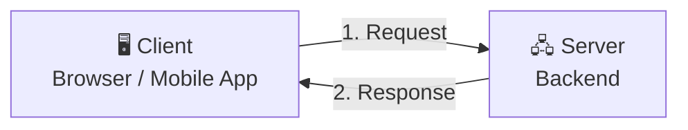

Simple, right? But here's where it gets interesting.

---

### 💡 Can an App Server Also Act as a Client?

This is a question most beginners don't think about — but it's crucial for system design.

**Yes. Absolutely.**

In real-world systems, your backend server rarely does everything alone. It calls other services — a payment gateway, an email provider, another internal microservice. In those moments, **your server is the client** making requests to someone else's server.

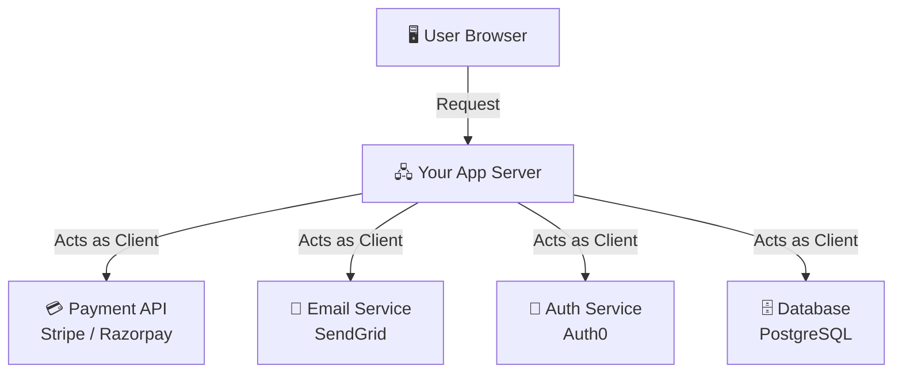

> **Key insight:** Client and Server are **roles**, not machines. The same machine can be a server to one service and a client to another — at the same time.

Now that we know what talks to what — the next question is: **how does a client even find the server?** That's where IP addresses come in.

---

## 2. IP Address

Every device on the internet needs a unique address — otherwise how would data know where to go? That's exactly what an **IP (Internet Protocol) address** solves.

Think of it like a **home address for your computer**. When you send a letter, you write the destination address. When a client sends data, it uses an IP address.

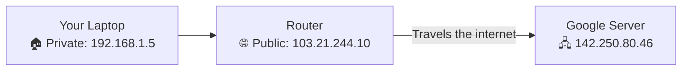

There are two types you'll encounter:

| Type | Example | What it means |
|------|---------|--------------|
| **Private IP** | `192.168.1.5` | Only works inside your home/office network |
| **Public IP** | `103.21.244.10` | Visible on the internet — your router's identity |
| **IPv4** | `142.250.80.46` | ~4 billion addresses — almost exhausted |
| **IPv6** | `2001:db8::1` | ~340 undecillion addresses — the future |

Your laptop has a private IP. Your router has a public IP. When you access Google, the request goes from your laptop → router (with its public IP) → Google's server. Google sees your router's public IP, not your laptop's.

But here's the problem — **nobody memorizes IP addresses**. You type `google.com`, not `142.250.80.46`. So how does your browser figure out the IP? That's DNS.

---

## 3. DNS — Domain Name System

DNS is the **phonebook of the internet**. You give it a name like `google.com` and it gives you back the IP address.

But it's not just one server doing this — it's a whole hierarchy working together. Let's trace exactly what happens when you type `google.com`:

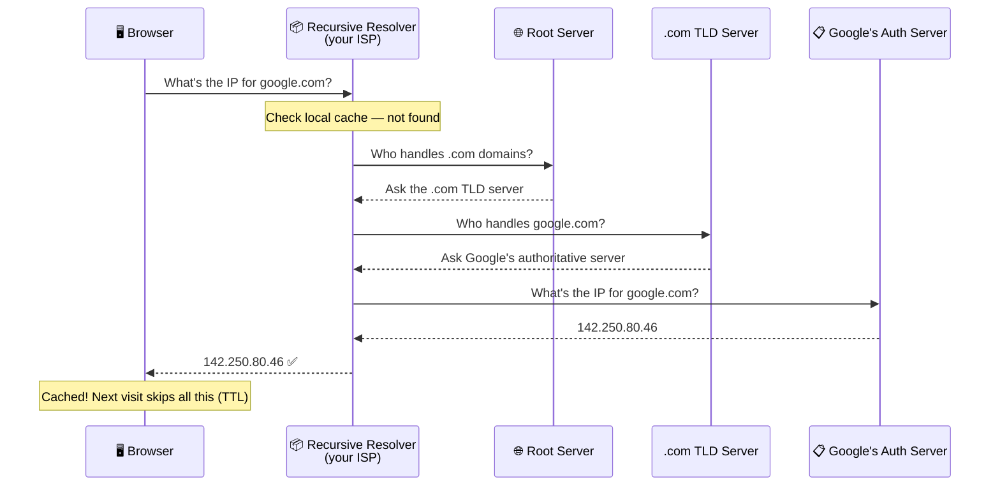

This whole lookup takes **milliseconds** — and after that, the result is cached so the next visit is instant.

---

### 💡 Why Does DNS Use UDP Instead of TCP?

This is a classic interview question. DNS is supposed to be "reliable" — so why use UDP which doesn't guarantee delivery?

The answer is about **pragmatism over purity**:

| Reason | Explanation |
|--------|-------------|
| **Speed matters** | UDP skips the 3-way handshake — sends immediately |
| **Tiny payloads** | DNS queries are tiny (~50 bytes) — fits in a single UDP packet |
| **Simple retry** | If no response in 500ms, the DNS client just asks again — reliability at the app level |
| **Stateless by nature** | A DNS lookup is a single question → single answer. No need to maintain a connection. |

> DNS *does* use TCP — but only for large responses like zone transfers or DNSSEC. For the billions of everyday lookups, UDP wins.

Now we know how the client finds the server. But how does the actual data get from one machine to another? To understand that, we need to look at how networking is structured — enter the OSI model.

---

## 4. OSI Model

When engineers built the internet, they faced a huge challenge — how do you get a message from one computer to another, across different hardware, different software, different countries?

Their solution: **break the problem into layers**. Each layer solves one specific problem and hands off to the next. That's the **OSI (Open Systems Interconnection) model** — 7 layers, each with a single responsibility.

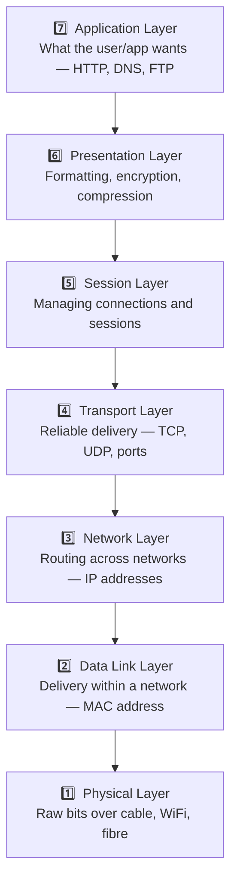

**Memory trick (top → bottom):** *"All People Seem To Need Data Processing"*

When you send an HTTP request, data travels **down** all 7 layers on your machine, across the network, and back **up** all 7 layers on the server's machine. Each layer wraps the data with its own header (called **encapsulation**).

In practice though, engineers rarely talk in all 7 layers. The industry simplified this into the **TCP/IP model**.

---

## 5. TCP/IP Model

The TCP/IP model collapses the OSI's 7 layers into 4 practical ones — this is what the real internet actually runs on.

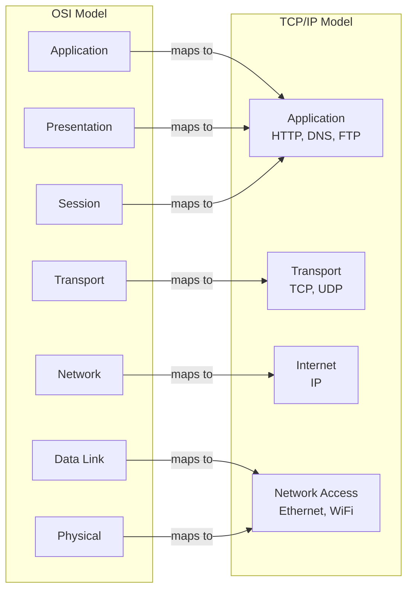

For system design interviews, the two layers you'll talk about most are:
- **Transport Layer** — TCP vs UDP (reliability, speed)
- **Application Layer** — HTTP, WebSockets, gRPC

Let's go deeper on both. Starting with Transport.

---

## 6. Transport Layer — TCP vs UDP

The Transport layer answers one question: **how should we deliver this data?**

There are two protocols, each with a very different philosophy.

---

### TCP — When Every Byte Matters

**TCP (Transmission Control Protocol)** guarantees that every packet arrives, in the right order, with no corruption. If a packet is lost, it's retransmitted.

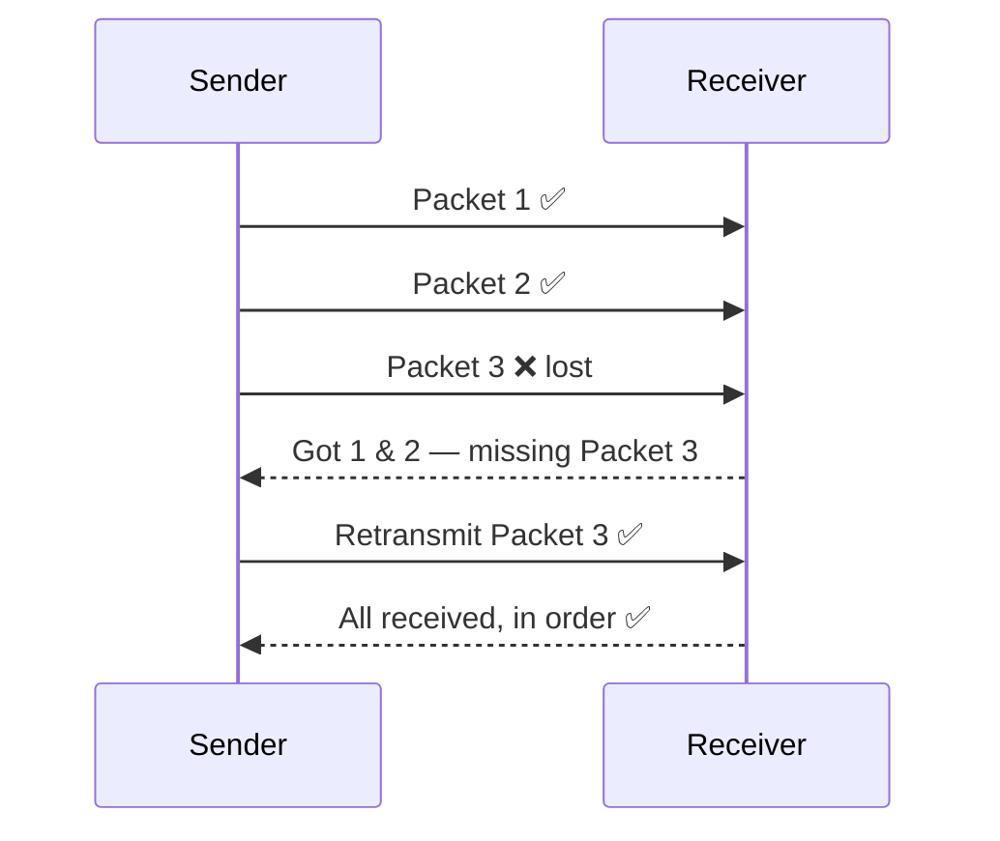

Use TCP when losing data is unacceptable — web pages, file downloads, emails, banking.

---

### UDP — When Speed Matters More

**UDP (User Datagram Protocol)** fires packets and doesn't wait to confirm receipt. Faster, but no guarantees.

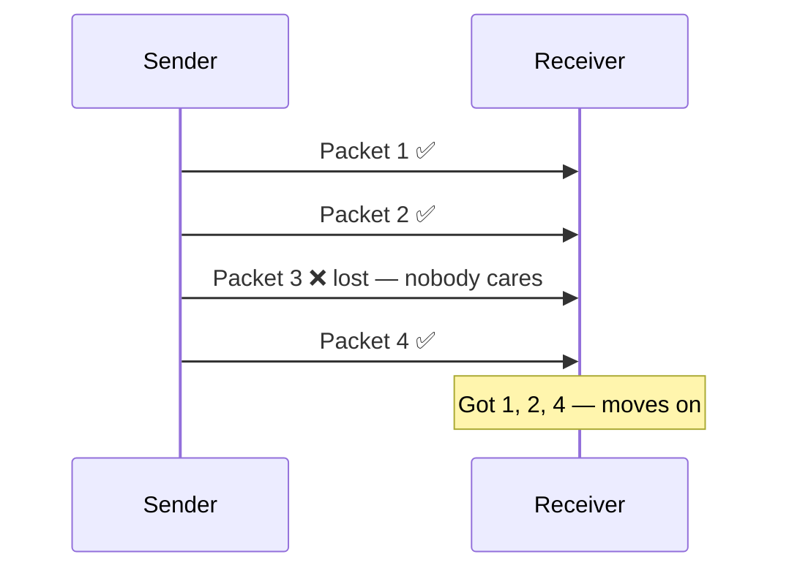

Use UDP when **a little data loss is okay** and speed is critical — video calls, live streams, online gaming, DNS.

---

### TCP vs UDP — Side by Side

| | TCP | UDP |
|--|-----|-----|
| Delivery guarantee | ✅ Yes | ❌ No |
| Ordered packets | ✅ Yes | ❌ No |
| Speed | Slower | ✅ Faster |
| Connection needed | ✅ Yes (handshake) | ❌ No |
| Use cases | HTTP, FTP, Email | Video calls, Gaming, DNS, Streaming |

---

## 7. 3-Way Handshake

Before TCP can transfer any data, it needs to establish a **trusted connection** between client and server. This is done through the **3-way handshake**.

Think of it like two people agreeing to have a conversation before actually talking:

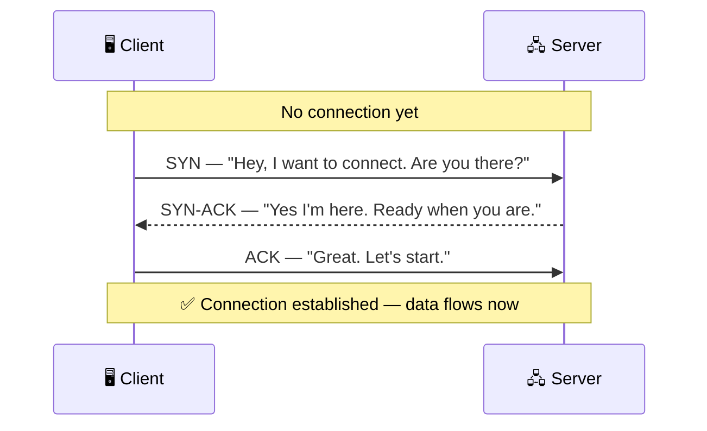

| Step | Message | Meaning |
|------|---------|---------|
| 1 | **SYN** | Client initiates — "synchronize sequence numbers" |
| 2 | **SYN-ACK** | Server acknowledges and responds |
| 3 | **ACK** | Client confirms — channel is open |

> This handshake costs **1 round trip** before any real data moves. At scale, this latency adds up — it's one reason HTTP/2 and HTTP/3 were built to reduce connection overhead.

Now that we have a reliable connection, it's time for the application layer to take over and actually send useful data.

---

## 8. Application Layer & Protocols

The **Application Layer** is where your actual product lives. It doesn't care how packets travel — it just uses the transport layer and gets on with the job.

Different use cases need different protocols:

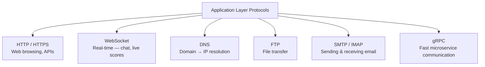

The one you'll use the most — and the one that powers the entire web — is **HTTP**.

---

## 9. HTTP — Versions & Methods

**HTTP (HyperText Transfer Protocol)** is the language of the web. Every time your browser loads a page or your app calls an API, it's speaking HTTP.

---

### HTTP Has Evolved — Here's Why

The web got faster and more complex over time. Each version of HTTP solved a specific bottleneck:

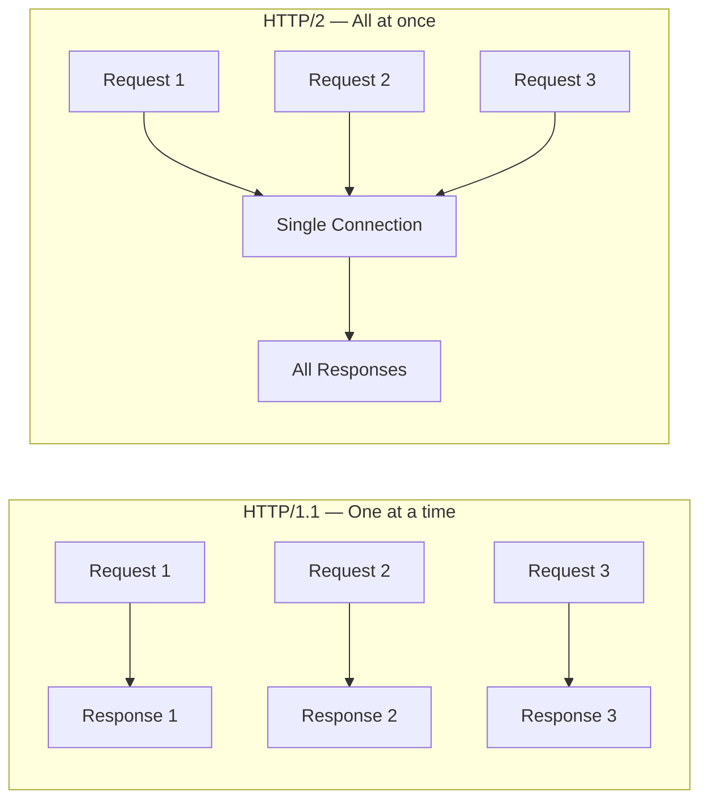

| Version | Key Improvement | Limitation |
|---------|----------------|-----------|
| **HTTP/1.0** | Basic request/response | New connection every request |
| **HTTP/1.1** | Persistent connections | Only one request at a time per connection |
| **HTTP/2** | Multiplexing — many requests one connection | Still TCP — head-of-line blocking |
| **HTTP/3** | Built on UDP (QUIC) — no head-of-line blocking | Newer, not everywhere yet |

---

### HTTP Methods

HTTP methods tell the server **what you want to do**:

| Method | Action | Example |
|--------|--------|---------|
| `GET` | Fetch data | Get a user's profile |
| `POST` | Create something new | Submit a signup form |
| `PUT` | Replace entire resource | Update a full user record |
| `PATCH` | Partial update | Change only the email field |
| `DELETE` | Remove something | Delete a post |

---

### HTTP Status Codes

The server always replies with a **status code** telling you what happened:

| Code | Meaning | Examples |
|------|---------|---------|
| `2xx` | ✅ Success | 200 OK, 201 Created, 204 No Content |
| `3xx` | ↩️ Redirect | 301 Moved Permanently, 304 Not Modified |
| `4xx` | ❌ Client's fault | 400 Bad Request, 401 Unauthorized, 404 Not Found |
| `5xx` | 🔥 Server's fault | 500 Internal Error, 503 Service Unavailable |

Now we have HTTP working. But there's a problem — anyone on the network can **read** your HTTP traffic. That's why HTTPS exists.

---

## 10. HTTPS & Encryption

**HTTP sends data as plain text.** If someone intercepts your request (a hacker on public WiFi, your ISP, a government), they can read your passwords, card numbers, messages — everything.

**HTTPS = HTTP + TLS encryption.** It wraps all HTTP traffic in an encrypted tunnel.

---

### Why Use HTTPS?

| Without HTTPS | With HTTPS |
|--------------|-----------|
| Passwords visible to attackers | Encrypted — unreadable |
| Responses can be tampered with | Integrity is verified |
| Fake server can impersonate real one | Certificate proves server identity |
| ISP can log everything you do | Only sees encrypted bytes |

---

### How Does HTTPS Actually Work? (TLS Handshake)

Before encrypted data flows, the client and server do a **TLS handshake** to agree on encryption keys:

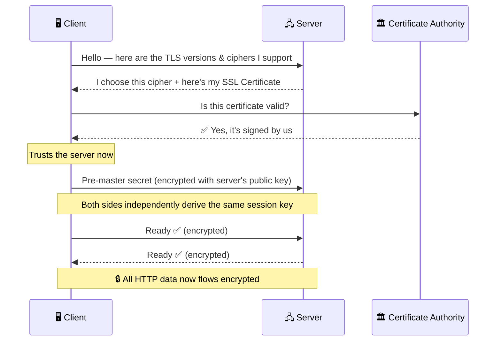

---

### The Three Types of Encryption

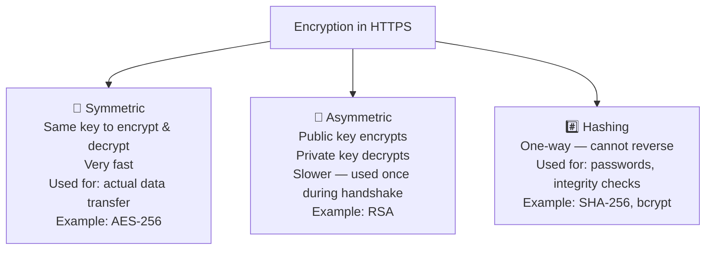

> **The clever part of HTTPS:** Asymmetric encryption is used *only during the handshake* to securely exchange a symmetric key. After that, the much faster symmetric encryption handles all actual data. Best of both worlds.

---

## ❓ Interview Questions

**Foundation**
1. Can an app server act as a client? Give a real-world example.
2. What is the difference between a public IP and a private IP?
3. What is IPv4 vs IPv6 and why are we moving to IPv6?

**DNS**

4. Explain how DNS resolution works step-by-step.
5. Why does DNS use UDP instead of TCP? When does DNS switch to TCP?

**OSI & TCP/IP**

6. What are the 7 layers of the OSI model? Which ones matter most in system design?
7. How does the TCP/IP model differ from OSI?

**TCP vs UDP**

8. What is the difference between TCP and UDP? When would you choose one over the other?
9. Explain the TCP 3-way handshake. Why is it necessary?
10. What is head-of-line blocking? How does HTTP/2 and HTTP/3 address it?

**HTTP & HTTPS**

11. What are the key differences between HTTP/1.1, HTTP/2, and HTTP/3?
12. What is HTTPS and how does TLS encryption work?
13. What is the difference between symmetric and asymmetric encryption? How does HTTPS use both?
14. A user says your website is slow — walk through the full request lifecycle to identify where the bottleneck might be.

---
