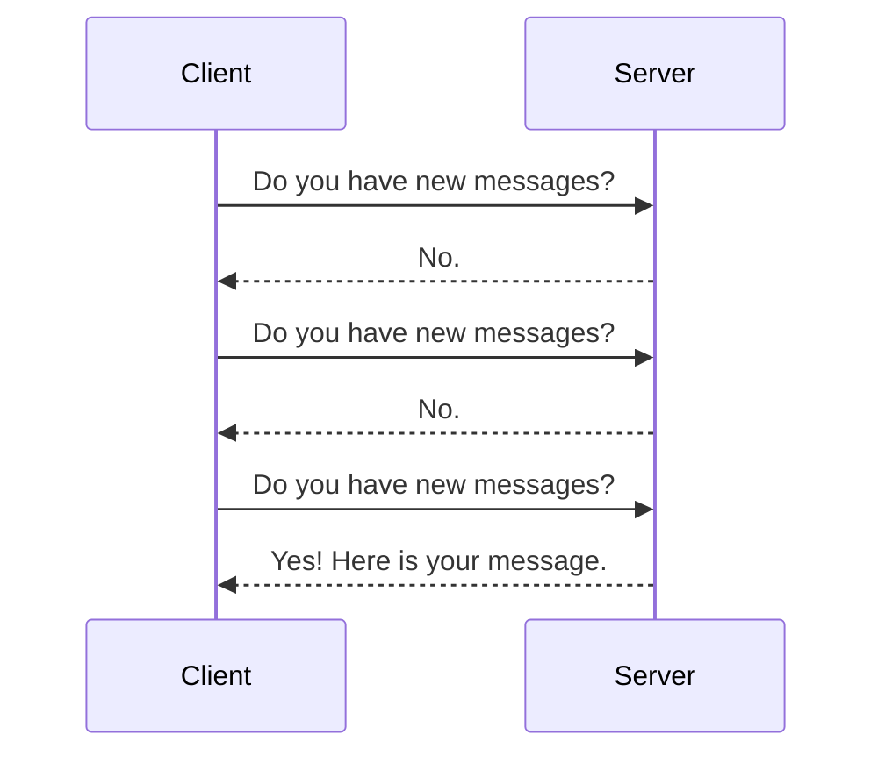
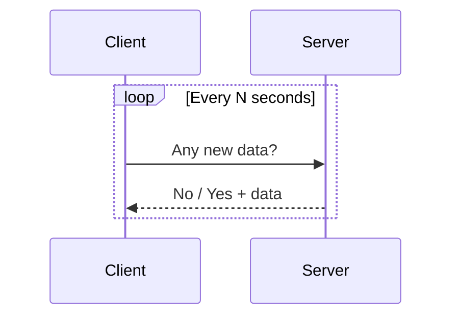
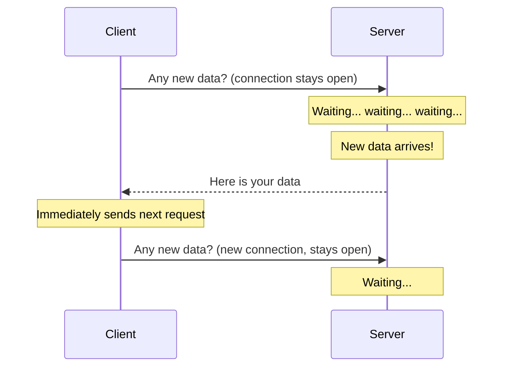
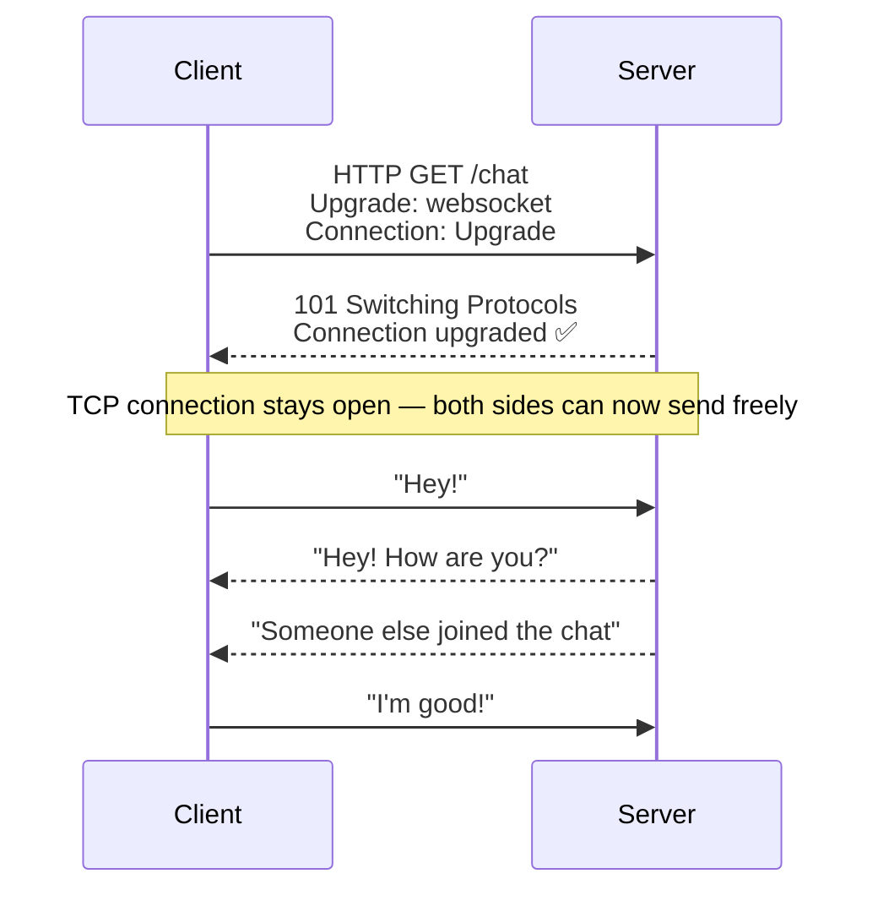
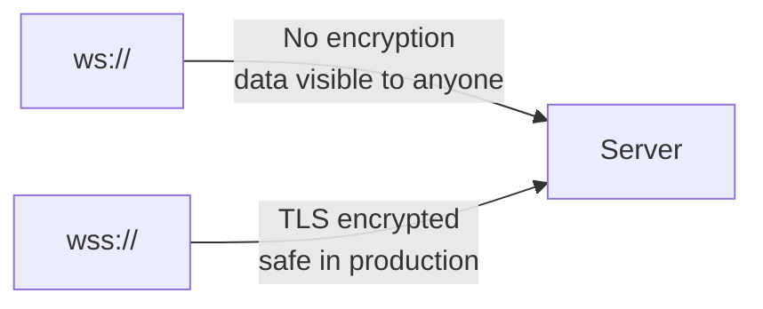
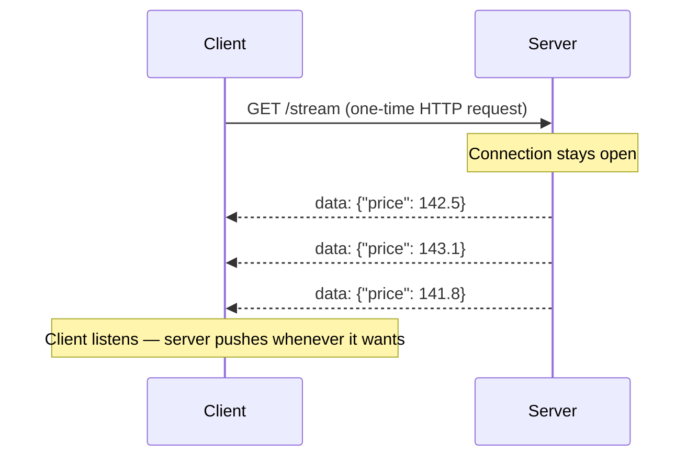
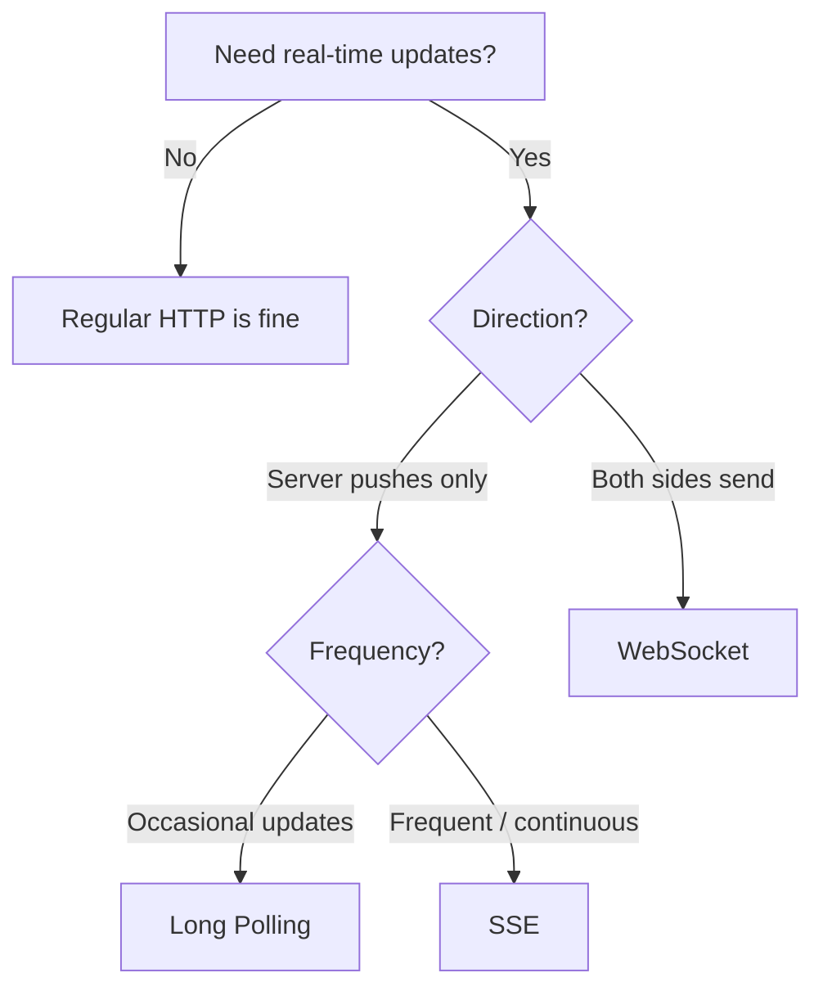

# 03. Real-Time Communication — Polling, WebSockets & SSE

> HTTP was built for a request-response world. But what happens when the server needs to push data to the client — without the client asking? This topic covers every technique built to solve that problem, why each one exists, and when to use which.

---

## Table of Contents

1. [The Problem with HTTP for Real-Time](#1-the-problem-with-http-for-real-time)
2. [Short Polling](#2-short-polling)
3. [Long Polling](#3-long-polling)
4. [WebSockets](#4-websockets)
5. [WSS — WebSocket Secure](#5-wss--websocket-secure)
6. [Server-Sent Events (SSE)](#6-server-sent-events-sse)
7. [Comparison — Which One to Use](#7-comparison--which-one-to-use)
8. [Interview Questions](#-interview-questions)

---

## 1. The Problem with HTTP for Real-Time

You already know HTTP — a client sends a request, the server responds, connection closes. Clean and simple.

But what if you are building a chat app? A live score tracker? A stock price feed?

The server has **new data** — but HTTP has no way to push it to the client. The client has to ask first. Always.



This is the core problem. Engineers solved it in three different ways — each a tradeoff between simplicity and efficiency. Let's go through them in order of how the industry evolved.

---

## 2. Short Polling

### What is it?

Short polling is the simplest approach. The client asks the server repeatedly on a fixed interval — every 1 second, every 5 seconds, whatever you set.



### How it connects to HTTP

Short polling is just **regular HTTP requests in a loop**. No special protocol. Your client makes a GET request on a timer, reads the response, waits, and repeats.

### Code Example

**Client (JavaScript)**
```javascript
function shortPoll() {
  setInterval(async () => {
    const response = await fetch('/api/messages');
    const data = await response.json();

    if (data.messages.length > 0) {
      renderMessages(data.messages);
    }
  }, 3000); // asks every 3 seconds
}
```

**Server (Node.js / Express)**
```javascript
app.get('/api/messages', (req, res) => {
  const messages = getNewMessages(); // fetch from DB
  res.json({ messages });
});
```

### Advantages

- Dead simple to implement — just a loop with fetch
- Works everywhere — no special browser or server support needed
- Easy to debug — it's just HTTP

### Disadvantages

- **Wasteful** — most responses are empty ("No new data") — you are making hundreds of useless requests
- **Not truly real-time** — there is always a delay equal to your polling interval
- **Server overload** — 10,000 users polling every second = 10,000 requests/second even when nothing is happening
- **Battery drain** — especially bad on mobile

### Real-World Example

Old email clients used to do this — checking for new email every 30 seconds. You would notice the small lag before a new email appeared.

---

## 3. Long Polling

### What is it?

Long polling is a smarter version of short polling. Instead of the server responding immediately with "nothing new", it **holds the connection open** and waits until it actually has something to send back.



### How it connects to HTTP

Long polling is still HTTP — but the server deliberately **delays the response** until data is available or a timeout is reached (usually 30–60 seconds). If timeout hits with no data, the server sends an empty response and the client immediately reconnects.

### Code Example

**Client (JavaScript)**
```javascript
async function longPoll() {
  while (true) {
    try {
      const response = await fetch('/api/messages/wait');
      const data = await response.json();

      if (data.messages.length > 0) {
        renderMessages(data.messages);
      }
    } catch (err) {
      // connection timed out or error — wait briefly and retry
      await new Promise(resolve => setTimeout(resolve, 1000));
    }

    // immediately reconnect — no delay
  }
}
```

**Server (Node.js / Express)**
```javascript
app.get('/api/messages/wait', (req, res) => {
  // Hold the connection open — check for new messages
  const timeout = setTimeout(() => {
    res.json({ messages: [] }); // timeout — send empty response
  }, 30000); // 30 second max wait

  // Subscribe to new message events
  onNewMessage((messages) => {
    clearTimeout(timeout);
    res.json({ messages }); // respond as soon as data arrives
  });
});
```

### Advantages

- More efficient than short polling — fewer empty responses
- Works on all browsers — no special support needed
- Feels close to real-time when data arrives quickly

### Disadvantages

- **Server holds connections open** — 10,000 users = 10,000 open connections eating memory
- **Still HTTP overhead** — each cycle reconnects, re-sends headers
- **Not truly bidirectional** — server can only send when the client has an open request waiting
- **Complex server logic** — managing pending connections and timeouts is tricky

### Real-World Example

Facebook chat used long polling before switching to WebSockets. Gmail still uses a variant of it as a fallback for older clients.

---

## 4. WebSockets

### What is it?

WebSockets are a completely different approach. Instead of repeatedly opening and closing HTTP connections, a WebSocket establishes a **single persistent, bidirectional connection** between client and server. Both sides can send data to each other at any time — no asking, no waiting.

### How it Works — The Upgrade Handshake

WebSocket starts as an HTTP request and then upgrades the connection:



The HTTP handshake happens once. After that, the protocol switches to WebSocket and the connection stays open indefinitely — until one side closes it.

### Why WebSocket is Better Than HTTP for Real-Time

| | HTTP (Polling) | WebSocket |
|--|---------------|-----------|
| Connection | Opens and closes every request | One persistent connection |
| Direction | Client → Server only | Both ways, anytime |
| Latency | Polling interval delay | Near zero — instant push |
| Overhead | Full HTTP headers every request | Tiny frames after handshake |
| Server load | High — many repeated requests | Low — one connection per client |

### Code Example

**Client (JavaScript)**
```javascript
const socket = new WebSocket('ws://yourserver.com/chat');

// Connection opened
socket.addEventListener('open', () => {
  console.log('Connected to server');
  socket.send(JSON.stringify({ type: 'join', room: 'general' }));
});

// Receive messages from server
socket.addEventListener('message', (event) => {
  const data = JSON.parse(event.data);
  renderMessage(data);
});

// Send a message
function sendMessage(text) {
  socket.send(JSON.stringify({ type: 'message', text }));
}

// Handle disconnect
socket.addEventListener('close', () => {
  console.log('Disconnected — attempting reconnect...');
  setTimeout(connectSocket, 3000);
});
```

**Server (Node.js with `ws` library)**
```javascript
const WebSocket = require('ws');
const wss = new WebSocket.Server({ port: 8080 });

const clients = new Set();

wss.on('connection', (ws) => {
  clients.add(ws);
  console.log('Client connected. Total:', clients.size);

  ws.on('message', (rawData) => {
    const data = JSON.parse(rawData);

    // Broadcast to all connected clients
    clients.forEach((client) => {
      if (client.readyState === WebSocket.OPEN) {
        client.send(JSON.stringify(data));
      }
    });
  });

  ws.on('close', () => {
    clients.delete(ws);
    console.log('Client disconnected. Total:', clients.size);
  });
});
```

### Advantages

- True real-time — no polling delay
- Full bidirectional — server and client both push freely
- Low overhead — headers only on initial handshake
- Efficient at scale — one connection vs constant reconnections

### Disadvantages

- **Stateful** — server must track all open connections (harder to scale horizontally)
- **Load balancer complexity** — sticky sessions needed so a client always hits the same server
- **Reconnection logic** — you must handle disconnects yourself
- **Not HTTP** — firewalls and proxies sometimes block WebSocket connections

### Real-World Examples

WhatsApp, Slack, Discord — all use WebSockets for instant messaging. Online multiplayer games use them for real-time state sync.

---

## 5. WSS — WebSocket Secure

WSS is to WebSocket what HTTPS is to HTTP — the **encrypted version**.



- `ws://` — plain WebSocket, unencrypted. Only for local development.
- `wss://` — WebSocket over TLS. Always use this in production.

WSS uses the same TLS handshake as HTTPS. After the secure channel is established, the WebSocket upgrade happens inside it. All data transmitted is encrypted end-to-end.

```javascript
// Development
const socket = new WebSocket('ws://localhost:8080');

// Production — always use wss
const socket = new WebSocket('wss://yourserver.com/chat');
```

> If your page is served over HTTPS, the browser will **block** any `ws://` connections. You must use `wss://`.

---

## 6. Server-Sent Events (SSE)

### What is it?

SSE is a middle ground between long polling and WebSockets. It keeps an HTTP connection open but only allows **one-way communication — server to client**. The server can push updates whenever it wants, but the client cannot send data back over the same connection.



### How it Works

SSE uses regular HTTP with a special content type `text/event-stream`. The server never closes the response — it just keeps writing data to it.

### Code Example

**Client (JavaScript)**
```javascript
const eventSource = new EventSource('/api/stock-prices');

eventSource.onmessage = (event) => {
  const data = JSON.parse(event.data);
  updatePriceDisplay(data.price);
};

eventSource.onerror = () => {
  console.log('Connection lost — browser auto-reconnects');
};

// To stop listening
// eventSource.close();
```

**Server (Node.js / Express)**
```javascript
app.get('/api/stock-prices', (req, res) => {
  // Set SSE headers
  res.setHeader('Content-Type', 'text/event-stream');
  res.setHeader('Cache-Control', 'no-cache');
  res.setHeader('Connection', 'keep-alive');

  // Send a price update every second
  const interval = setInterval(() => {
    const price = getLatestStockPrice();
    res.write(`data: ${JSON.stringify({ price })}\n\n`);
  }, 1000);

  // Cleanup when client disconnects
  req.on('close', () => {
    clearInterval(interval);
  });
});
```

### Advantages

- Simpler than WebSockets — uses plain HTTP
- **Auto-reconnect built in** — browser handles reconnection automatically
- Works through HTTP/2 — can multiplex many SSE streams over one connection
- Easy to implement — no special libraries needed

### Disadvantages

- **One-way only** — server to client. Client cannot send data back over SSE.
- **Limited by HTTP** — max 6 concurrent SSE connections per domain in HTTP/1.1 (solved by HTTP/2)
- Not suitable for bidirectional use cases like chat

### Real-World Examples

Live sports scores, stock price tickers, progress bars for long-running tasks, ChatGPT's streaming responses — all use SSE.

---

## 7. Comparison — Which One to Use



| | Short Polling | Long Polling | WebSocket | SSE |
|--|--------------|-------------|-----------|-----|
| Direction | Client → Server | Client → Server | Both ways | Server → Client |
| Real-time | No | Near real-time | Yes | Yes |
| HTTP | Yes | Yes | Starts as HTTP, upgrades | Yes |
| Auto-reconnect | Manual | Manual | Manual | Built-in |
| Complexity | Low | Medium | High | Low |
| Use case | Simple checks | Chat fallback | Chat, gaming | Feeds, notifications |

### Decision Guide

- Building a **chat app or multiplayer game** → WebSocket
- Building a **live feed, price ticker, or notification stream** → SSE
- Need a **simple fallback** for older environments → Long Polling
- Checking for updates **occasionally** (not real-time critical) → Short Polling

---

## Interview Questions

**Polling**
1. What is the difference between short polling and long polling?
2. Why is short polling wasteful at scale? How would you calculate the server load for 10,000 users polling every second?
3. When would you still choose long polling over WebSockets?

**WebSockets**
1. Explain how the WebSocket handshake works. What HTTP status code is returned?
2. Why are WebSockets better than HTTP for real-time communication?
3. WebSockets are stateful — how does this create challenges when scaling horizontally? How would you solve it?
4. What is the difference between `ws://` and `wss://`? Why must you always use `wss://` in production?
5. How would you handle WebSocket reconnection on the client side?

**SSE**
1. What is SSE and how does it differ from WebSockets?
2. SSE is built on HTTP — what advantage does this give over WebSockets?
3. What is the browser limit on concurrent SSE connections in HTTP/1.1? How does HTTP/2 solve this?

**System Design**
1. You are designing a live cricket score app for 5 million users. Which real-time technique would you use and why?
2. How does ChatGPT stream its responses token by token to the browser?
3. Design a notification system — would you use polling, WebSockets, or SSE? Justify your choice.

---
