# 04. Monolith, Microservices, RPC, gRPC & Webhooks

> This topic is where architecture decisions get real. Every startup begins with a monolith. Every company that scales hits the wall. Understanding when to break things apart — and how services talk to each other once you do — is what separates a junior developer from a senior engineer.

---

## Table of Contents

1. [Monolith Architecture](#1-monolith-architecture)
2. [Microservices Architecture](#2-microservices-architecture)
3. [Monolith vs Microservices — The Real Trade-off](#3-monolith-vs-microservices--the-real-trade-off)
4. [How Microservices Talk — Communication Patterns](#4-how-microservices-talk--communication-patterns)
5. [RPC — Remote Procedure Call](#5-rpc--remote-procedure-call)
6. [gRPC — Google's RPC Framework](#6-grpc--googles-rpc-framework)
7. [Webhooks](#7-webhooks)
8. [Putting It All Together](#8-putting-it-all-together)
9. [Interview Questions](#-interview-questions)

---

## 1. Monolith Architecture

### What is it?

A monolith is a single, unified application where **all features live in one codebase and are deployed together**.

Auth, payments, user profiles, notifications, order management — all in one place, all deployed as one unit.

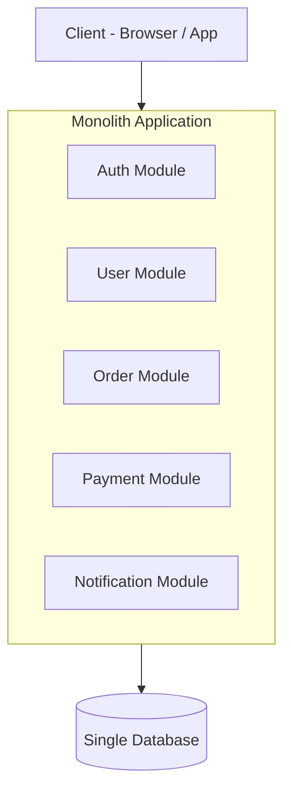

This is not a bad thing. This is how **every great company started**.

- Amazon — monolith until ~2002
- Netflix — monolith until ~2008
- Shopify — largely monolith, still runs one of the biggest Rails apps in the world
- Stack Overflow — serves millions of users on a monolith today

### Why Start With a Monolith?

When you are building something new, you do not fully understand your domain yet. You will change your mind about how features interact. A monolith lets you move fast without the overhead of distributed systems.


No network calls between services. No service discovery. No distributed tracing. Just code and ship.

### Advantages

| Advantage | Why it matters |
|-----------|---------------|
| Simple to develop | One codebase, one repo, one deploy |
| Easy to debug | One log stream, one stack trace |
| Fast local development | Run everything with one command |
| No network overhead | Function calls, not HTTP requests |
| Easier testing | End-to-end tests in one process |
| Low operational complexity | One app to monitor and manage |

### Disadvantages

| Disadvantage | What it looks like in practice |
|-------------|-------------------------------|
| Scaling is all-or-nothing | If payments need more CPU, you scale the entire app |
| One bug can bring down everything | A memory leak in notifications kills auth |
| Deployments get scary | Touching any code requires deploying the whole app |
| Tech stack is locked in | Chose PHP in 2010? You're still writing PHP. |
| Team bottlenecks | 50 engineers editing the same codebase = merge conflicts daily |
| Long build & test times | As codebase grows, CI takes 30+ minutes |

### The Monolith Pain Point — When Do You Feel It?

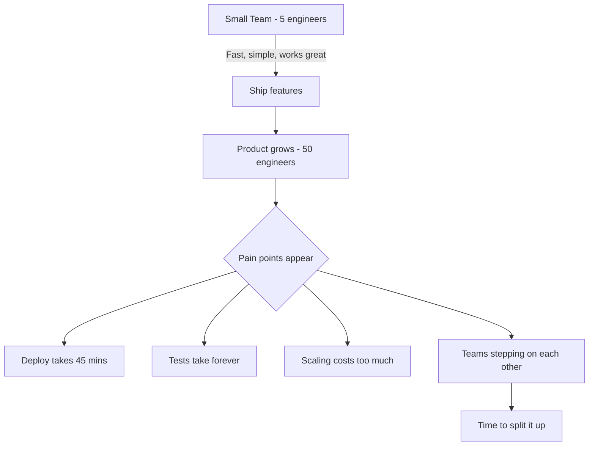

> Senior dev insight: The monolith does not fail you on day one. It fails you silently, gradually — until one day a deploy takes 45 minutes and a single bug in the email module crashes your entire checkout flow.

---

## 2. Microservices Architecture

### What is it?

Microservices break the monolith into **small, independently deployable services**, each owning a single business capability. They communicate over the network — via HTTP APIs, RPC, or message queues.

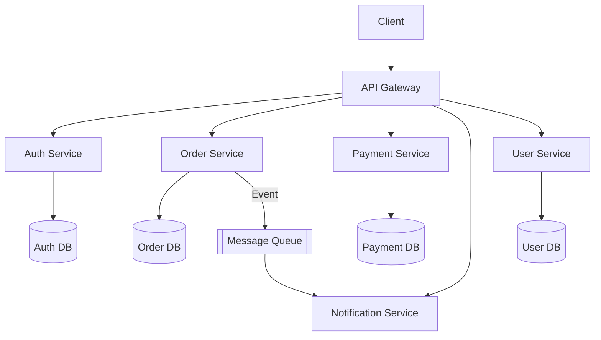

Each service:
- Has its **own database** — no sharing
- Can be **deployed independently**
- Can be written in a **different language**
- Can be **scaled independently**

### Advantages

| Advantage | Why it matters |
|-----------|---------------|
| Independent scaling | Scale only payment service during sales, not everything |
| Independent deployment | Fix a bug in notifications without touching payments |
| Tech freedom | Payment service in Go, ML service in Python, frontend in Node |
| Team autonomy | 5 teams own 5 services — no merge conflicts across teams |
| Fault isolation | Notification service down? Orders still work. |
| Smaller codebases | Easier to understand, test, and onboard into |

### Disadvantages

| Disadvantage | What it looks like in practice |
|-------------|-------------------------------|
| Distributed system complexity | Network calls fail. Latency increases. Timeouts happen. |
| Data consistency is hard | No shared database = no simple ACID transactions across services |
| Debugging is painful | One user request touches 6 services — where did it fail? |
| Operational overhead | 10 services = 10 CI pipelines, 10 log streams, 10 monitoring dashboards |
| Service discovery needed | How does Order service find Payment service? |
| Latency adds up | 6 hops of 10ms each = 60ms added before anything useful happens |

### The Hidden Cost Nobody Talks About

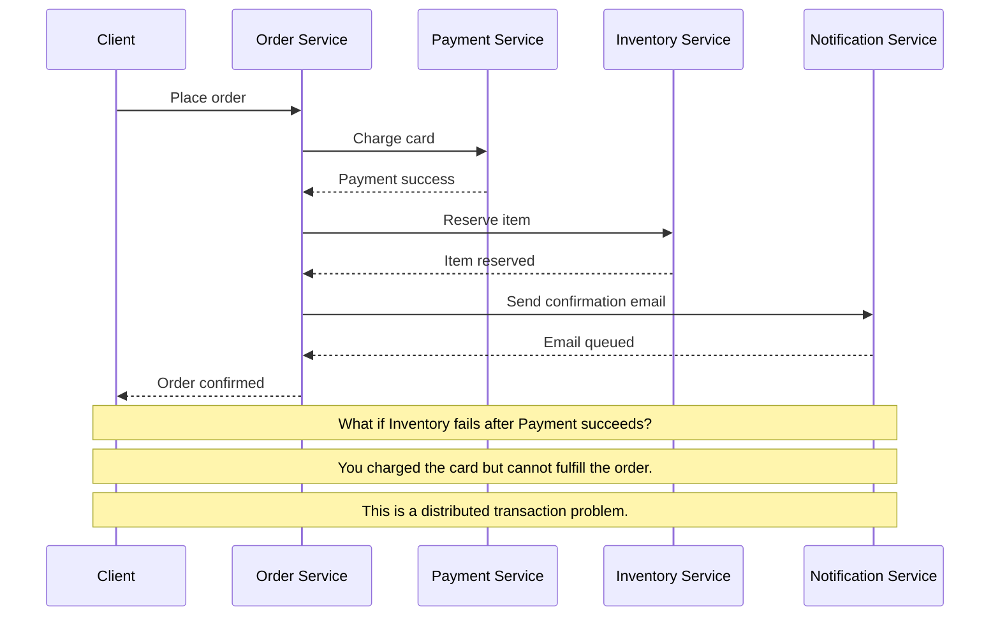

This is why senior engineers say: **microservices trade code complexity for operational complexity**. The bugs do not go away — they just move from your codebase to your network.

---

## 3. Monolith vs Microservices — The Real Trade-off

Most articles make this sound like a clear choice. It is not.

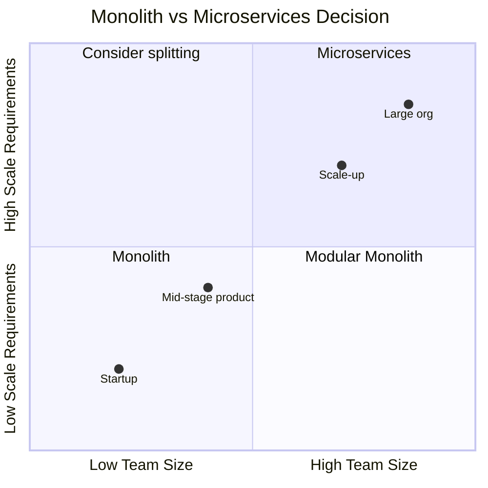

### The Rule Every Senior Engineer Follows

> Start with a monolith. Break it apart **only when the monolith actually hurts** — not when you think it might hurt someday.

| Signal | What to do |
|--------|-----------|
| Small team, early product | Monolith |
| One module slowing everyone down | Extract that one module |
| One module needs 10x more scale | Extract and scale independently |
| Teams constantly breaking each other | Define service boundaries |
| Compliance requires data isolation | Split that data domain |

### The Modular Monolith — The Best of Both

There is a middle ground most people skip. A **modular monolith** keeps one deployment unit but enforces strict module boundaries in code — so you get monolith simplicity now and a clear migration path to microservices later.

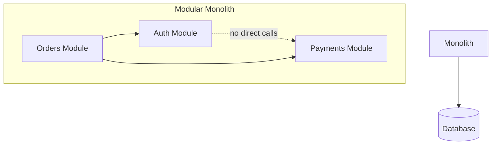

Shopify does this. Basecamp does this. It works.

---

## 4. How Microservices Talk — Communication Patterns

Once you have multiple services, they need to communicate. There are two fundamental patterns:

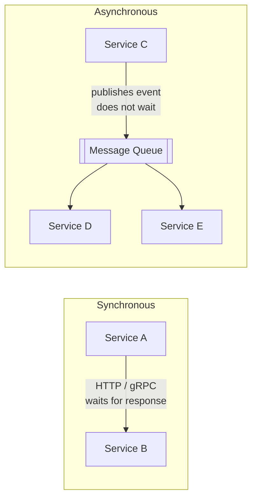

| | Synchronous | Asynchronous |
|--|-------------|-------------|
| Pattern | HTTP REST, gRPC, RPC | Message queues, events |
| Coupling | Tight — caller waits | Loose — caller moves on |
| Latency | Adds up across hops | Decoupled from response time |
| Failure handling | If B is down, A fails | If B is down, message waits |
| Use case | Real-time response needed | Background tasks, fan-out |

---

## 5. RPC — Remote Procedure Call

### What is it?

RPC lets you **call a function on another machine as if it were a local function**. The network call is hidden from the developer — you just call `userService.getUser(id)` and get a result back.

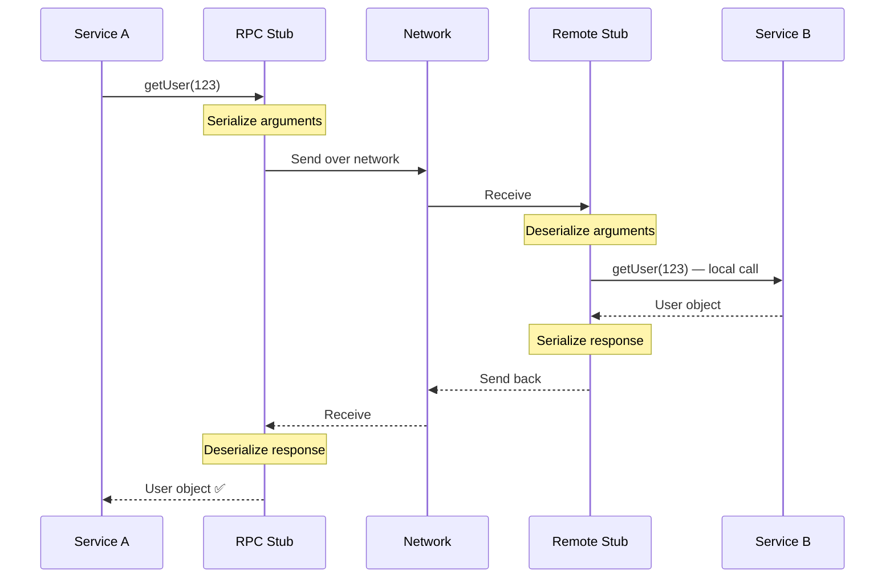

From Service A's perspective — it just called a function. The entire network roundtrip is invisible.

### The Problem with Traditional RPC

Early RPC implementations (XML-RPC, SOAP) were:
- Slow — XML is verbose and heavy
- Brittle — changing a function signature broke clients
- Hard to debug — opaque binary formats

This is what gRPC was built to fix.

---

## 6. gRPC — Google's RPC Framework

### What is it?

gRPC is a modern, high-performance RPC framework built by Google. It uses **Protocol Buffers (Protobuf)** as its data format and runs over **HTTP/2**.

It solves the problems of traditional RPC:
- Protobuf is binary — 3-10x smaller than JSON
- HTTP/2 — multiplexed, bidirectional streaming
- Strongly typed contracts via `.proto` files — changes are controlled

### How gRPC Works

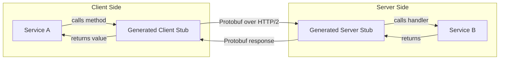

### Defining a gRPC Service

You write a `.proto` file — this is the contract both services agree on:

```protobuf
// user.proto
syntax = "proto3";

service UserService {
  rpc GetUser (GetUserRequest) returns (UserResponse);
  rpc ListUsers (ListUsersRequest) returns (stream UserResponse);
}

message GetUserRequest {
  string user_id = 1;
}

message UserResponse {
  string user_id = 1;
  string name = 2;
  string email = 3;
  int32 age = 4;
}
```

gRPC generates client and server code from this file — in any language you choose.

### gRPC Streaming — 4 Modes

This is where gRPC gets powerful. Unlike REST which is always request-response, gRPC supports streaming:

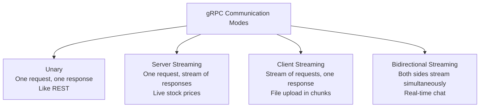

### gRPC vs REST

| | REST / HTTP | gRPC |
|--|-------------|------|
| Protocol | HTTP/1.1 usually | HTTP/2 |
| Data format | JSON (text, verbose) | Protobuf (binary, compact) |
| Contract | Optional (OpenAPI) | Mandatory (.proto file) |
| Code generation | Manual or optional | Auto-generated clients |
| Streaming | Limited (SSE, WebSocket) | Native — 4 modes |
| Browser support | Universal | Limited (needs grpc-web) |
| Debugging | Easy — JSON readable | Harder — binary format |
| Best for | Public APIs, browser clients | Internal microservices |

### When to Use gRPC

- Internal service-to-service communication where performance matters
- Polyglot environments — teams using different languages
- Real-time streaming between backend services
- When you need strict API contracts enforced by the compiler

### When NOT to Use gRPC

- Public APIs that browser JavaScript calls directly — use REST
- Simple CRUD services where JSON readability matters
- Teams that do not want the Protobuf learning curve

---

## 7. Webhooks

### What is it?

A webhook is the **reverse of an API call**. Instead of your server asking another service "did anything happen?", the other service calls your server when something happens.

It is **event-driven HTTP** — you give a service your URL and it calls you when it has something to tell you.

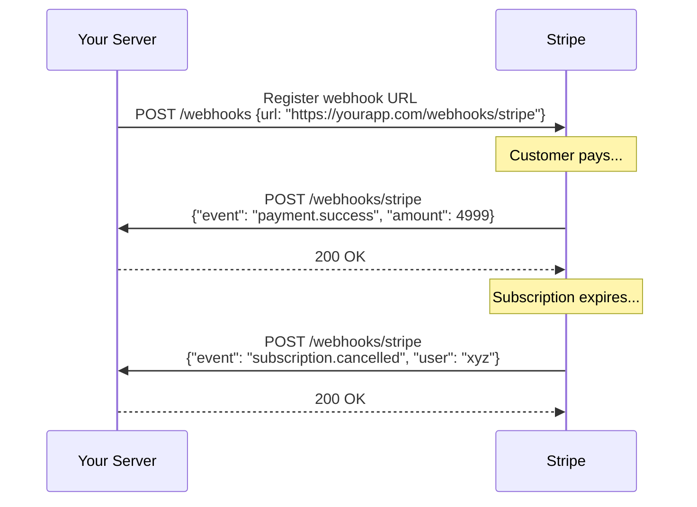

### Polling vs Webhook — The Core Difference

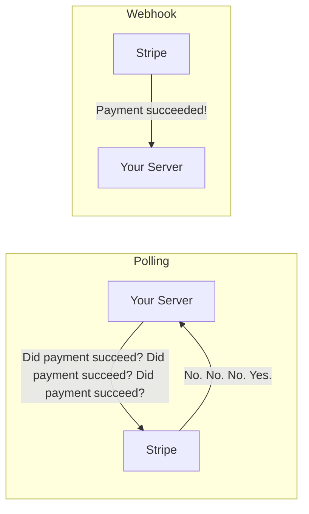

Polling is you calling your friend every 5 minutes asking if the package arrived.
Webhook is the delivery company calling you the moment it arrives.

### Webhook Security — How to Verify the Sender

Anyone can POST to your webhook URL. How do you know it really came from Stripe and not an attacker?

**Signature verification:**

```javascript
const crypto = require('crypto');

app.post('/webhooks/stripe', express.raw({ type: 'application/json' }), (req, res) => {
  const signature = req.headers['stripe-signature'];
  const webhookSecret = process.env.STRIPE_WEBHOOK_SECRET;

  // Stripe signs the payload with your webhook secret
  // Verify the signature matches
  const expectedSignature = crypto
    .createHmac('sha256', webhookSecret)
    .update(req.body)
    .digest('hex');

  if (signature !== `sha256=${expectedSignature}`) {
    return res.status(401).send('Invalid signature');
  }

  const event = JSON.parse(req.body);

  switch (event.type) {
    case 'payment_intent.succeeded':
      fulfillOrder(event.data.object);
      break;
    case 'customer.subscription.deleted':
      cancelUserSubscription(event.data.object);
      break;
  }

  res.json({ received: true });
});
```

### Webhook Reliability — What Happens if Your Server is Down?

This is a critical question in system design.

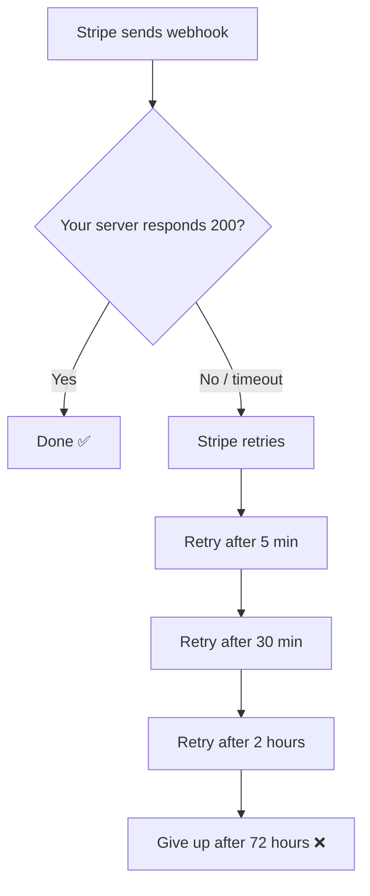

Most webhook providers retry on failure. This means your webhook handler must be **idempotent** — processing the same event twice should not cause problems.

```javascript
// Bad — charges user twice if webhook is delivered twice
async function handlePaymentSuccess(event) {
  await chargeUser(event.userId, event.amount);
}

// Good — check if already processed
async function handlePaymentSuccess(event) {
  const alreadyProcessed = await db.events.findOne({ eventId: event.id });
  if (alreadyProcessed) return;

  await chargeUser(event.userId, event.amount);
  await db.events.insert({ eventId: event.id, processedAt: new Date() });
}
```

### Advantages of Webhooks

| Advantage | Why it matters |
|-----------|---------------|
| No polling needed | Zero wasted requests |
| Real-time | Event delivered instantly |
| Simple to implement | Just an HTTP endpoint |
| Works across companies | Stripe, GitHub, Twilio all use webhooks |

### Disadvantages of Webhooks

| Disadvantage | How to handle it |
|-------------|-----------------|
| Your server must be publicly accessible | Use a tunnel (ngrok) in development |
| No guarantee of delivery | Implement idempotency + retry logic |
| No ordering guarantee | Handle out-of-order events gracefully |
| Security must be implemented manually | Always verify signatures |
| Hard to debug | Log every incoming webhook payload |

### Real-World Webhook Use Cases

- **Stripe** → notifies you when a payment succeeds or a subscription is cancelled
- **GitHub** → calls your CI server when code is pushed
- **Twilio** → calls your server when an SMS is received
- **Shopify** → notifies your fulfillment system when an order is placed

---

## 8. Putting It All Together

Here is how a real system uses all of these together:

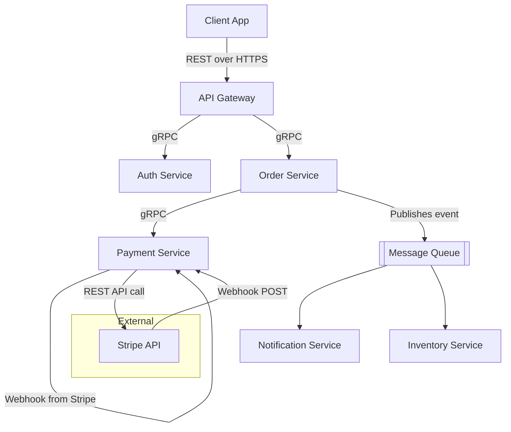

- **Client ↔ Gateway** — REST, because browsers speak HTTP
- **Internal services** — gRPC, because it is fast and strongly typed
- **Background work** — Message queues, because services should not wait on each other
- **External events** — Webhooks, because Stripe tells you when something happens

---

## Interview Questions

**Monolith vs Microservices**
1. What is the difference between a monolith and microservices?
2. Amazon and Netflix started as monoliths. Why did they migrate to microservices?
3. What is a modular monolith? When would you recommend it over microservices?
4. What are the operational challenges of running 50 microservices?
5. How do you handle a transaction that spans multiple microservices? (Saga pattern)
6. If a senior engineer says "we should move to microservices", what questions would you ask before agreeing?

**RPC and gRPC**
1. What is RPC and how does it differ from REST?
2. Why does gRPC use Protobuf instead of JSON? What are the trade-offs?
3. What are the 4 communication modes in gRPC? Give a use case for each.
4. When would you choose gRPC over REST for internal service communication?
5. Why is gRPC not ideal for public-facing APIs consumed by browsers?

**Webhooks**
1. What is a webhook? How is it different from polling?
2. How do you verify that a webhook request actually came from Stripe and not an attacker?
3. What is idempotency and why is it critical for webhook handlers?
4. Your webhook handler is down for 2 hours. What happens to incoming events? How would you design for this?
5. How would you test webhooks during local development?

**System Design**
1. Design a payment notification system. Would you use polling, webhooks, gRPC, or a message queue?
2. You are building an internal microservices platform for a 200-engineer company. How do services communicate with each other?
3. A bug in your notification service is causing it to crash. How does this impact other services in a microservices vs monolith architecture?

---
