# 05. Consistency, Availability & CAP Theorem

> You built the app. It works on your laptop. Now 10 million people use it. Two users update the same data at the same time. A server crashes. Your database has copies in three countries. What does each user see? Who wins? Does the system stay up? This topic answers all of that.

---

## Table of Contents

1. [What is a Distributed System?](#1-what-is-a-distributed-system)
2. [Consistency Levels](#2-consistency-levels)
3. [Availability & The Nines](#3-availability--the-nines)
4. [SLA vs SLO](#4-sla-vs-slo)
5. [CAP Theorem](#5-cap-theorem)
6. [How to Increase Availability](#6-how-to-increase-availability)
7. [Functional vs Non-Functional Requirements](#7-functional-vs-non-functional-requirements)
8. [System Properties](#8-system-properties)
9. [Stateful vs Stateless Systems](#9-stateful-vs-stateless-systems)
10. [Interview Questions](#-interview-questions)

---

## 1. What is a Distributed System?

A **distributed system** is a group of independent computers that work together and appear as one single system to the user.

When you open Instagram, you see one app. Behind the scenes, thousands of servers across the world are working together to serve you that feed in under a second.

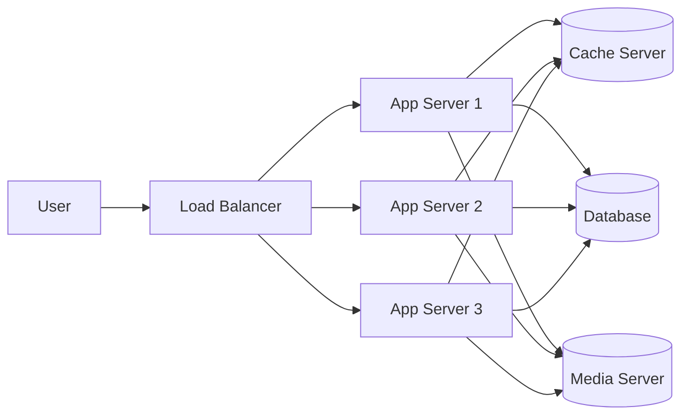

To the user — it is just Instagram. To the engineer — it is hundreds of machines talking to each other perfectly.

### Why Not Just Use One Server?

A single server sounds simple. And it is — until it is not.

| Problem | What happens |
|---------|-------------|
| **Single Point of Failure** | Server goes down → entire app goes down |
| **Limited Scalability** | One machine has a ceiling — RAM, CPU, disk |
| **Performance Bottleneck** | All 10 million users hitting one machine |
| **Downtime Risk** | Any maintenance = downtime for everyone |

Distributed systems solve this by spreading the work across many machines. If one dies, others keep serving. If traffic spikes, add more machines. No ceiling.

---

## 2. Consistency Levels

Imagine you and your friend both open the same bank account page at the same time. You just got your salary credited — ₹50,000. Your friend refreshes immediately. What should they see?

In a perfect world — ₹50,000 immediately. But in a distributed system with servers across Mumbai, Delhi, and Singapore, "immediately" is expensive. Making every server agree instantly takes time. And that time costs you speed and availability.

So consistency is not a yes/no switch. It is a dial — and you choose where to set it based on what your product actually needs.

---

### Strong Consistency — "Give me the truth, always."

Every read returns the most recent write. No exceptions. If you write to Server A, and someone reads from Server B a millisecond later — they see the exact same value.

```mermaid
sequenceDiagram
    participant You
    participant ServerIndia as Server India
    participant ServerUS as Server US
    participant Friend

    You->>ServerIndia: Write: balance = ₹50,000
    ServerIndia->>ServerUS: Sync now — before responding
    ServerUS-->>ServerIndia: Confirmed ✅
    ServerIndia-->>You: Done ✅
    Friend->>ServerUS: Read balance
    ServerUS-->>Friend: ₹50,000 ✅ Always correct
```

The system waits for all servers to agree before confirming your write. Your friend always sees the truth — but your write took a little longer because of that sync step.

**The cost:** Latency goes up. If any server is slow to sync, everyone waits.

**Where you see this:** ATMs, bank transfers, stock trading, payment systems — anywhere a wrong number means real-world consequences.

---

### Eventual Consistency — "It'll be right... give it a second."

The system responds immediately. Syncing happens in the background. For a brief window, different servers may return slightly different values — but they will all catch up eventually.

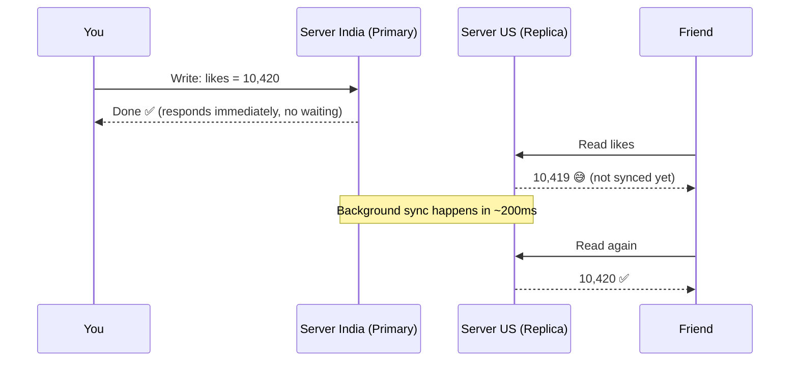

Your friend sees a like count that is one behind. A second later it corrects itself. Nobody has ever filed a complaint about this.

**The benefit:** The system never makes you wait for global agreement. Blazing fast.

**Where you see this:** YouTube likes, Instagram feeds, Twitter timelines, DNS propagation, product recommendations.

---

### Read-Your-Write Consistency — "Don't show me my own old data."

This is subtle but really important for user experience. After *you* write something, *you* will always read back your own update — even if other users haven't seen it yet.

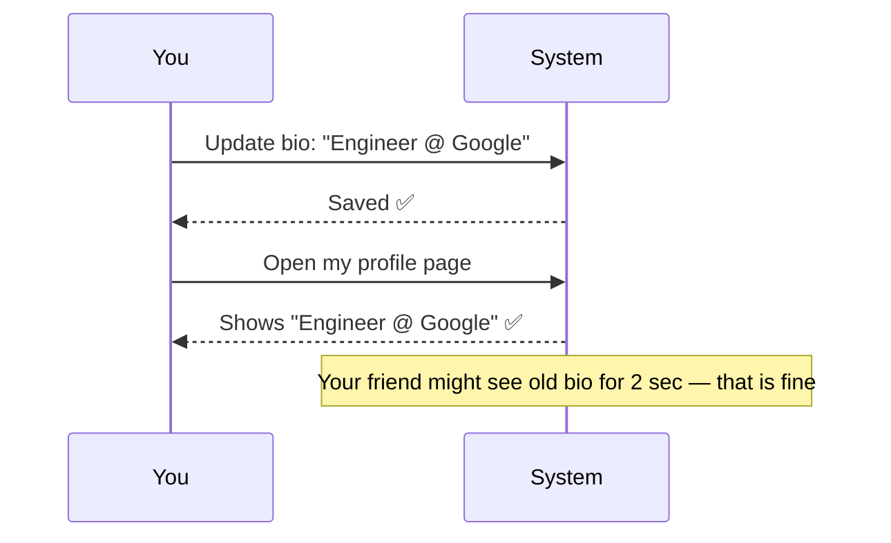

**Why it matters:** You update your LinkedIn bio. You refresh the page. If you see your *old* bio, that feels like a bug — even if everyone else sees it correctly in 2 seconds. Read-your-write prevents that jarring experience.

**Where you see this:** Profile updates, cart items, settings pages, anything a user just changed and will immediately look at.

---

### Consistency Level Cheat Sheet

| Consistency | Guarantee | Use When |
|-------------|-----------|----------|
| **Strong** | Everyone sees the same data instantly | Money, inventory, bookings |
| **Eventual** | Data syncs eventually, not instantly | Likes, feeds, view counts |
| **Read-Your-Write** | You always see your own updates | Profiles, settings, carts |

---

## 3. Availability & The Nines

Availability = what percentage of the time is your system up and actually responding to users.

Sounds simple. But look at what the difference between 99% and 99.999% actually means in real downtime:

| Availability | Downtime per year | Reality check |
|-------------|-------------------|---------------|
| 90% | 36+ days | Unusable for any real product |
| 99% | 3.65 days | Your app is broken for 3 days a year |
| 99.9% | 8.76 hours | Acceptable for early-stage startups |
| 99.99% | 52.6 minutes | What WhatsApp, Instagram target |
| 99.999% | 5.26 minutes | Payment systems, banking |
| 99.9999% | 31.5 seconds | Critical infrastructure |

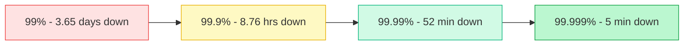

The jump from 99.9% to 99.99% sounds like nothing. Achieving it in engineering requires redundancy, automatic failover, multi-region deployments, and a team that gets paged at 3am.

**Reality check:** In 2021, AWS had a major outage that took down Netflix, Disney+, and Coinbase simultaneously. Even with the best infrastructure in the world, availability is hard.

---

## 4. SLA vs SLO

These two terms get mixed up constantly. They are different things with very different consequences.

**SLO (Service Level Objective)** is your internal target. The promise you make to your own engineering team.
> "Our API must respond in under 200ms for 95% of requests."

**SLA (Service Level Agreement)** is your external contract with customers. Legally binding. Violating it means paying penalties.
> "AWS promises 99.99% uptime for EC2. If we fall below that, you get service credits."

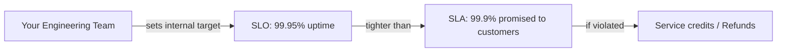

**The senior engineer's rule:** Always set your SLO tighter than your SLA. If you promise customers 99.9%, target 99.95% internally. That buffer is your safety net — you catch problems before they breach the contract.

---

## 5. CAP Theorem

This is one of the most important ideas in distributed systems — and also one of the most misunderstood. Every senior engineer interview touches this.

**CAP Theorem says:** In a distributed system, you can only fully guarantee two of these three properties simultaneously.

| Property | What it means |
|----------|--------------|
| **Consistency (C)** | Every read returns the most recent write — all nodes agree |
| **Availability (A)** | Every request gets a response — system never refuses |
| **Partition Tolerance (P)** | System keeps working even when servers cannot talk to each other |

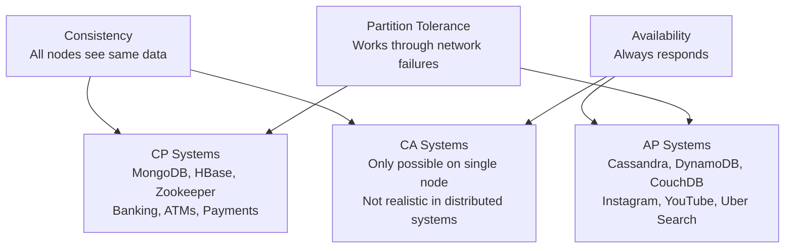

---

### The Part Nobody Explains Clearly

Here is the truth: **Partition Tolerance is not optional.**

In any real distributed system, network failures happen. Servers lose connectivity. Cables get cut. Cloud regions go down. You cannot design a system that avoids network partitions — they will happen whether you like it or not.

So the real CAP decision is not "which two do I pick?" It is: **when a network partition happens, what does my system do?**

**Option 1 — Stay Consistent (CP):** Refuse to respond until all servers agree again. Users get an error. But when they do get data, it is correct.

**Option 2 — Stay Available (AP):** Keep responding with whatever data you have, even if it is slightly stale. Users always get an answer. But it might not be the very latest.

---

### Real-World CAP Examples

| Application | Choice | Why |
|------------|--------|-----|
| ATM | CP | Wrong balance = real money lost |
| Banking | CP | Cannot show incorrect account data |
| Payment Gateway | CP | Charge must be confirmed before proceeding |
| Amazon Cart | CP | Incorrect items = wrong order shipped |
| Uber Payment | CP | Must confirm payment before booking ride |
| Instagram Feed | AP | Seeing a post 2 seconds late is totally fine |
| YouTube Comments | AP | Comment appearing slightly delayed is acceptable |
| Uber Cab Search | AP | Finding a cab fast matters more than perfect accuracy |
| DNS | AP | Takes hours to propagate — that is okay |

---

### The Uber Example That Clicks Every Time

Same app. Two features. Two completely different CAP decisions.

When you **search for a cab**, the system needs to respond fast. If a cab shows as available but got booked 800ms ago — that is fine. You will just be shown the next one. Speed matters more than perfect accuracy here. **AP.**

When you **pay for the ride**, the system must confirm the transaction is correct before booking. A wrong answer means double charges or disputed payments. A few extra milliseconds of latency is worth it. **CP.**

This is what senior engineers mean when they say "it depends." The answer to every CAP question depends on what that specific feature actually needs.

---

## 6. How to Increase Availability

Knowing your target is one thing. Actually building a system that hits 99.99% requires deliberately designing for failure — because failure is inevitable.

**Replication** — Keep copies of your data on multiple servers. If one server dies, others serve the data without missing a beat.

**Redundancy** — Have backup components sitting ready. Primary database fails → replica promotes to primary automatically, in seconds.

**Load Balancing** — Spread traffic across many servers. No single server is a point of failure. If one goes down, the load balancer routes around it.

**Geographical Distribution** — Run servers in multiple regions. Mumbai burns down → Singapore takes over. Users in India might have slightly higher latency for a moment, but the app stays up.

**Automatic Failover** — When a server fails, the system detects it and reroutes traffic automatically. No human needed at 3am.

**Monitoring & Alerting** — You know about the problem before your users do. Tools like Datadog, Grafana, PagerDuty alert your on-call engineer the moment something looks wrong.

**Scheduled Maintenance** — Deploy updates and run maintenance at 3am on a Tuesday, not 12pm on a Monday. Minimize user impact.

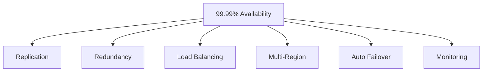

**The Netflix story every engineer should know:**

Netflix built a tool called **Chaos Monkey** — it randomly kills servers in their production environment on purpose, during business hours. Why? Because they would rather discover that their failover is broken during a controlled experiment than during an actual outage when 200 million users are watching. Their philosophy: if your system cannot survive random server deaths, it is not actually highly available. You just got lucky so far.

---

## 7. Functional vs Non-Functional Requirements

Before designing any system, you need to understand what you are building. Every requirement falls into one of two buckets.

**Functional requirements** — what the system does. The features.

**Non-functional requirements** — how well the system does it. The quality.

Think of building a car. Functional: it must drive, steer, brake, play music. Non-functional: it must do 0-100 in 6 seconds, run for 200,000 km, survive a crash, get 20km per litre.

| Functional — WHAT it does | Non-Functional — HOW WELL it does it |
|---------------------------|--------------------------------------|
| User can register and login | Handles 1 million concurrent users |
| User can place an order | Every page loads in under 2 seconds |
| System sends confirmation email | 99.99% uptime |
| Admin can view all orders | All data encrypted at rest and in transit |

**In a system design interview**, always clarify both before touching architecture. Candidates who jump straight to drawing boxes miss critical constraints. A system that does all the right things but falls over under load is not a good system. Non-functional requirements are where your architecture decisions live.

---

## 8. System Properties

These terms come up constantly in system design. Know them cold — and know the difference between the ones that sound similar.

---

### Latency vs Throughput

People confuse these constantly. They are completely different metrics.

**Latency** is how long a single request takes from start to finish. Your API responds in 40ms — that is latency.

**Throughput** is how many requests your system handles per second. Your API handles 10,000 requests/second — that is throughput.

Think of a highway:

- **Latency** = how long it takes one car to drive from one end to the other
- **Throughput** = how many cars pass through per hour

A single-lane highway can have low latency (cars move fast) but low throughput (only one car at a time). A 10-lane highway has high throughput but during rush hour, every car is slow — high latency.

Optimizing one does not automatically improve the other. You need to think about them separately.

---

### Bandwidth

The maximum amount of data your network can transfer in a given time. Measured in Mbps or Gbps.

Latency is how fast. Throughput is how much you are actually moving. Bandwidth is the hard ceiling of how much you could ever move.

Even if your server is fast, if your network connection is 100Mbps, you cannot transfer more than 100Mbps no matter what.

---

### Fault vs Failure

A **fault** is a problem in one component. A hard drive starts failing. A memory leak builds up. A network cable is damaged.

A **failure** is when that fault causes the system to stop doing its job. The hard drive dies and takes down the server. The memory leak crashes the process. The cable cuts connectivity.

The goal of system design is to ensure **faults do not become failures**. You do this with redundancy, retries, circuit breakers, and automatic failover.

**Real scenario:** A hard drive in one of Netflix's servers fails on a Friday evening — a fault. Because Netflix replicates data across multiple drives and servers, the system automatically reads from a replica. No engineer gets paged. No user's video buffers. The fault was contained. No failure.

---

### Resiliency vs Redundancy

**Redundancy** is having backups. A spare server. A replicated database. A secondary data center.

**Resiliency** is the system's ability to actually use those backups correctly and recover when things go wrong.

You can have redundancy without resiliency — backups that were never tested and do not actually work when needed. That is terrifying, and it happens more than you would think.

Netflix's Chaos Monkey exists precisely to validate resiliency, not just redundancy. Having a backup database means nothing if the failover mechanism has never actually been triggered and tested.

---

### System Properties Summary

| Property | What it measures | Example |
|----------|-----------------|---------|
| **Latency** | Time for one request | API responds in 40ms |
| **Throughput** | Requests per second | 10,000 RPS |
| **Bandwidth** | Max data transfer capacity | 1 Gbps network |
| **Fault** | A component problem | Hard drive degrading |
| **Failure** | System cannot do its job | Server crashes, users see error |
| **Resiliency** | Ability to recover | Auto-failover kicks in, users notice nothing |
| **Redundancy** | Having backups ready | Data replicated across 3 servers |

---

## 9. Stateful vs Stateless Systems

This is one of those things that sounds academic until you try to scale a real system. Then it becomes the most practical decision you make.

---

### Stateless — The Dream for Scaling

A stateless system does not remember anything between requests. Every request carries everything the server needs. The server processes it and forgets you exist.

**HTTP is stateless by design.** Your API request carries a JWT token with your user ID, permissions, and session info. The server reads it, responds, and moves on. It does not need to remember you.

Why is this amazing for scaling?

Because any server can handle any request. The load balancer can route you to Server 1 today and Server 7 tomorrow — they both have everything they need in your request.

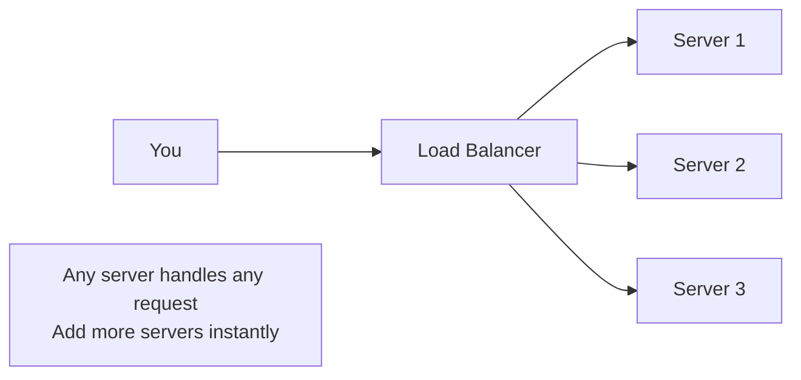

Want to handle twice the traffic? Add more servers. The load balancer routes to them immediately. Zero coordination needed.

---

### Stateful — Powerful but Hard to Scale

Some systems inherently need memory between requests. A WebSocket chat connection. A live multiplayer game session. A video call in progress.

The server needs to remember who you are and what you were doing.

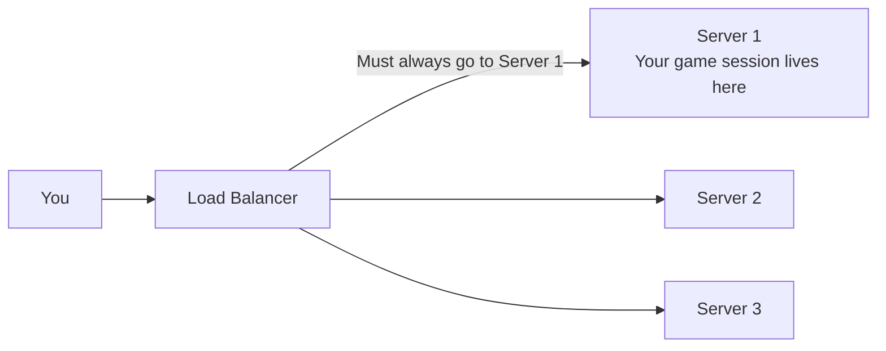

This requires **sticky sessions** — the load balancer always sends you to the same server. It works, but it creates problems. That server becomes a hotspot. If it crashes, your session is gone and you get disconnected. Scaling becomes uneven because some servers have many sticky users and others have few.

---

### The Senior Engineer's Solution — Move State Out

The elegant answer is to keep your application servers stateless but store shared state in an external store like Redis.

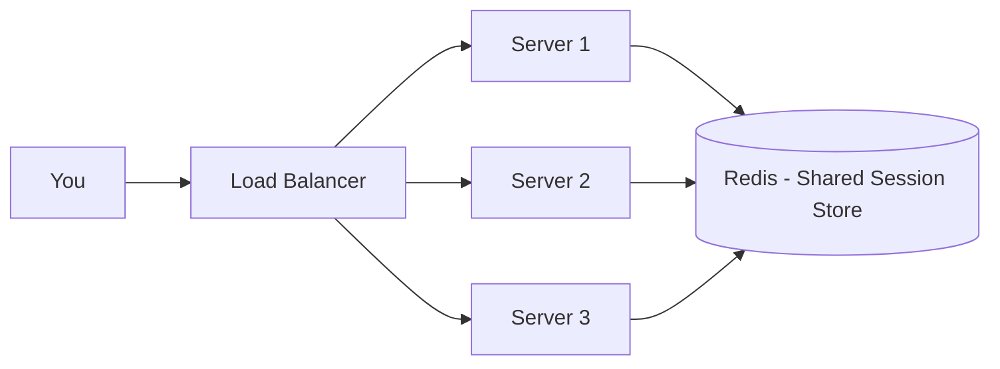

Now any server can handle your request. They all read your session from Redis, do their work, write back to Redis. No sticky sessions. No hotspots. Pure horizontal scaling with the memory of a stateful system.

When you log into any major app, your session is not stored on a server — it is in Redis. The server that handles your next request reads it from there, and you never notice the difference.

---

## Interview Questions

**Distributed Systems**
1. What is a distributed system? Why do we use them instead of a single powerful server?
2. What is a single point of failure? How do you eliminate it?

**Consistency**
1. Explain the three consistency levels with real-world examples.
2. Instagram uses eventual consistency for likes. ATMs use strong consistency. Why the difference?
3. What is read-your-write consistency? Give a scenario where violating it would feel like a bug.

**Availability & SLA**
1. What does 99.99% availability actually mean in downtime per year?
2. What is the difference between SLA and SLO? Why should your SLO always be tighter?
3. Netflix deliberately kills production servers. Why? What is Chaos Engineering?

**CAP Theorem**
1. Explain CAP theorem. What are the three properties?
2. Why is partition tolerance not optional in a real distributed system?
3. What is the real choice engineers make in CAP — CP or AP?
4. Uber uses both CP and AP in the same app. Explain with examples.
5. Design an ATM system — which CAP properties do you prioritize and why?
5. Is Cassandra CP or AP? What about MongoDB?

**System Properties**
1. What is the difference between latency and throughput? Can you have low latency but low throughput?
2. What is the difference between bandwidth, latency, and throughput?
3. What is the difference between a fault and a failure? How does redundancy help?
4. What is the difference between resiliency and redundancy?

**Stateful vs Stateless**
1. What is the difference between stateful and stateless systems?
2. Why does stateless architecture scale better?
3. What are sticky sessions? What problems do they create?
4. How would you convert a stateful login system to be stateless?
5. You are designing a multiplayer game — is it stateful or stateless? How do you handle a server crash mid-game?

---