# 06. Message Queues, Pub/Sub & Kafka

> Your app is growing. Services need to talk to each other. But what happens when one service is slow? Or crashes? Or gets 10x more traffic than it can handle? If services call each other directly, one slow service brings everyone down. Message queues exist to solve exactly this — and Kafka takes it to an entirely different level.

---

## Table of Contents

1. [The Problem — Why Direct Communication Breaks](#1-the-problem--why-direct-communication-breaks)
2. [Message Queues](#2-message-queues)
3. [Pub/Sub Pattern](#3-pubsub-pattern)
4. [Message Queue vs Pub/Sub](#4-message-queue-vs-pubsub)
5. [Apache Kafka](#5-apache-kafka)
6. [Kafka vs Traditional Message Queues](#6-kafka-vs-traditional-message-queues)
7. [Real-World Architectures Using Kafka](#7-real-world-architectures-using-kafka)
8. [When to Use What](#8-when-to-use-what)
9. [Interview Questions](#-interview-questions)

---

## 1. The Problem — Why Direct Communication Breaks

Let's say you have an e-commerce app. When a user places an order, you need to:

- Confirm the order in the database
- Send a confirmation email
- Notify the warehouse
- Update the inventory
- Generate an invoice

The naive approach — your Order Service calls all of these directly:

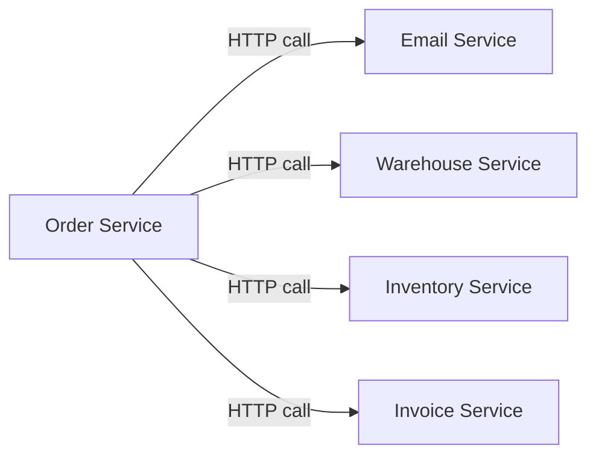

This looks fine until something goes wrong.

What if the Email Service is slow? The user waits. What if the Warehouse Service is down? The entire order fails — even though the payment went through. What if traffic spikes and the Invoice Service gets overwhelmed? Everything backs up and your Order Service starts timing out too.

You have tightly coupled your services. One weak link breaks the entire chain.

**The fix:** Stop making services call each other directly. Instead, drop a message into a queue and let services pick it up when they are ready. This is asynchronous communication — and it changes everything.

---

## 2. Message Queues

A message queue is exactly what it sounds like — a queue that holds messages between services.

The service that sends a message is called the **Producer**. The service that receives it is called the **Consumer**. The queue sits in the middle, holding messages until the consumer is ready.

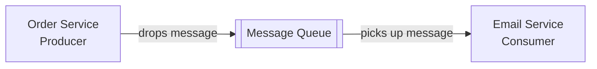

The producer does not wait. It drops the message and moves on. The consumer picks it up whenever it is ready — even if that is 5 seconds later, or 5 minutes later if it was temporarily down.

### What This Solves

**Decoupling** — The Order Service does not care whether the Email Service is up, slow, or down. It just drops a message and forgets about it. Both services can be deployed, scaled, and updated independently.

**Resilience** — If the Email Service crashes, messages pile up in the queue. When it comes back online, it processes the backlog. No messages are lost. No orders are affected.

**Load leveling** — Imagine a flash sale. 50,000 orders come in within a minute. Instead of hammering the Warehouse Service with 50,000 simultaneous requests, the queue absorbs the burst and the Warehouse Service processes messages at whatever rate it can handle.

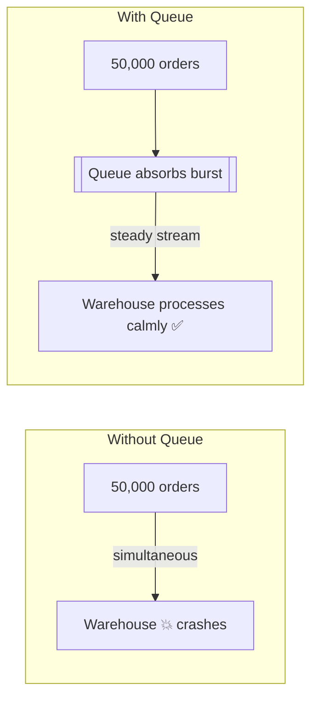

### How a Message Queue Works Internally

1. Producer sends a message to the queue
2. Queue stores the message durably — on disk, not just in memory
3. Consumer polls the queue or receives a push notification
4. Consumer processes the message
5. Consumer sends an **acknowledgement (ACK)** — "I processed this successfully"
6. Queue deletes the message

What if the consumer crashes mid-processing and never sends an ACK? The queue keeps the message and re-delivers it to another consumer. This is how message queues guarantee **at-least-once delivery**.

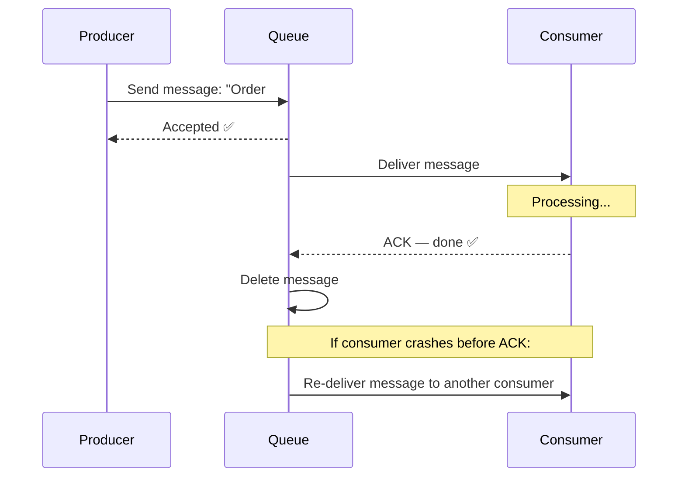

### Delivery Guarantees

| Guarantee | What it means | Trade-off |
|-----------|--------------|-----------|
| **At-most-once** | Delivered once, never retried | Fast, but messages can be lost |
| **At-least-once** | Retried until ACK received | No data loss, but duplicates possible |
| **Exactly-once** | Delivered exactly once, no duplicates | Hard to achieve, requires coordination |

Most real systems use **at-least-once** and make their consumers idempotent — processing the same message twice produces the same result.

### Popular Message Queue Tools

**RabbitMQ** — The classic. Great for task queues, easy to use, supports complex routing. Messages are deleted after consumption — it is a true queue.

**Amazon SQS** — AWS managed queue. Zero infrastructure to manage. Pay per message. Scales automatically. Great for cloud-native applications.

**Redis (as a queue)** — Lightweight, fast, in-memory. Good for simple task queues when you already use Redis for caching.

---

## 3. Pub/Sub Pattern

Pub/Sub (Publish-Subscribe) is a messaging pattern where the sender does not send to a specific receiver — it **publishes to a topic**, and any number of services that are **subscribed** to that topic receive the message.

Think of it like a newspaper. The newspaper does not know who its readers are. It just publishes. Anyone who subscribed gets a copy.

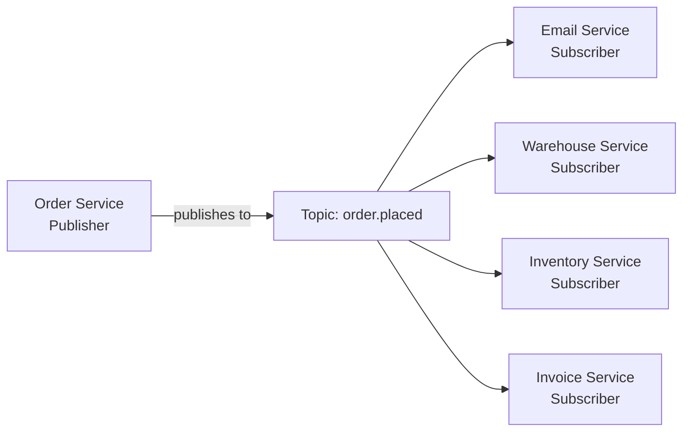

One event. Four services notified. The Order Service does not know or care who is listening. If you add a fifth service tomorrow — a loyalty points service, say — you just subscribe it to the same topic. The Order Service does not change at all.

### The Power of Pub/Sub

**Fan-out** — One message, many consumers. Perfect for broadcasting events.

**Zero coupling** — Publisher does not know subscribers exist. Subscribers do not know about each other. Services are truly independent.

**Easy extensibility** — Adding a new consumer is just a subscription. No changes to the publisher.

### Real-World Scenario — Swiggy Order Flow

When you place an order on Swiggy, one event fans out to multiple services simultaneously:

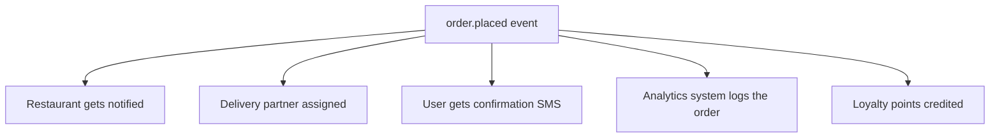

All of this happens from a single published event. The order service did not call each of these — it just published. Each service reacts independently.

---

## 4. Message Queue vs Pub/Sub

These are often confused because they both involve messages between services. The key difference is in **how many consumers receive each message**.

| | Message Queue | Pub/Sub |
|--|--------------|---------|
| Delivery | One consumer gets each message | All subscribers get each message |
| Pattern | Task distribution | Event broadcasting |
| Consumer relationship | Competing consumers | Independent subscribers |
| Use case | Background jobs, task processing | Notifications, event-driven architecture |
| Example | Email job queue | Order placed event |

**Message Queue analogy:** A single pizza being delivered to one customer. Only one person eats it.

**Pub/Sub analogy:** A live cricket match broadcast. One broadcast, millions of viewers all watching simultaneously.

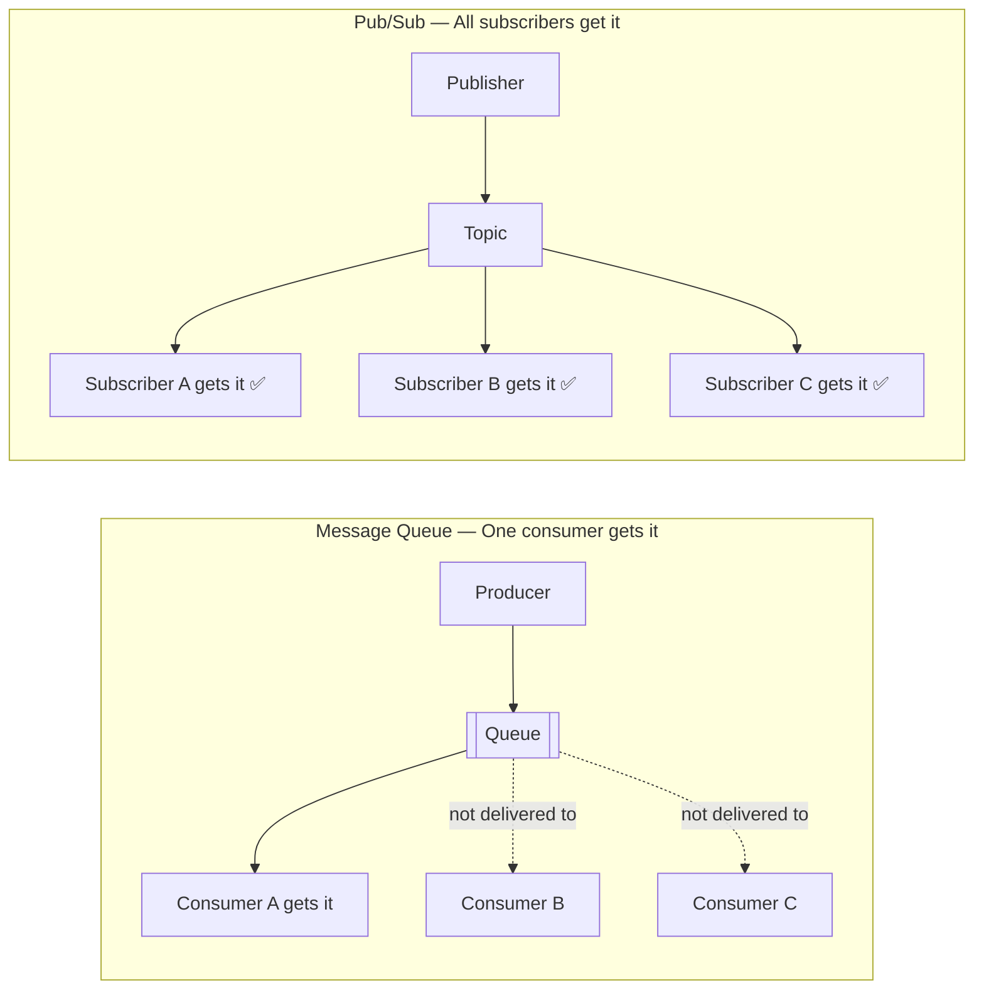

In practice, many tools support both patterns. Kafka, for example, can do both — which is part of why it is so popular.

---

## 5. Apache Kafka

Kafka is not just a message queue. It is a **distributed event streaming platform** — and it thinks about messages in a fundamentally different way.

Traditional queues delete messages after they are consumed. Kafka keeps them. Every event is stored on disk, in order, for as long as you configure — hours, days, weeks, forever. Any consumer can read from any point in time.

This single idea — **persisting the stream** instead of deleting it — is what makes Kafka so powerful.

### Core Concepts

**Event / Message** — The data being sent. Could be "user clicked buy", "payment succeeded", "sensor temperature reading".

**Topic** — A named stream of events. Like a category. "order-events", "payment-events", "user-activity".

**Partition** — Topics are split into partitions for parallelism. Each partition is an ordered, append-only log. More partitions = more throughput.

**Producer** — Writes events to a topic.

**Consumer** — Reads events from a topic.

**Consumer Group** — Multiple consumers working together to read from a topic in parallel. Each partition is assigned to exactly one consumer in the group.

**Broker** — A single Kafka server. Stores partitions and serves producers and consumers.

**Cluster** — Multiple brokers working together. Kafka is designed to run as a cluster for fault tolerance and scale.

**Offset** — The position of a message within a partition. Consumers track their offset — where they have read up to.

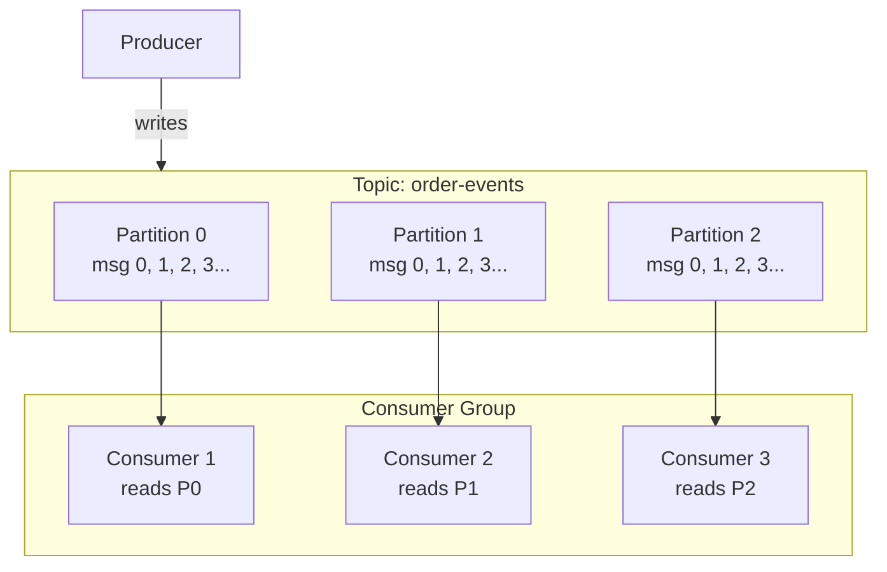

### How Kafka Stores Messages

Unlike a queue where messages disappear after consumption, Kafka stores every message in an **append-only log** on disk.

```
Partition 0:
[offset 0] user_id=101, action=signup
[offset 1] user_id=102, action=signup
[offset 2] user_id=101, action=purchase
[offset 3] user_id=103, action=login
[offset 4] user_id=101, action=logout
          ← new messages always appended at the end
```

Each consumer group tracks its own offset — where it has read up to. If a new analytics service is added today and needs to process all historical events from last month, it just starts reading from offset 0. The data is still there.

### Consumer Groups — How Kafka Scales Reading

Consumer groups are what make Kafka scale for both throughput and multiple use cases simultaneously.

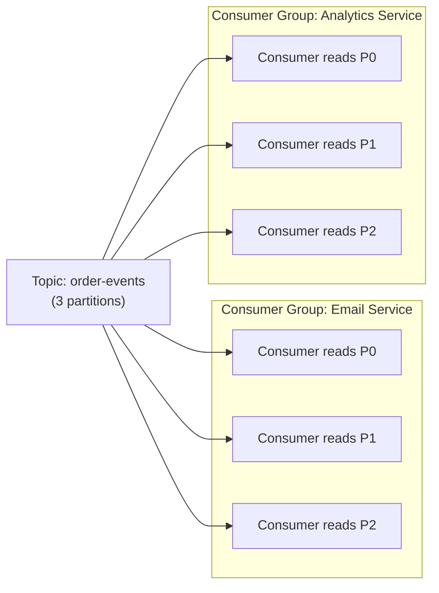

Both groups read the same topic independently. The Email Service processes every order to send confirmations. The Analytics Service processes every order to update dashboards. They do not interfere with each other. Each group tracks its own offset.

This is how Kafka does both **task queuing** (within a consumer group, each message goes to one consumer) and **pub/sub** (across groups, every group gets every message).

### Kafka Guarantees — What Makes It Reliable

**Durability** — Messages are written to disk and replicated across multiple brokers. A broker crashing does not lose data.

**Replication** — Each partition has a leader and multiple replicas on different brokers. If the leader dies, a replica is promoted automatically.

**Ordering** — Within a partition, messages are strictly ordered. Kafka cannot guarantee order across partitions, but you can control which partition a message goes to (usually by key — all events for the same user_id go to the same partition).

**Retention** — Messages are kept for a configurable period. Default is 7 days. Can be set to forever. Can also be set by size.

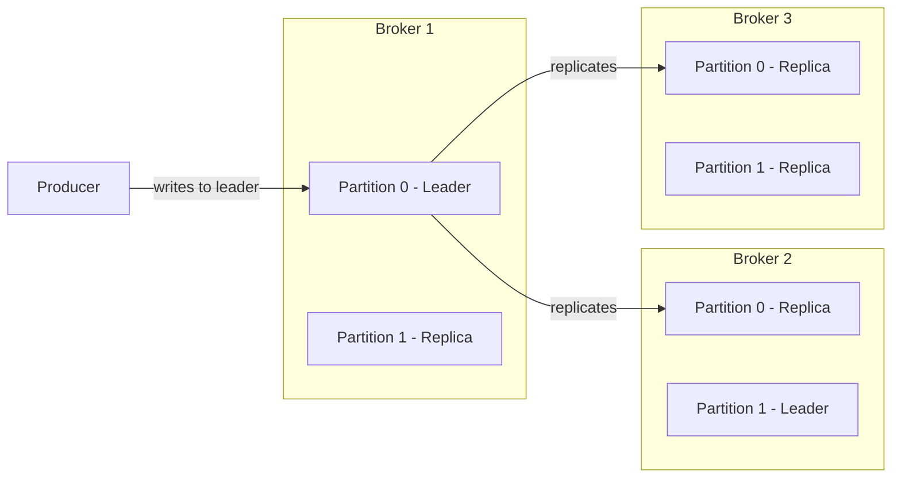

If Broker 1 crashes, Broker 2 already has a replica of Partition 0. It becomes the new leader. Producers and consumers reconnect to it. No data loss.

### Kafka in Action — Code Example

**Producer (Node.js with kafkajs)**
```javascript
const { Kafka } = require('kafkajs');

const kafka = new Kafka({ brokers: ['localhost:9092'] });
const producer = kafka.producer();

async function publishOrderEvent(order) {
  await producer.connect();

  await producer.send({
    topic: 'order-events',
    messages: [
      {
        key: order.userId,        // same user = same partition = ordered events
        value: JSON.stringify({
          eventType: 'ORDER_PLACED',
          orderId: order.id,
          userId: order.userId,
          amount: order.amount,
          timestamp: Date.now()
        })
      }
    ]
  });

  console.log('Order event published');
}
```

**Consumer (Node.js with kafkajs)**
```javascript
const { Kafka } = require('kafkajs');

const kafka = new Kafka({ brokers: ['localhost:9092'] });
const consumer = kafka.consumer({ groupId: 'email-service' });

async function startEmailConsumer() {
  await consumer.connect();
  await consumer.subscribe({ topic: 'order-events', fromBeginning: false });

  await consumer.run({
    eachMessage: async ({ topic, partition, message }) => {
      const event = JSON.parse(message.value.toString());

      if (event.eventType === 'ORDER_PLACED') {
        await sendConfirmationEmail(event.userId, event.orderId);
        console.log(`Email sent for order ${event.orderId}`);
      }
      // Kafka auto-commits offset after this function returns
    }
  });
}
```

---

## 6. Kafka vs Traditional Message Queues

| | RabbitMQ / SQS | Apache Kafka |
|--|----------------|--------------|
| Message retention | Deleted after consumption | Retained on disk for days/forever |
| Consumer model | Competing consumers | Independent consumer groups |
| Throughput | High | Extremely high — millions/sec |
| Ordering | Per queue | Per partition |
| Replay | Not possible | Yes — rewind to any offset |
| Use case | Task queues, job processing | Event streaming, audit logs, analytics |
| Complexity | Simple to set up | More complex, needs tuning |
| Latency | Very low | Low, but slightly higher than SQS |

**The key insight:** Use a traditional queue when you just need to distribute work. Use Kafka when you need a persistent, replayable record of everything that happened in your system.

---

## 7. Real-World Architectures Using Kafka

### LinkedIn (where Kafka was born)

Kafka was created at LinkedIn in 2011 to handle their activity data. Every click, page view, job application, and connection request was an event. They needed to stream this data to multiple systems — real-time dashboards, recommendation engines, analytics pipelines — simultaneously. Kafka was built to do exactly that. Today LinkedIn processes over **7 trillion messages per day** with Kafka.

### Uber's Real-Time Infrastructure

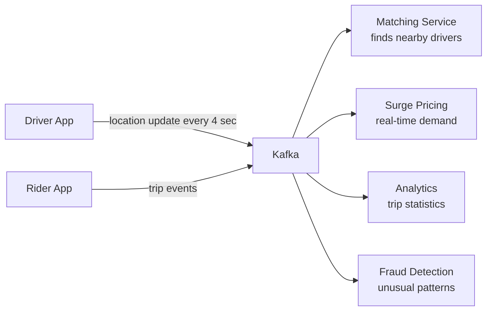

Every driver sends a location update every 4 seconds. Millions of drivers. That is billions of location events per day. Kafka ingests all of it and fans it out to every service that needs it — without any service directly calling another.

### Event Sourcing — The Audit Log Pattern

Instead of storing only the current state in your database, you store every event that led to that state. Kafka is the perfect backbone for this.

```
Instead of:
  user_balance = ₹8,000

Store:
  [offset 0] ACCOUNT_OPENED, initial_balance=₹0
  [offset 1] SALARY_CREDITED, amount=₹50,000
  [offset 2] RENT_PAID, amount=₹20,000
  [offset 3] GROCERIES, amount=₹5,000
  [offset 4] WITHDRAWAL_ATM, amount=₹17,000
  Current balance = ₹8,000
```

You can replay these events to reconstruct the balance at any point in history. You have a complete audit trail. You can feed this stream to a fraud detection model in real time. This is what banks and fintech companies build on Kafka.

---

## 8. When to Use What

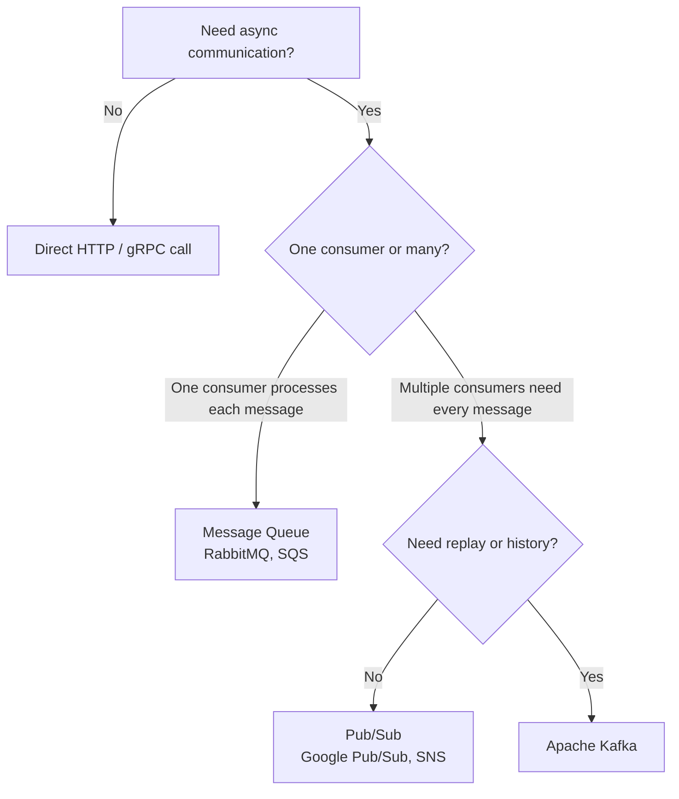

| Scenario | Tool |
|----------|------|
| Send a background email after signup | Message Queue (SQS, RabbitMQ) |
| Notify 5 services when an order is placed | Pub/Sub or Kafka |
| Stream millions of user events per second | Kafka |
| Need to replay events from last week | Kafka |
| Simple task queue for image processing | SQS or RabbitMQ |
| Real-time fraud detection pipeline | Kafka |
| Audit log of everything that happened | Kafka |

---

## Interview Questions

**Message Queues**
1. What is a message queue and what problem does it solve?
2. What is the difference between synchronous and asynchronous communication? When would you choose each?
3. What are the three message delivery guarantees? Which is most common in practice and why?
4. What is idempotency? Why is it important for message consumers?
5. A flash sale brings 100x normal traffic. How does a message queue help your system survive this?

**Pub/Sub**
1. What is the Pub/Sub pattern? How is it different from a message queue?
2. Give a real-world example where Pub/Sub is the right choice over a direct HTTP call.
3. What does fan-out mean? When is it useful?

**Kafka**
1. What makes Kafka different from a traditional message queue like RabbitMQ?
2. What is a topic, partition, offset, and consumer group in Kafka?
3. Why does Kafka retain messages after consumption? What use cases does this enable?
4. How does Kafka achieve high throughput? What role do partitions play?
5. How does Kafka handle fault tolerance? What happens when a broker crashes?
6. How do consumer groups work? How does Kafka support both task queuing and pub/sub?
7. Why would you use a message key in Kafka? What does it control?
8. What is event sourcing? How does Kafka fit into that pattern?

**System Design**
1. Design the order confirmation system for an e-commerce app using a message queue.
2. Uber processes millions of driver location updates per second. How would you architect this with Kafka?
3. You need to add a new loyalty points service to your platform. The order service should not be modified. How would you design this?
4. What is the difference between Kafka and Google Pub/Sub or AWS SNS/SQS?

---