# 07. Caching, Load Balancing, Proxies & CDN

> You have a working system. Now you need it to be fast, resilient, and available to users everywhere in the world. These four tools — caching, load balancing, proxies, and CDNs — are how every major system achieves that. This is not theory. This is the actual infrastructure running Google, Netflix, and Instagram right now.

---

## Table of Contents

1. [Caching](#1-caching)
2. [Cache Hit, Miss & Invalidation](#2-cache-hit-miss--invalidation)
3. [Cache Eviction Policies](#3-cache-eviction-policies)
4. [Cache Write Strategies](#4-cache-write-strategies)
5. [Where to Place Cache in Your System](#5-where-to-place-cache-in-your-system)
6. [Redis vs Memcached](#6-redis-vs-memcached)
7. [Cache vs Database](#7-cache-vs-database)
8. [Load Balancing](#8-load-balancing)
9. [Load Balancing Strategies](#9-load-balancing-strategies)
10. [Proxy — Forward & Reverse](#10-proxy--forward--reverse)
11. [CDN — Content Delivery Network](#11-cdn--content-delivery-network)
12. [Interview Questions](#-interview-questions)

---

## 1. Caching

Every time someone opens their Twitter feed, your server has to fetch tweets, profile pictures, follow counts, recommendations — querying multiple tables, joining data, running calculations. If you do that from scratch on every single request for every single user, your database gets crushed and every user waits.

Caching is the answer to this problem. **You compute something once, store it somewhere fast, and serve it instantly to everyone who asks for it next.**

A cache is a high-speed storage layer that sits between your application and your database. It holds the results of expensive operations in memory so you never repeat the same work twice.

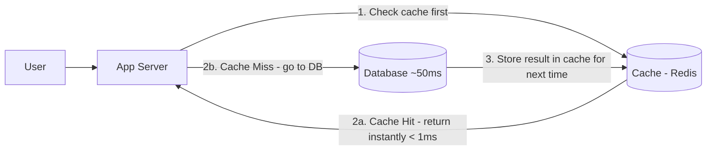

The math is simple. RAM is orders of magnitude faster than disk. A cache read takes under 1ms. A database query takes 10–100ms. At scale, that difference is everything.

**Real example:** Netflix does not freshly generate your homepage from the database every time you open the app. Your recommendations, trending content, and watch history are cached. Heavy computation happens in the background every few hours, the result is stored in cache, and every homepage load is instant.

---

## 2. Cache Hit, Miss & Invalidation

### Cache Hit — The Happy Path

The data you need is already in cache. Returned instantly, database not touched.

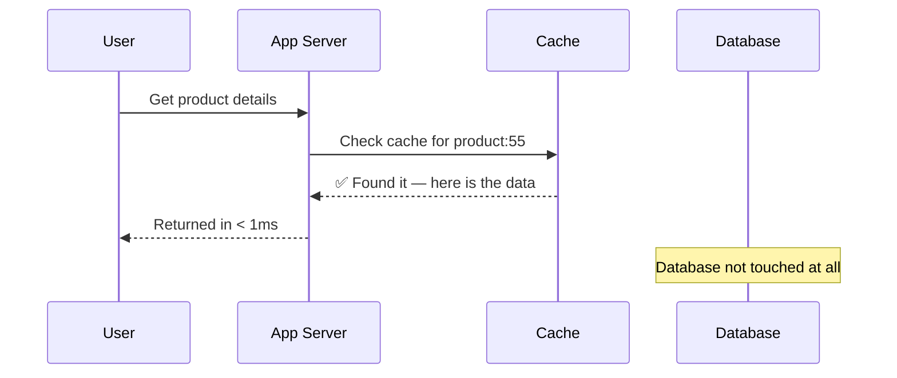

### Cache Miss — The Fallback

The data is not in cache. The app queries the database, stores the result in cache, and returns it. Slower this one time — but every request after hits the cache.

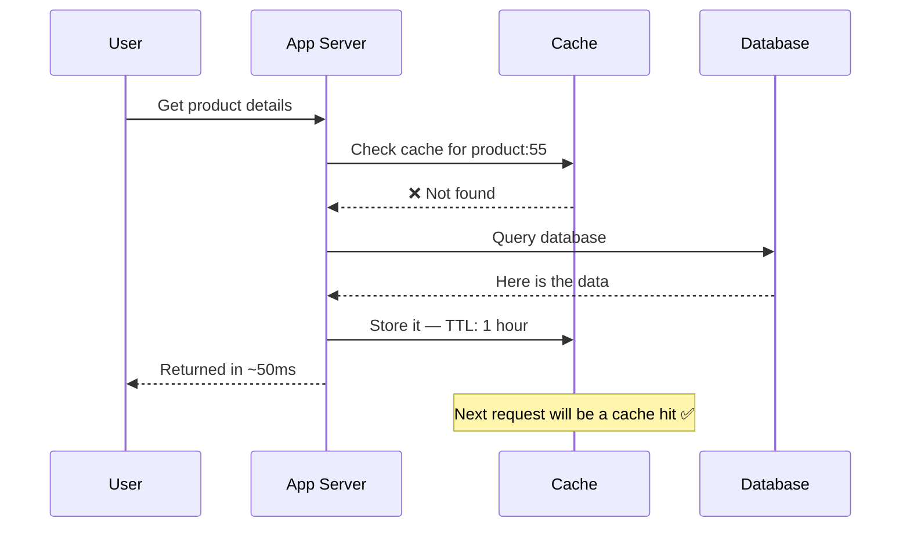

### Cache Invalidation — The Hard Problem

This is the part people underestimate. Your cache is a copy of your data. When the original changes, the copy is stale. You need to update or delete the cached copy — but doing this correctly at scale, without serving stale data or hammering your database, is genuinely difficult.

Phil Karlton said: *"There are only two hard things in Computer Science: cache invalidation and naming things."*

**Scenario:** A user updates their profile picture. The old picture is cached. Until that cache entry is invalidated, every request returns the old picture.

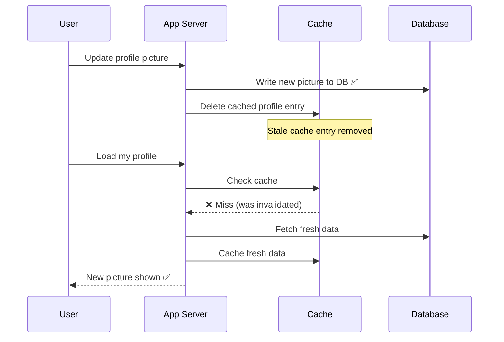

---

## 3. Cache Eviction Policies

Cache has limited memory. It cannot store everything. When it is full, something must go to make room for new data. **The eviction policy decides what gets removed.**

The wrong policy means your cache keeps the wrong data — and your hit rate drops, defeating the purpose of having a cache at all.

---

### LRU — Least Recently Used

Removes the item that has not been accessed for the longest time. The logic is simple: if you have not needed it recently, you probably will not need it soon.

Think of your desk. You keep the papers you are currently working on at the top. Papers you haven't touched in a week get filed away. LRU works the same way.

```
Cache (ordered most recent → least recent):
[user:101] [product:55] [user:202] [search:shoes] [user:305]

Cache is full. New item arrives.
Evict: user:305 — hasn't been accessed the longest.
```

**Used by:** Redis (as default policy). Most general-purpose caching — user sessions, product pages, API responses.

---

### LFU — Least Frequently Used

Removes the item that has been accessed the fewest total times. Not what was accessed least recently — but what was accessed least overall.

Think of a library. A book borrowed 200 times stays on the shelf. A book borrowed twice in 10 years gets moved to storage.

```
Cache entries with access counts:
user:101     → accessed 847 times  ✅ keep
product:55   → accessed 12 times   ✅ keep
trending:old → accessed 3 times    ❌ evict this
```

**Used by:** Systems where popularity is the right signal — trending content, product recommendation caches.

**The catch:** New items start with a count of zero. They look unpopular even if they are actually very relevant. LFU can be unfair to recently added content.

---

### FIFO — First In, First Out

The oldest item in cache — the one added first — gets evicted. Regardless of how often it was accessed.

Simple to understand and implement. But it can evict popular items just because they were cached early.

**Used for:** Simple scenarios where the access pattern does not matter much.

---

### MRU — Most Recently Used

The opposite of LRU. Evicts the item accessed most recently.

Counterintuitive, but correct for specific workloads. If you are doing a sequential scan through a huge dataset, the item you just read is the one you are least likely to read again. MRU is optimal for this.

**Used for:** Batch processing, one-time sequential scans.

---

### Eviction Policy Summary

| Policy | Removes | Best for |
|--------|---------|----------|
| **LRU** | Least recently accessed | General purpose — most common choice |
| **LFU** | Least frequently accessed | Popularity-based content |
| **FIFO** | Oldest item added | Simple, predictable scenarios |
| **MRU** | Most recently accessed | Sequential scans, batch jobs |
| **Random** | Random item | Low overhead, unpredictable patterns |

---

## 4. Cache Write Strategies

Reading from cache is simple. Writing is where complexity lives — because now you have two copies of the same data (cache and database) and they need to stay in sync. How you handle writes determines the trade-off between speed and consistency.

---

### Write-Through — Consistency First

Every write goes to both cache and database simultaneously. The write is only confirmed to the user when both succeed.

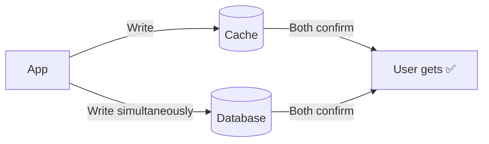

**Advantages:** Cache and database always in sync. No stale data. No data loss even if cache crashes.

**Disadvantages:** Every write is slower — must complete in two places before confirming.

**Use when:** Data accuracy is critical. Banking, inventory, order management — anywhere a wrong cached value has real consequences.

---

### Write-Back (Write-Behind) — Speed First

Writes go to cache immediately. The user gets a confirmation right away. The database is updated later, asynchronously.

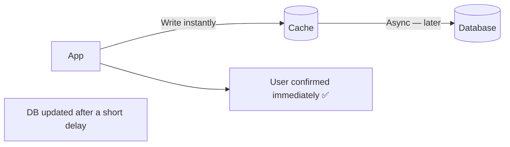

**Advantages:** Extremely fast writes. Great for write-heavy workloads.

**Disadvantages:** If the cache crashes before flushing to the database, that data is gone. There is always a window of inconsistency.

**Use when:** Write speed matters more than absolute safety. Gaming leaderboards, counters, real-time analytics where approximate data is acceptable.

---

### Write-Around — Skip the Cache

Writes go directly to the database. The cache is not touched. The cache only gets populated when data is subsequently read (on a cache miss).

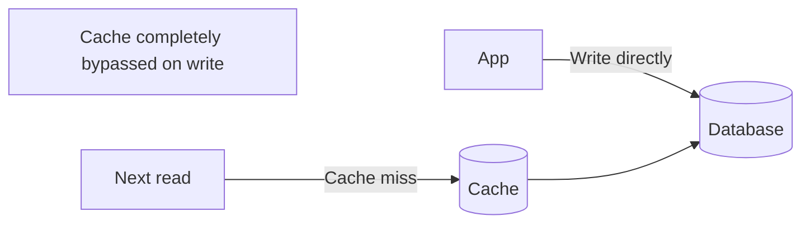

**Advantages:** Prevents the cache from filling up with data that will rarely be read again.

**Disadvantages:** The first read after a write always misses the cache and hits the database.

**Use when:** Data is written once and rarely read back — log files, batch imports, one-time reports.

---

### Write Strategy Summary

| Strategy | Write destination | Speed | Safety |
|----------|------------------|-------|--------|
| **Write-Through** | Cache + DB together | Slower | No data loss |
| **Write-Back** | Cache first, DB later | Fastest | Risk of data loss |
| **Write-Around** | DB only | Medium | First read always misses |

---

## 5. Where to Place Cache in Your System

Cache does not have to live in just one place. Different layers of your system benefit from caching in different ways.

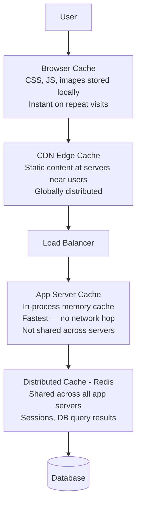

Each layer serves a different purpose and different type of content. In a well-designed system, you use multiple layers together — browser cache for static assets, CDN for global reach, Redis for shared application data.

---

## 6. Redis vs Memcached

When you run multiple app servers, you cannot use in-process caching — each server has its own separate cache and they go out of sync. You need a **shared distributed cache** that all servers read from and write to.

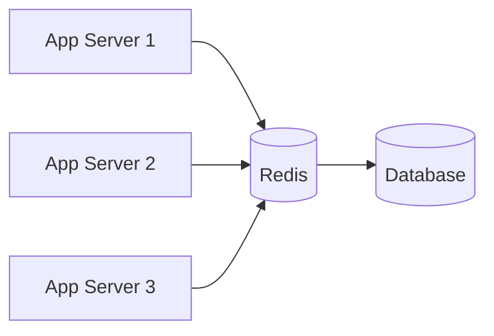

The two most popular tools for this are Redis and Memcached.

---

### Redis

Redis is not just a cache. It is an in-memory data structure store. Beyond simple key-value pairs, it supports lists, sets, sorted sets, hashes, and streams — making it incredibly versatile.

**What makes Redis special:**

**Rich data structures** — A sorted set lets you build a leaderboard with one command. A list lets you implement a job queue. A set lets you track unique visitors per day. You get entire data structure operations, not just get/set.

**Persistence** — Redis can write to disk via snapshots or an append-only log. If Redis restarts, your data survives. This is optional — you can run Redis as pure in-memory if you prefer.

**TTL on every key** — Set any key to expire after a time period. Perfect for sessions, OTPs, rate limiting windows, and temporary data. It just disappears automatically.

**Pub/Sub built in** — Redis can act as a lightweight message broker for simple use cases.

**Clustering** — Redis Cluster distributes data across multiple Redis nodes for horizontal scaling and fault tolerance.

**Real uses:** Session storage, rate limiting counters, leaderboards, caching database query results, job queues, real-time analytics.

---

### Memcached

Memcached does one thing and does it well — fast key-value caching.

It is purely in-memory with no persistence. Restart it and all data is gone. It only supports string values — no rich data structures. But it is multi-threaded, which means it can use multiple CPU cores simultaneously and outperform Redis in raw throughput for pure caching workloads.

**Real uses:** High-volume database query caching when you do not need any of Redis's extra features.

---

### Redis vs Memcached

| | Redis | Memcached |
|--|-------|-----------|
| Data types | Strings, lists, sets, hashes, sorted sets | Strings only |
| Persistence | Optional (yes) | No — data lost on restart |
| TTL support | Yes | Yes |
| Clustering | Yes | Yes |
| Pub/Sub | Yes | No |
| Threading | Mostly single-threaded | Multi-threaded |
| Best for | Versatile — sessions, queues, leaderboards, cache | Pure high-throughput caching |

**The honest answer in interviews:** Almost always Redis. It does everything Memcached does and more. Unless you have a very specific need for Memcached's multi-threading advantage at extreme scale, Redis is the right call.

---

## 7. Cache vs Database

| | Cache (Redis) | Database (PostgreSQL) |
|--|---------------|----------------------|
| Purpose | Speed — serve data fast | Reliably store data permanently |
| Storage | RAM | Disk |
| Latency | < 1ms | 10–100ms |
| Durability | Optional | Always guaranteed |
| Data size | Limited by RAM | Effectively unlimited |
| Query power | Simple key lookups | Complex joins, aggregations |
| Data lifespan | Short-term, temporary | Long-term, permanent |

Cache is not a replacement for a database. It is a complement. The database is your source of truth — always. The cache is just a faster, temporary copy of the data you access most often. If the cache dies, you rebuild it from the database.

---

## 8. Load Balancing

You scaled horizontally — you now have 10 servers instead of one. Great. But who decides which server handles each incoming request? How do you ensure no server gets overwhelmed while others sit idle?

A **load balancer** sits in front of your servers, receives all incoming traffic, and distributes requests across your server pool.

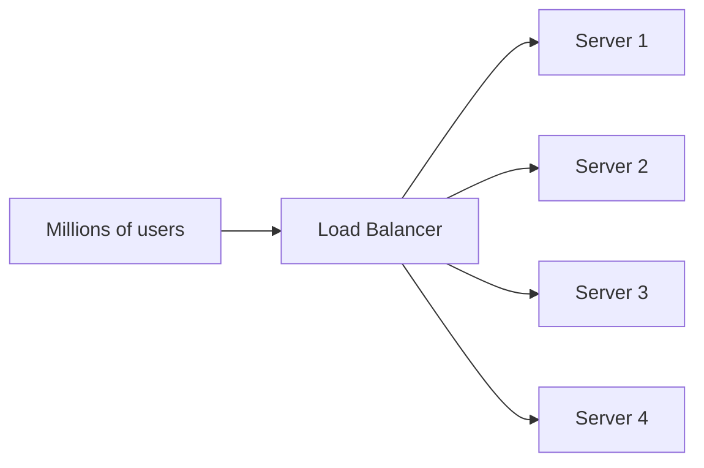

Without a load balancer, users need to know specific server IPs — and if a server goes down, those users are just stuck. With a load balancer, users always talk to one address. Routing happens invisibly.

### What Else Load Balancers Do

**Health checks** — The load balancer pings each server periodically. If Server 3 stops responding, it is removed from the rotation automatically. Traffic flows to healthy servers with zero manual intervention.

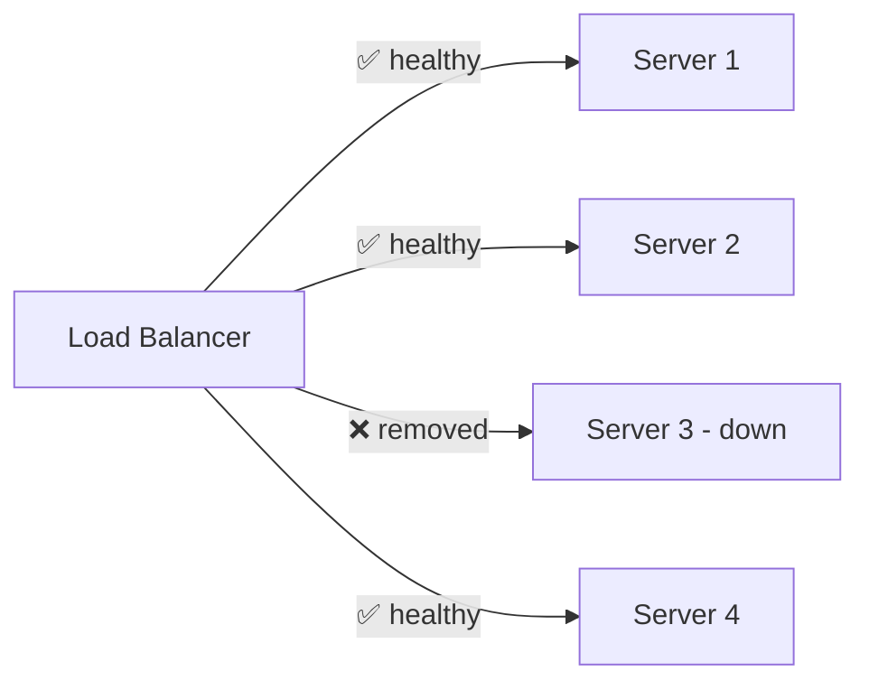

**SSL termination** — LB handles HTTPS decryption so app servers only deal with plain HTTP internally. Less CPU load on every server.

**Rate limiting** — Throttle or block clients sending too many requests before they even reach your servers.

**Sticky sessions** — When needed, pin a user to the same server for stateful applications.

---

## 9. Load Balancing Strategies

Different algorithms for deciding which server gets the next request.

---

### Round Robin

Cycles through servers in order. Request 1 → Server 1, Request 2 → Server 2, Request 3 → Server 3, Request 4 → Server 1, and so on.

Simple, predictable, zero overhead. But it ignores how busy each server actually is. If Server 1 is processing a slow query, it still gets the next request in rotation.

**Best for:** Servers with similar specs handling requests of similar complexity.

---

### Weighted Round Robin

Same as round robin but powerful servers get more requests proportional to their capacity.

```
Server 1 (16 core) → weight 8
Server 2 (8 core)  → weight 4
Server 3 (4 core)  → weight 2

Pattern: S1,S1,S1,S1,S1,S1,S1,S1,S2,S2,S2,S2,S3,S3 → repeat
```

**Best for:** Mixed infrastructure where servers have different capabilities.

---

### Least Connections

Routes each new request to the server with the fewest active connections right now.

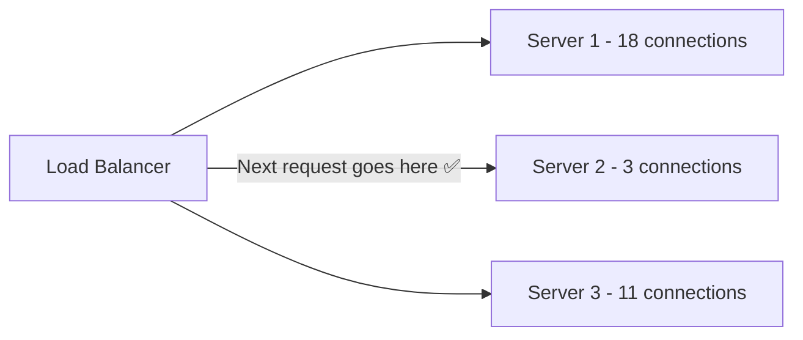

Smarter than round robin because it accounts for actual server load. If one server has many slow long-running requests, it will not get new ones until it catches up.

**Best for:** Long-lived connections, WebSockets, video streaming, variable request processing times.

---

### IP Hash

Hashes the client IP address to always route that client to the same server.

```
Client IP: 103.21.44.12
Hash(103.21.44.12) % 4 = 2  → always Server 3
```

Guarantees the same user always hits the same server. No need for sticky session logic at the app level.

**Best for:** Stateful applications where session data lives on a specific server.

**Drawback:** If that server goes down, all its users get re-routed and lose their sessions.

---

### Least Response Time

Routes to the server with both the fewest active connections and the fastest average response time. More intelligent than least connections alone.

**Best for:** Latency-sensitive applications where response time variance between servers matters.

---

### Load Balancing Strategy Summary

| Strategy | How it decides | Best for |
|----------|---------------|----------|
| **Round Robin** | Take turns | Uniform servers, uniform requests |
| **Weighted Round Robin** | Turns weighted by capacity | Mixed server specs |
| **Least Connections** | Fewest active connections | Long-lived or slow requests |
| **IP Hash** | Hash of client IP | Stateful apps, sticky sessions |
| **Least Response Time** | Fewest connections + fastest | Latency-sensitive apps |

---

### Layer 4 vs Layer 7 Load Balancing

**Layer 4 (Transport Layer)** — Routes based on IP address and TCP port. Cannot inspect request content. Very fast, minimal overhead. Example: AWS Network Load Balancer.

**Layer 7 (Application Layer)** — Routes based on HTTP content — URL path, headers, cookies. Slower but far more intelligent. Can send `/api` traffic to one server pool and `/static` to another. Example: AWS Application Load Balancer, Nginx.

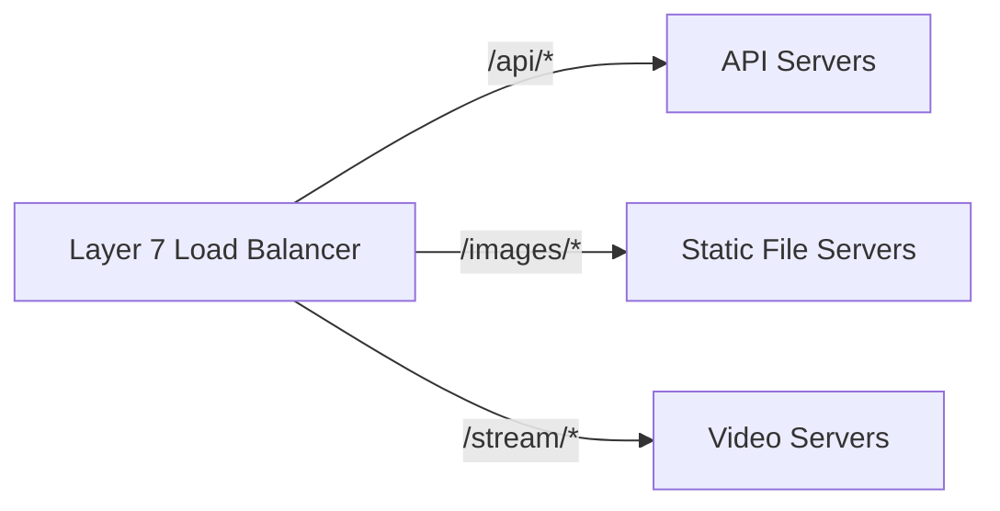

Most modern applications use Layer 7. The routing intelligence is almost always worth the small overhead.

---

## 10. Proxy — Forward & Reverse

A proxy is a server that sits between a client and another server, intercepting requests and responses. There are two types, and they are almost opposite in purpose.

---

### Forward Proxy — On Behalf of the Client

A forward proxy sits in front of clients. When a client makes a request, it goes to the proxy first — and the proxy makes the request on the client's behalf.

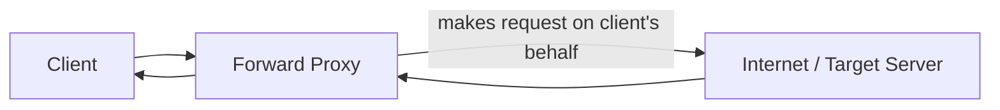

**The server sees the proxy's IP — not the client's IP.** The client's identity is hidden.

**Real uses:**
- **Privacy / Anonymity** — VPNs work like forward proxies. Your ISP and the target server see the VPN server's IP, not yours.
- **Content filtering** — Corporate networks use forward proxies to block certain websites for employees.
- **Bypassing restrictions** — Accessing geo-blocked content by routing through a proxy in another country.
- **Caching** — A company's forward proxy can cache frequently accessed content so multiple employees get it instantly.

---

### Reverse Proxy — On Behalf of the Server

A reverse proxy sits in front of servers. Clients think they are talking directly to the server — but they are actually talking to the proxy, which forwards requests to the actual backend.

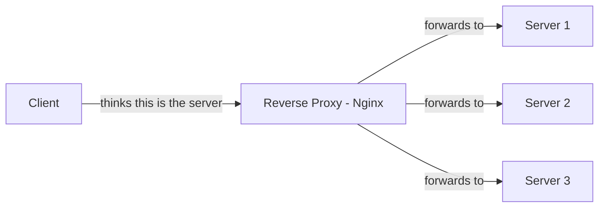

**The client does not know the real server IPs.** The backend infrastructure is hidden.

**Real uses:**
- **Load balancing** — Distribute traffic across multiple backend servers. (Nginx and HAProxy are both reverse proxies used as load balancers)
- **SSL termination** — Handle HTTPS at the proxy layer so backend servers deal with plain HTTP
- **Caching** — Cache responses at the proxy level, serving common requests without hitting the backend
- **Security** — Hide backend server IPs from the public internet. DDoS attacks hit the proxy, not your servers directly.
- **Compression** — Compress responses before sending to clients

---

### Forward vs Reverse Proxy

| | Forward Proxy | Reverse Proxy |
|--|--------------|--------------|
| Sits in front of | Clients | Servers |
| Hides | Client's identity from server | Server's identity from client |
| Used by | Users, VPNs, corporate networks | Companies, load balancers, CDNs |
| Examples | Squid, VPN providers | Nginx, HAProxy, Cloudflare |

**The one-line way to remember it:** Forward proxy protects the client. Reverse proxy protects the server.

---

## 11. CDN — Content Delivery Network

Here is the exact problem that CDN was built to solve.

Your servers are in Mumbai. A user in New York opens your website. Their request travels New York → Mumbai → New York. Round trip is thousands of kilometres. Even at the speed of light, that is ~200ms just for the physics. Add network hops and that is 250–400ms. For every image, every CSS file, every JavaScript bundle — that delay multiplies.

Now multiply by users in Tokyo, London, São Paulo, Lagos — all hitting your Mumbai servers. Your site feels slow to the majority of your users. Your origin server gets hammered with traffic from around the world. Bandwidth costs climb.

**CDN fixes this by bringing your content closer to your users.**

CDN places copies of your content at **edge servers** distributed across the world. Instead of a user in New York talking to Mumbai, they talk to a CDN server in New York.

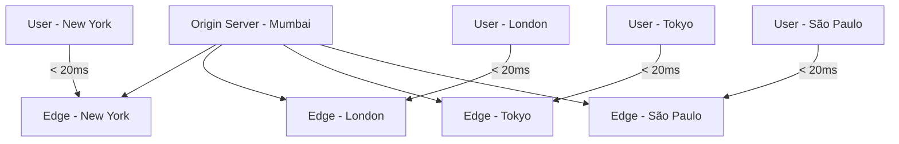

Mumbai to New York takes 200ms. New York to New York takes 5ms. Every user in the world gets content from a server near them.

---

### How CDN Serving Works

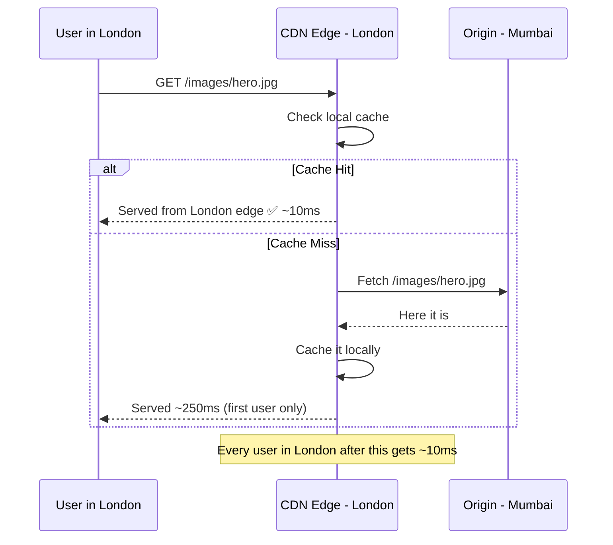

The first user in London triggers a cache miss — the CDN fetches from Mumbai. Every subsequent user in London gets it from the London edge server instantly. The origin server only has to serve the asset once per region.

---

### What CDN Caches

CDNs excel at **static content** — anything that is the same for every user:

- Images, videos, audio files
- CSS, JavaScript, web fonts
- HTML files that do not change per user
- PDFs, software downloads, documentation

Dynamic content — personalized feeds, user data, API responses — generally cannot be CDN-cached because it changes per user. Though modern CDNs are getting smarter at caching even some dynamic content with smart cache keys.

---

### Other Problems CDN Solves

**DDoS protection** — A DDoS attack sends massive traffic to take your server down. When you are behind a CDN, the attack hits thousands of edge servers simultaneously across the world. Cloudflare regularly absorbs some of the largest DDoS attacks ever recorded — attacks that would instantly destroy an unprotected origin server.

**Bandwidth cost savings** — Traffic served from CDN edge servers does not count as egress from your cloud provider. CDN bandwidth is far cheaper. At scale — millions of users — this saves significant money every month.

**Availability during origin outages** — If your origin server has a brief issue, the CDN continues serving cached content. Users may not notice at all.

**SSL offloading** — CDNs terminate SSL at the edge, removing that CPU overhead from your origin servers.

---

### Popular CDNs

| CDN | Known for |
|-----|-----------|
| **Cloudflare** | DDoS protection, security, generous free tier |
| **AWS CloudFront** | Deep AWS integration, pay per use |
| **Akamai** | Oldest and largest, enterprise scale |
| **Fastly** | Real-time cache purging, developer-friendly |
| **Azure CDN** | Microsoft Azure integration |

---

## Interview Questions

**Caching**
1. What is caching and what problem does it solve?
2. What is cache invalidation? Why is it considered one of the hardest problems in computer science?
3. Walk through what happens step by step when a user requests data that is not in the cache.
4. What is the difference between cache and a database?

**Eviction Policies**
1. What is a cache eviction policy and why is it needed?
2. Explain LRU vs LFU. When would you choose each?
3. You are building a cache for trending social media posts. Which eviction policy do you use and why?

**Write Strategies**
1. What are the three cache write strategies and their trade-offs?
2. When would you use write-back over write-through? What is the risk you accept?
3. When is write-around the right choice?

**Redis & Memcached**
1. What is Redis? How is it different from a regular cache?
2. What is the difference between Redis and Memcached? Which would you choose and why?
3. Why do you need a distributed cache? What problem does it solve that in-process caching does not?
4. What data structures does Redis support? Give a real use case for sorted sets.
5. How does TTL work in Redis? Give a scenario where it is essential.

**Load Balancing**
1. What is a load balancer and what does it do beyond distributing traffic?
2. What is the difference between round robin and least connections?
3. What is IP hash load balancing? When is it needed and what is its drawback?
4. What is the difference between Layer 4 and Layer 7 load balancing?
5. A server in your pool crashes. How does the load balancer handle this?

**Proxy**
1. What is the difference between a forward proxy and a reverse proxy?
2. How does a VPN work as a forward proxy?
3. What is Nginx and why is it used as a reverse proxy?
4. What does "SSL termination at the load balancer" mean? Why is it done?

**CDN**
1. What problem does a CDN solve? Explain with a real scenario.
2. What happens the first time a user in a new region requests content from a CDN?
3. What types of content are best served through a CDN? What is not suitable?
4. How do CDNs help with DDoS protection?
5. You deployed a new version of your CSS file but users still see the old styling. What is the problem and how do you fix it?

---

