# 08. Databases, Scaling, Sharding & Consistent Hashing

> Every system eventually comes down to one question — where does the data live, and how do you access it fast when you have billions of rows across hundreds of servers? This topic covers how to choose the right database, how to scale it when one machine is not enough, and how distributed systems keep data evenly distributed even as servers come and go.

---

## Table of Contents

1. [How to Choose a Data Store](#1-how-to-choose-a-data-store)
2. [Types of Databases](#2-types-of-databases)
3. [SQL vs NoSQL](#3-sql-vs-nosql)
4. [When to Use SQL vs NoSQL](#4-when-to-use-sql-vs-nosql)
5. [Vertical Scaling vs Horizontal Scaling](#5-vertical-scaling-vs-horizontal-scaling)
6. [Database Partitioning](#6-database-partitioning)
7. [Sharding — Horizontal Partitioning at Scale](#7-sharding--horizontal-partitioning-at-scale)
8. [Sharding Strategies](#8-sharding-strategies)
9. [Consistent Hashing](#9-consistent-hashing)
10. [Interview Questions](#-interview-questions)

---

## 1. How to Choose a Data Store

This is the first question in every system design interview. You cannot answer "just use PostgreSQL" for everything — each data store has a very specific reason to exist.

Think about what Amazon stores: user profiles, product details, orders, inventory, search queries, reviews, payment history, browsing behaviour. No single database handles all of this optimally. Amazon uses different data stores for different parts of the system — each chosen for the specific nature of that data.

Before picking a database, ask these questions:

**What does your data look like?** Is it structured with a fixed schema (SQL), or is it flexible and document-like (NoSQL)? Is it time-series data from sensors? Is it a social graph with millions of relationships?

**How will you read and write?** Is this a read-heavy system like a product catalogue, or write-heavy like a logging system? The answer changes everything.

**How much will it grow?** A database that works at 10,000 users might collapse at 10 million. Plan for the scale you expect to reach, not just where you are today.

**How consistent does data need to be?** A payment needs strong consistency. A social media like count can be eventually consistent.

**What can you afford?** Some databases are free and open source. Others cost significant money at scale. Managed cloud databases cost more but save engineering time.

---

## 2. Types of Databases

Not all databases think about data the same way. Each type was built to solve a specific problem.

---

### Relational Databases (SQL)

Data is organized into tables with rows and columns. Tables can relate to each other through foreign keys. You query with SQL. The structure is rigid — every row follows the same schema.

**Best for:** Structured data with clear relationships. Financial systems, e-commerce orders, user accounts, anything where data integrity and complex queries matter.

**Examples:** PostgreSQL, MySQL, SQLite, OracleDB

---

### Document Stores

Data is stored as documents — usually JSON or BSON. Each document can have a different structure. No fixed schema. Great for data that varies in shape.

**Best for:** Product catalogues (each product has different attributes), user profiles, content management systems, anything where the structure of your data is not uniform.

**Examples:** MongoDB, CouchDB

**Real example:** An Amazon product can have a dozen attributes or a thousand. A t-shirt has size and colour. A laptop has RAM, GPU, battery life, display resolution. A relational database would need a messy workaround. MongoDB stores each product as a document with exactly the fields it needs.

---

### Key-Value Stores

The simplest database model. Store any value under a unique key. Retrieve by key. Extremely fast because there is no query planning — just a direct lookup.

**Best for:** Sessions, caching, user preferences, anything where you access data by a known ID with no complex querying needed.

**Examples:** Redis, DynamoDB, Riak

---

### Columnar Databases

Instead of storing data row by row, they store it column by column. This sounds like a minor detail but it changes performance dramatically for analytical queries. If you want the average price of all products, a columnar database reads only the price column — not every row.

**Best for:** Analytics, data warehousing, big data processing, aggregations over huge datasets.

**Examples:** Apache Cassandra, HBase, Amazon Redshift

---

### Graph Databases

Data is stored as nodes (entities) and edges (relationships). When your data is fundamentally about connections — who follows whom, which products are bought together, how diseases spread — graph databases let you traverse those relationships in ways that SQL joins cannot match efficiently.

**Best for:** Social networks, recommendation engines, fraud detection, knowledge graphs.

**Examples:** Neo4j, Amazon Neptune

**Real example:** LinkedIn's "People you may know" feature. Finding your second-degree connections in a SQL database would require expensive multi-level joins. In a graph database, you just traverse two hops on the graph.

---

### Time-Series Databases

Optimized for data that is indexed by time. Every reading comes with a timestamp, and the most common queries are things like "give me all readings from the last hour" or "show me the average every 5 minutes."

**Best for:** IoT sensor data, application metrics, server monitoring, financial tick data.

**Examples:** InfluxDB, OpenTSDB, TimescaleDB

---

### Data Warehouses

Designed for analytics on massive amounts of historical data, pulled from many different sources. You do not run your live application against a data warehouse — you run reports, dashboards, and business intelligence queries.

**Best for:** Business analytics, historical reporting, BI dashboards.

**Examples:** Google BigQuery, Amazon Redshift, Snowflake

---

### All Database Types at a Glance

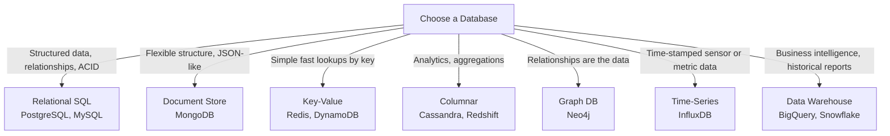

---

## 3. SQL vs NoSQL

This is one of the most common interview questions — and most people answer it too simplistically. Here is the real comparison.

### SQL — Structure and Guarantees

SQL databases have been around for decades and are battle-tested. They enforce a strict schema — every row in a table must follow the same structure. They give you ACID transactions — Atomicity, Consistency, Isolation, Durability. If you transfer money from one account to another, SQL guarantees that either both the debit and credit happen, or neither does. No half-completed transactions.

SQL scales vertically — you add more CPU, RAM, and disk to your existing server to handle more load. There is a ceiling to this, and it can get expensive.

### NoSQL — Flexibility and Scale

NoSQL is an umbrella term covering document stores, key-value stores, columnar databases, and graph databases. What they share is that they throw out the fixed schema and often relax consistency guarantees in exchange for horizontal scalability and flexibility.

NoSQL scales horizontally — you add more servers to handle more load. This is how you get to petabytes of data. The trade-off is that you often lose ACID transactions and complex query capabilities.

---

### SQL vs NoSQL — Side by Side

| | SQL | NoSQL |
|--|-----|-------|
| Data model | Tables, rows, columns — fixed schema | Flexible — documents, key-value, columns, graphs |
| Schema | Strict — defined in advance | Schema-less — each record can differ |
| Consistency | ACID — strong consistency | Varies — often eventual consistency |
| Scaling | Vertical — bigger machine | Horizontal — more machines |
| Transactions | Full ACID support | Limited or none (exceptions: MongoDB) |
| Query language | SQL — powerful, standardized | Varies per database |
| Best for | Complex queries, data integrity, relationships | Scale, flexibility, unstructured data |
| Examples | PostgreSQL, MySQL, Oracle | MongoDB, Cassandra, Redis, DynamoDB |

---

## 4. When to Use SQL vs NoSQL

The real answer is not "one is better" — it is "they solve different problems."

**Use SQL when:**
- Data has clear structure and relationships (users, orders, payments)
- You need ACID transactions (banking, inventory, bookings)
- You need complex queries with joins and aggregations
- Your team is more comfortable with relational models
- Data integrity is non-negotiable

**Use NoSQL when:**
- Data structure varies per record (product catalogue, user-generated content)
- You need to scale horizontally to handle enormous volumes
- You need very high write throughput (logging, event tracking)
- Eventual consistency is acceptable for your use case
- You are storing unstructured or semi-structured data

**The honest truth:** Most large systems use both. Instagram uses PostgreSQL for user data and relationships, and Cassandra for storing media metadata at scale. Twitter uses MySQL for core data and Manhattan (their own NoSQL store) for high-throughput data.

---

## 5. Vertical Scaling vs Horizontal Scaling

Your database is getting slow. You have two options — make the machine bigger, or add more machines.

### Vertical Scaling — Scale Up

You upgrade your existing server. Add more CPU cores, more RAM, faster SSDs. The database stays on one machine, just a more powerful one.

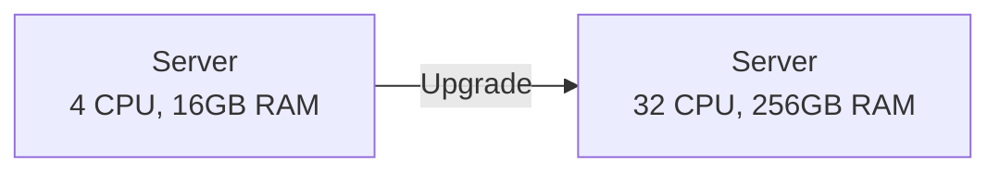

**Advantages:** Simple — no changes to your application or data distribution. No consistency issues. Easy to manage.

**Disadvantages:** There is a ceiling. The most powerful single machine in the world still has limits. And expensive hardware gives diminishing returns. Also, one machine is still a single point of failure.

**Best for:** Early stages when your data fits on one powerful machine. SQL databases traditionally scale this way.

### Horizontal Scaling — Scale Out

You add more servers. The data and load are distributed across multiple machines.

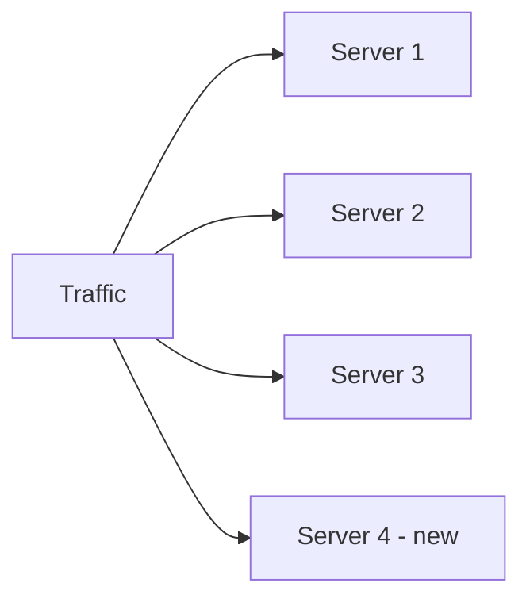

**Advantages:** No ceiling — keep adding servers as you grow. More resilient — losing one server does not lose everything. Cost-effective at very large scale.

**Disadvantages:** Complex. Your data is now spread across multiple machines — consistency, coordination, and partitioning all become hard problems. Your application needs to know how to route queries to the right server.

**Best for:** NoSQL databases are designed for this. SQL databases can be made to scale horizontally, but it requires more work.

---

## 6. Database Partitioning

Once you decide to scale horizontally, you need to split your data across multiple servers. That is **partitioning** — dividing the database into smaller pieces called partitions.

There are two fundamental ways to split data.

### Vertical Partitioning — Split by Columns

Different columns of a table are stored separately. You split a wide table into narrower tables, each containing a subset of columns.

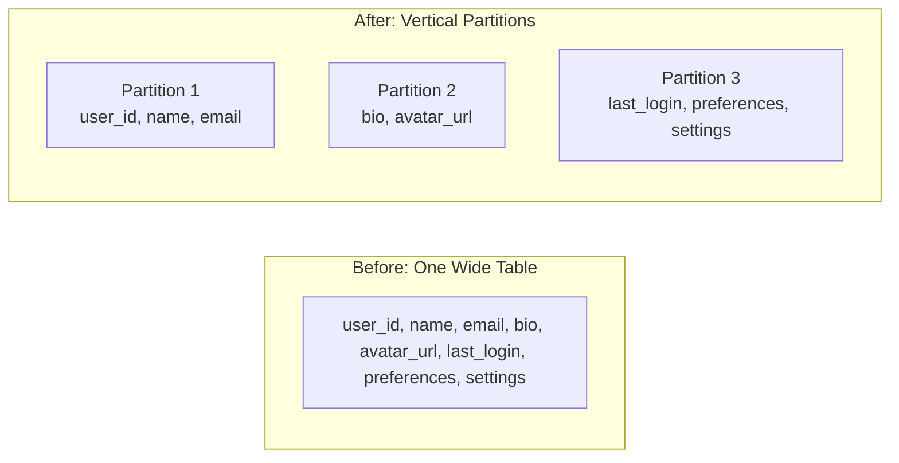

**Why?** If you query user profiles for authentication, you only need user_id, name, and email. You should not be loading avatar URLs and preference blobs every time someone logs in.

Vertical partitioning also maps well to microservices — the Auth Service owns the credentials partition, the Profile Service owns the profile partition.

### Horizontal Partitioning (Sharding) — Split by Rows

Different rows are stored on different servers. Each partition (shard) contains a subset of the total rows.

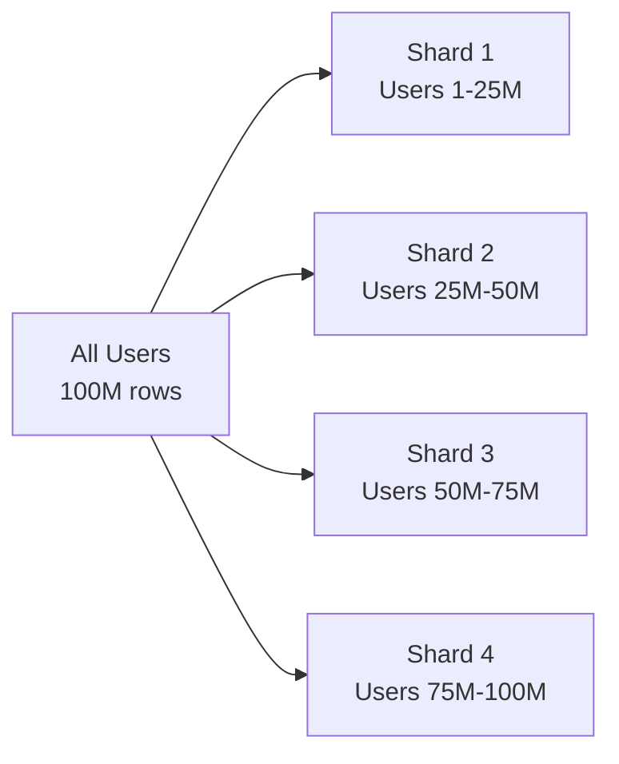

This is what makes horizontal scaling actually work. Each shard is a full database — just with a fraction of the total data.

---

## 7. Sharding — Horizontal Partitioning at Scale

Sharding is horizontal partitioning applied across multiple physical machines. It is how databases like Cassandra, MongoDB, and DynamoDB handle billions of rows.

### Logical vs Physical Sharding

**Logical sharding** — data is split into shards conceptually, but all shards live on the same physical machine. Improves query efficiency and manageability without the complexity of distribution.

**Physical sharding** — each shard lives on a separate server. True horizontal scale. More complex to manage but handles volumes that no single machine can hold.

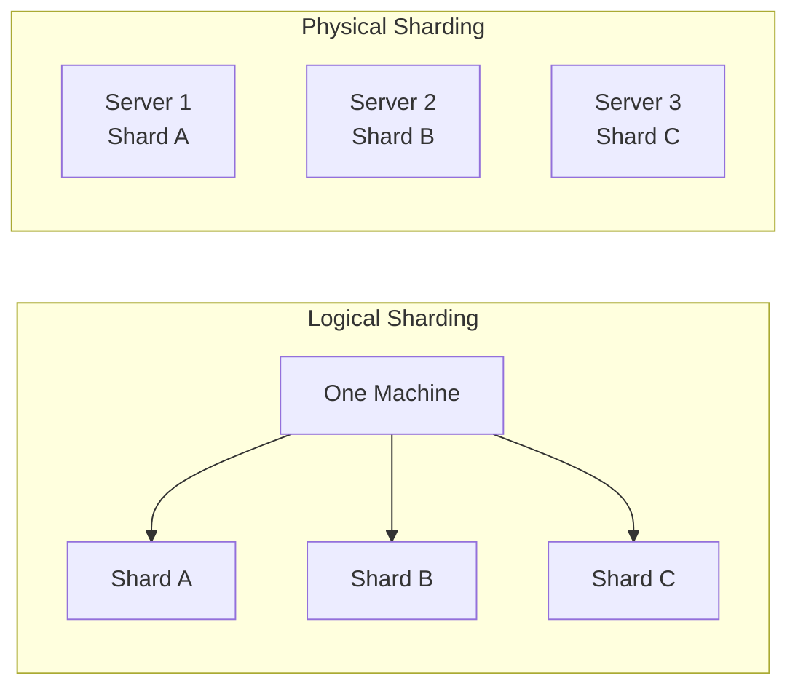

---

## 8. Sharding Strategies

Once you decide to shard, you need to decide *how* to assign rows to shards. The strategy determines everything — how evenly data is distributed, how easy it is to add new shards, and how queries are routed.

### Range-Based Sharding

Data is split based on a range of values. Users with IDs 1–1,000,000 go to Shard 1. IDs 1,000,001–2,000,000 go to Shard 2. And so on.

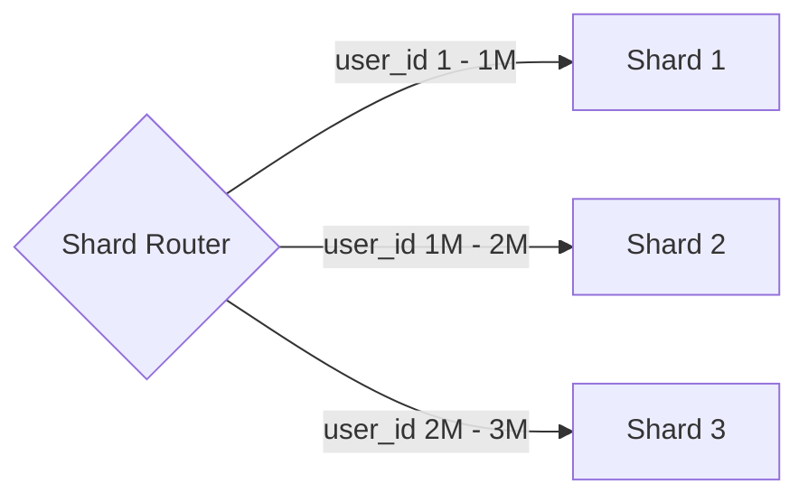

**Simple and predictable.** Easy to understand which shard holds which data.

**Problem:** Hotspots. If most of your active users have recent IDs (because they signed up recently), Shard 3 gets all the traffic while Shard 1 sits idle. The distribution becomes uneven over time.

---

### Hash-Based Sharding

A hash function is applied to a key (like user_id) and the result determines the shard.

```
shard = hash(user_id) % number_of_shards

hash(user_id: 1042) % 4 = 2 → Shard 3
hash(user_id: 5531) % 4 = 1 → Shard 2
hash(user_id: 9988) % 4 = 0 → Shard 1
```

**Distributes data evenly** across shards — no hotspots. The hash function spreads values uniformly.

**Problem:** Adding a new shard changes the formula. If you go from 4 to 5 shards, `hash(key) % 5` gives different results than `hash(key) % 4`. Almost all data needs to be remapped. This is expensive. Consistent hashing solves this — we cover it next.

---

### Directory-Based Sharding

A lookup table (directory) explicitly maps each key to a shard. A separate service maintains this mapping.

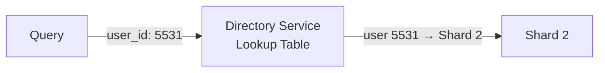

**Maximum flexibility** — you can move any data to any shard at any time by updating the directory.

**Problem:** The directory service is a single point of failure and a bottleneck. Every query needs to hit it first.

---

### Geolocation-Based Sharding

Data is sharded based on the geographic region of the user. Indian users → India shard. US users → US shard.

**Great for data sovereignty** — some countries require that user data stays within their borders. Also reduces latency because users are served from nearby shards.

**Problem:** Uneven distribution if user populations are wildly different across regions.

---

### Sharding Strategy Summary

| Strategy | How it works | Pros | Cons |
|----------|-------------|------|------|
| **Range-based** | Range of key values | Simple, predictable | Hotspots if data is not uniform |
| **Hash-based** | Hash function on key | Even distribution | Expensive to add shards |
| **Directory-based** | Lookup table | Fully flexible | Directory is a bottleneck |
| **Geo-based** | Geographic region | Data locality, compliance | Uneven if populations differ |

---

## 9. Consistent Hashing

This is the elegant solution to the biggest problem with hash-based sharding — what happens when you add or remove a server?

### The Problem

With regular hashing: `shard = hash(key) % N`

If N = 4 (4 servers), and you add a 5th server: `N = 5`

Every single key now maps to a different shard. All your data needs to move. For a database with billions of rows, this is catastrophic. You cannot do this in production without serious downtime.

### The Solution — A Hash Ring

Consistent hashing places both servers and data on a virtual circular ring. When you need to find which server owns a piece of data, you find where the data falls on the ring and walk clockwise until you hit a server.

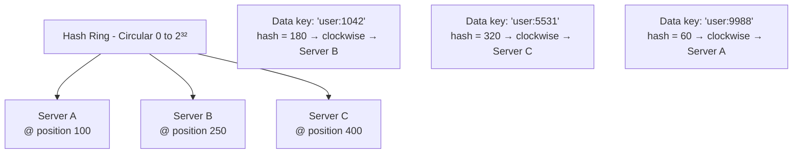

Each piece of data is owned by the first server you encounter going clockwise from its position on the ring.

### Adding a Server — Only Minimal Remapping

When you add Server D between Server B and Server C, only the data that was between B and D needs to move to D. Everything else stays exactly where it was.

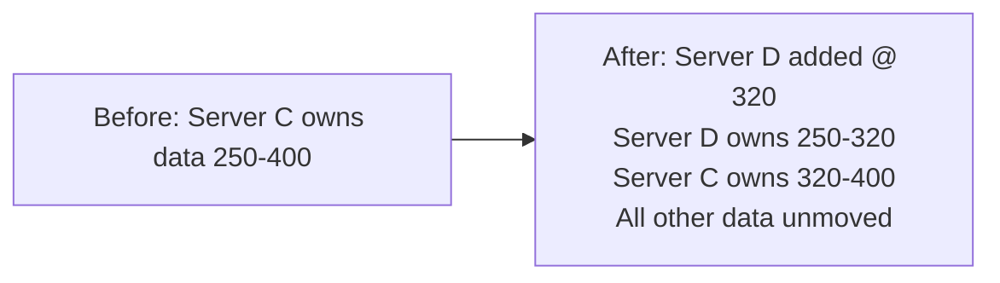

In regular hashing — add one server, remap everything. In consistent hashing — add one server, remap only a fraction.

### Virtual Nodes — Solving Uneven Distribution

With just a few real servers, the ring can have uneven gaps. Some servers end up with large sections of the ring (lots of data) and some with small sections. This creates hotspots.

The solution is **virtual nodes** — each physical server is placed at multiple positions on the ring. Instead of one point per server, you have 100 or 200 points per server, spread around the ring.

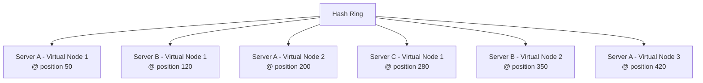

With many virtual nodes, each server ends up owning many small, scattered sections of the ring — giving naturally even distribution even with just a few physical servers.

### Why Consistent Hashing Matters

- **Adding a server** — only the adjacent data moves, not everything
- **Removing a server** — only that server's data moves to its neighbours
- **Virtual nodes** — even distribution without manual balancing
- **Fault tolerance** — data can be replicated to the next N servers clockwise, so if one dies, the next one has a copy

**Real-world use:** Amazon DynamoDB, Apache Cassandra, and Memcached all use consistent hashing. Akamai's CDN uses a variant of it to decide which edge server caches which content.

---

## Interview Questions

**Choosing a Database**
1. How do you decide which database to use for a given system?
2. Amazon stores user data, product catalogues, orders, and browsing history. Would you use one database for all of this? Why or why not?
3. What is the difference between a data warehouse and a regular database?

**SQL vs NoSQL**
1. What are ACID properties? Why do they matter?
2. What does eventual consistency mean in a NoSQL database?
3. Instagram uses both PostgreSQL and Cassandra. Why would you use both?
4. When would you choose MongoDB over PostgreSQL?

**Scaling**
1. What is the difference between vertical scaling and horizontal scaling?
2. Why does vertical scaling have a ceiling? What is the ceiling?
3. Why is horizontal scaling harder than vertical scaling?

**Partitioning & Sharding**
1. What is database partitioning? What are the two types?
2. What is the difference between vertical partitioning and horizontal partitioning?
3. What is sharding? What problem does it solve?
4. What is the difference between logical sharding and physical sharding?
5. What is a hotspot in sharding? Which strategy causes it and why?

**Sharding Strategies**
1. Explain range-based sharding with an example. What is its weakness?
2. How does hash-based sharding fix the hotspot problem? What is its weakness?
3. What is directory-based sharding? What is the trade-off?
4. When would you use geolocation-based sharding?

**Consistent Hashing**
1. What is the problem with regular hash-based sharding when you add a server?
2. How does consistent hashing solve that problem?
3. What is a virtual node? Why is it needed in consistent hashing?
4. What happens to data when a server is removed in consistent hashing?
5. Which real-world databases and systems use consistent hashing?

---