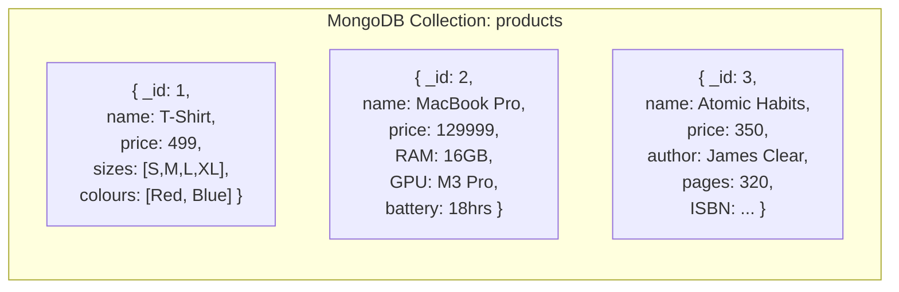
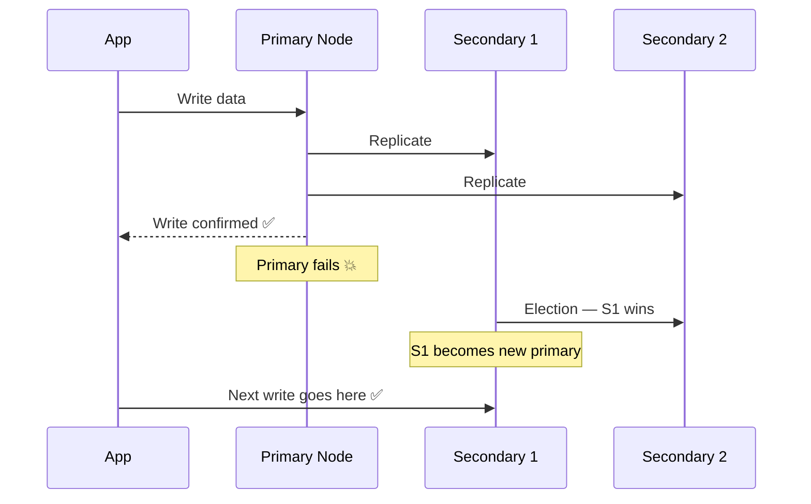
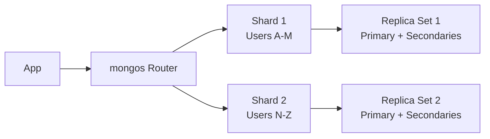
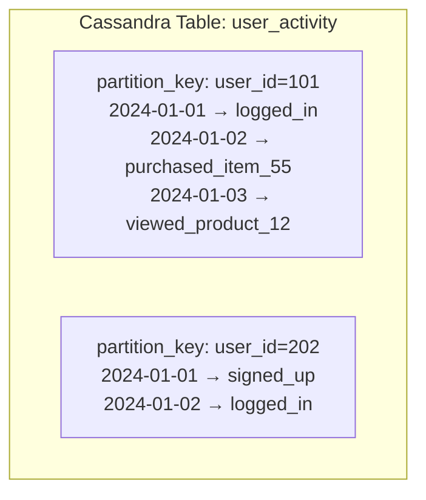
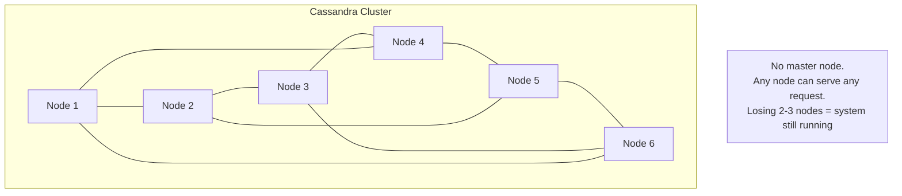
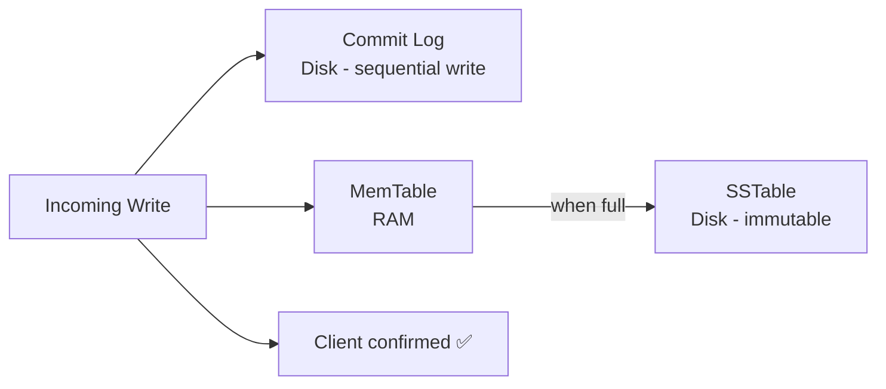
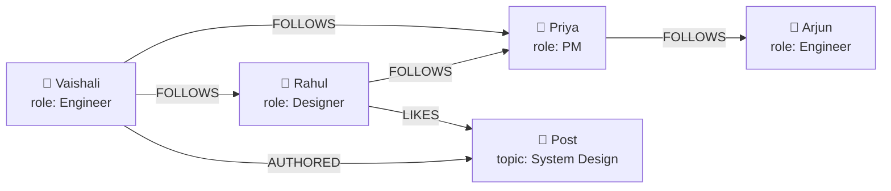
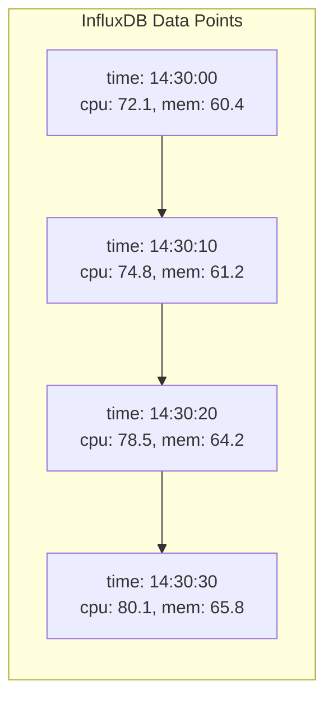
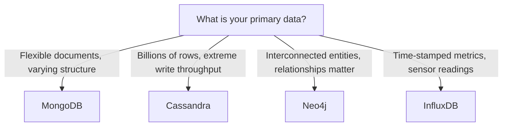
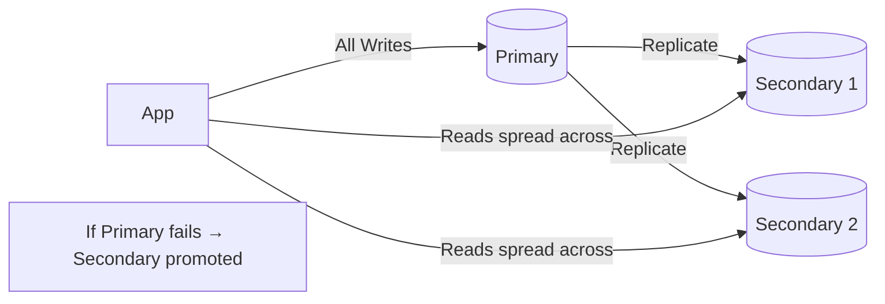

# 09. Database Deep Dive — MongoDB, Cassandra, Neo4j & InfluxDB

> You already know the types of databases. Now let's go deeper. When an interviewer asks "why MongoDB over PostgreSQL?" or "why Cassandra for this use case?" — they want to see that you understand how each database thinks about data, where it shines, and where it falls apart. This topic gives you that depth.

---

## Table of Contents

1. [Why Going Deeper on Databases Matters](#1-why-going-deeper-on-databases-matters)
2. [MongoDB — The Flexible Document Store](#2-mongodb--the-flexible-document-store)
3. [Apache Cassandra — Built for Scale and Availability](#3-apache-cassandra--built-for-scale-and-availability)
4. [Neo4j — When Your Data is Relationships](#4-neo4j--when-your-data-is-relationships)
5. [InfluxDB — Time is the Primary Key](#5-influxdb--time-is-the-primary-key)
6. [Head to Head — Choosing Between Them](#6-head-to-head--choosing-between-them)
7. [Database Replication](#7-database-replication)
8. [Interview Questions](#-interview-questions)

---

## 1. Why Going Deeper on Databases Matters

In a system design interview, saying "I'd use MongoDB" is not enough. The follow-up is always "why?" And the answer to that question requires you to understand not just what a database does, but *how* it does it.

Each database in this topic was built to solve a very specific problem that existing databases could not handle well. Understanding what that problem is — and what trade-offs the database accepted to solve it — is what separates a good answer from a great one.

---

## 2. MongoDB — The Flexible Document Store

### The Problem It Solves

Imagine you are building a product catalogue. A t-shirt has: name, price, size, colour. A laptop has: name, price, RAM, storage, display size, GPU, battery life, weight, OS. A book has: name, price, author, ISBN, pages, genre.

In a relational database, you either create one massive table with hundreds of nullable columns (ugly), or you build a complex entity-attribute-value structure (slow to query). Neither is clean.

MongoDB stores each product as a document — a JSON-like object with exactly the fields it needs. No nulls, no workarounds.



Every document is different. MongoDB does not care.

### How MongoDB Works Internally

**Documents and Collections** — MongoDB stores data as BSON (Binary JSON) documents. Documents live in collections. A collection is like a table, but there is no enforced schema — each document in the same collection can have completely different fields.

**Flexible Schema** — You can add a new field to a document at any time without running a migration. This is huge for fast-moving products where the data model changes frequently.

**Indexing** — MongoDB supports indexes on any field, including nested fields and arrays. Without an index, MongoDB does a full collection scan. With the right indexes, reads are fast.

**Replica Sets — High Availability**

MongoDB achieves high availability through replica sets. A replica set is a group of MongoDB instances that hold the same data. One is the primary, the others are secondaries.



If the primary fails, secondaries hold an automatic election and one of them becomes the new primary within seconds. No manual intervention needed.

**Horizontal Scaling — Sharding**

When a single replica set cannot handle the data volume, MongoDB shards data across multiple replica sets. Each shard holds a subset of the data. A mongos router sits in front and routes queries to the right shard.



**Tunable Consistency**

MongoDB lets you choose your consistency level per operation:

- **Read from primary only** — always get the latest data (strong consistency)
- **Read from secondaries** — potentially slightly stale, but less load on primary (eventual consistency)
- **Majority write concern** — write is only confirmed after the majority of nodes acknowledge it

This tuning is exactly the CP vs AP trade-off from CAP theorem applied in practice.

### When to Use MongoDB

- Product catalogues where items have different attributes
- Content management systems — blog posts, articles, user-generated content
- User profiles where fields vary by user type
- Rapid prototyping where the schema will change frequently
- Applications where you want to store nested, hierarchical data naturally

### When NOT to Use MongoDB

- When you need complex multi-table joins and aggregations regularly
- When ACID transactions across multiple collections are required frequently (MongoDB added transactions but they are slower)
- When your data is highly structured and relational by nature

---

## 3. Apache Cassandra — Built for Scale and Availability

### The Problem It Solves

In 2008, Facebook had a specific problem — storing the inbox of over 100 million users in a way that scaled linearly as they kept adding more users, never went down, and handled millions of writes per second.

They built Cassandra. The design goal was radical: **availability above everything else**. No single point of failure. Linear scalability. The trade-off: eventual consistency.

### How Cassandra Thinks About Data

Cassandra is a wide-column store. Think of it like a table, but where each row can have a completely different set of columns, and the primary key has a specific structure designed for how you will query the data.



The critical insight: **in Cassandra, you design your data model around your queries, not the other way around.** You cannot do ad-hoc joins. You decide upfront what questions you will ask, and design the table to answer exactly those questions efficiently.

### Cassandra's Architecture — No Single Point of Failure

Cassandra uses a peer-to-peer architecture. There is no master node. Every node is equal. Every node can accept reads and writes. This is what gives Cassandra its extraordinary fault tolerance.



Data is replicated across multiple nodes using consistent hashing. By default, Cassandra replicates data to 3 nodes. You can lose 2 of those nodes and still read and write without interruption.

**Tunable Consistency**

Cassandra gives you explicit control over consistency per operation:

| Level | What it means |
|-------|--------------|
| `ONE` | Write/read acknowledged by just 1 node. Fastest, least consistent. |
| `QUORUM` | Majority of replicas must acknowledge. Balanced. |
| `ALL` | All replicas must acknowledge. Slowest, strongest consistency. |

In practice, most production systems use `QUORUM` for writes and `LOCAL_QUORUM` for reads — balancing performance and consistency.

**Write Performance — Why Cassandra is a Write Beast**

Cassandra's write path is extremely fast because of how it works internally:

1. Write goes to an in-memory structure called a **MemTable**
2. Write is also appended to a **Commit Log** on disk (for durability)
3. Cassandra confirms the write immediately — no waiting for disk I/O to complete
4. When the MemTable fills up, it is flushed to disk as an **SSTable** (Sorted String Table)



Sequential disk writes are extremely fast. There is no random I/O on the write path. This is why Cassandra can handle millions of writes per second.

### When to Use Cassandra

- Time-series data — IoT sensor readings, application logs, user activity streams
- Messaging systems — chat history, notification logs
- Real-time analytics — tracking millions of events per second
- Any use case needing very high write throughput with global distribution
- Systems where availability cannot be compromised even during network partitions

### When NOT to Use Cassandra

- When you need ad-hoc queries and complex joins
- When you need strong ACID transactions
- When your data model is inherently relational
- Small datasets where the operational complexity is not worth it

---

## 4. Neo4j — When Your Data is Relationships

### The Problem It Solves

Most data has relationships. Users follow users. Products are bought together. Diseases spread through contact networks. But in relational databases, relationships are just foreign keys — and when you need to traverse many levels of relationships, you end up with expensive multi-level SQL joins that get slower and slower as data grows.

Graph databases store relationships as first-class citizens. A relationship in Neo4j is a physical connection between nodes stored on disk — not a computed join.

### How Neo4j Models Data

Everything is either a **node** (a thing) or a **relationship** (a connection between things). Both nodes and relationships can have properties.



**The "People You May Know" query in Neo4j:**

```cypher
MATCH (me:User {name: "Vaishali"})-[:FOLLOWS]->(friend)-[:FOLLOWS]->(suggestion)
WHERE NOT (me)-[:FOLLOWS]->(suggestion) AND suggestion <> me
RETURN suggestion.name, COUNT(*) as mutual_friends
ORDER BY mutual_friends DESC
LIMIT 10
```

In plain English: find people my friends follow that I do not follow yet — order by how many mutual friends we share. In Neo4j, this traverses the graph in milliseconds. In SQL, you would need multiple self-joins that get exponentially slower as data grows.

### Strong Consistency and ACID

Unlike many NoSQL databases, Neo4j provides full ACID compliance. Every transaction either fully completes or fully rolls back. This matters for graph data where a partial write — creating a node but not its relationships — would leave the graph in an inconsistent state.

### When to Use Neo4j

- Social networks — friend recommendations, common connections
- Fraud detection — finding patterns and unusual connections in transaction networks
- Recommendation engines — "customers who bought this also bought"
- Knowledge graphs — organizing interconnected concepts
- Access control — complex permission hierarchies

### When NOT to Use Neo4j

- Large volumes of simple records with no meaningful relationships
- Write-heavy workloads — Neo4j is optimized for reads and traversals
- When you need horizontal sharding at massive scale (Neo4j primarily scales vertically)

---

## 5. InfluxDB — Time is the Primary Key

### The Problem It Solves

You are monitoring 10,000 servers. Every server reports CPU usage, memory, disk I/O, and network traffic every 10 seconds. That is 40,000 data points every 10 seconds — 14.4 million per hour.

You cannot store this in a regular database efficiently. Regular databases index by arbitrary fields. Time-series data is always queried by time — "show me CPU usage for this server between 2pm and 4pm yesterday." InfluxDB is built for exactly this.

### How InfluxDB Organises Data

InfluxDB organises data into **measurements** (like tables), with **tags** (indexed metadata for filtering) and **fields** (the actual values being measured).

```
Measurement: server_metrics
Tags: host=server-01, region=india, env=production
Fields: cpu=78.5, memory=64.2, disk_io=142
Timestamp: 2024-01-15T14:32:00Z
```

The timestamp is not just a field — it is the primary key. Every query is a time-range query.



**Retention Policies** — You do not want to store 1-second resolution data forever. InfluxDB lets you define retention policies — automatically delete data older than N days or downsample it (compress 1-second data into 1-minute averages for long-term storage).

**Continuous Queries** — InfluxDB can automatically run queries on a schedule — like computing hourly averages from per-second data — and store the results. This is how dashboards stay fast even as raw data ages.

### When to Use InfluxDB

- Server and application monitoring (CPU, memory, error rates)
- IoT sensor data (temperature, pressure, GPS coordinates)
- Financial tick data (stock prices every millisecond)
- Any system where the timestamp is the most important dimension

### When NOT to Use InfluxDB

- General-purpose data storage
- When you need complex relational queries
- When data does not have a time dimension

---

## 6. Head to Head — Choosing Between Them



| | MongoDB | Cassandra | Neo4j | InfluxDB |
|--|---------|-----------|-------|---------|
| Data model | Documents (JSON) | Wide-column | Nodes + relationships | Time-series |
| Best for | Flexible structured data | Massive scale, high writes | Connected data | Metrics, monitoring |
| Consistency | Tunable | Tunable | Strong (ACID) | Tunable |
| Availability | High (replica sets) | Very high (no master) | High | High |
| Scaling | Horizontal (sharding) | Horizontal (linear) | Vertical primarily | Horizontal |
| Query language | MongoDB Query Language | CQL (Cassandra Query Language) | Cypher | InfluxQL / Flux |
| Joins | Limited | None | Native traversal | None |
| Real-world use | Product catalogues, CMS | IoT, messaging, analytics | Social graphs, fraud detection | Server monitoring, IoT |

---

## 7. Database Replication

No matter which database you choose, replication is how you achieve high availability and scale read traffic. The concept applies across all of them.

**Replication** means keeping copies of your data on multiple servers. If one server dies, another takes over. If read traffic is high, you can direct reads to replicas while writes go to the primary.

### Master-Slave (Primary-Secondary) Replication

One primary accepts all writes. Changes are replicated to one or more secondaries. Reads can be served by secondaries.



**Pros:** Simple. Writes are consistent — only one node accepts them. Reads scale by adding more secondaries.

**Cons:** Primary is still a bottleneck for writes. If primary fails, there is brief downtime during failover.

### Multi-Master Replication

Multiple nodes accept writes simultaneously. Changes are replicated across all masters.

**Pros:** No single write bottleneck. Higher write availability.

**Cons:** Conflict resolution — what happens when two masters receive conflicting writes to the same data at the same time? This is a genuinely hard problem. CouchDB and some Cassandra configurations handle this with last-write-wins or vector clocks.

### Synchronous vs Asynchronous Replication

**Synchronous** — the write is only confirmed after all replicas acknowledge it. Guarantees no data loss. But if a replica is slow, every write is slow.

**Asynchronous** — the write is confirmed as soon as the primary writes it. Replicas catch up later. Faster, but if the primary fails before replication completes, you can lose the most recent writes.

Most systems use asynchronous replication with quorum reads/writes to balance speed and safety.

---

## Interview Questions

**MongoDB**
1. What is a document database? How is it different from a relational database?
2. What is schema flexibility and why does it matter in MongoDB?
3. How does MongoDB achieve high availability? What is a replica set?
4. How does MongoDB scale horizontally? What is a mongos router?
5. You are designing an e-commerce product catalogue where each product has different attributes. Why would you choose MongoDB over PostgreSQL?
6. What is tunable consistency in MongoDB? When would you read from a secondary?

**Cassandra**
1. How is Cassandra different from a relational database and from MongoDB?
2. Why is there no master node in Cassandra? What advantage does this give?
3. Why is Cassandra excellent at write-heavy workloads? Explain the write path internally.
4. What is a MemTable and an SSTable in Cassandra?
5. What does "design your data model around your queries" mean in Cassandra?
6. What are Cassandra's consistency levels? When would you use QUORUM?
7. You are building a real-time chat message store for 500 million users. Would you use MySQL or Cassandra? Why?

**Neo4j**
1. What is a graph database? When is it better than a relational database?
2. How does Neo4j store relationships compared to SQL foreign keys?
3. What is the Cypher query language?
4. Why is Neo4j good for fraud detection?
5. What is the limitation of Neo4j when it comes to scaling?

**InfluxDB**
1. What is a time-series database? What makes InfluxDB different from PostgreSQL?
2. What are tags and fields in InfluxDB? What is the difference?
3. What is a retention policy in InfluxDB? Why is it important?
4. You are building a server monitoring dashboard showing CPU and memory over time. Which database do you use?

**Database Replication**
1. What is database replication? Why is it needed?
2. What is the difference between master-slave and multi-master replication?
3. What is the difference between synchronous and asynchronous replication? What is the trade-off?
4. How does replication help with read scaling?

---